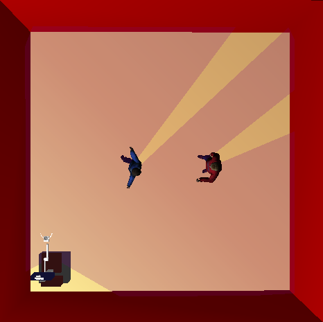
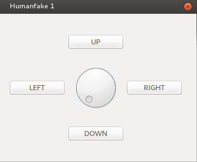
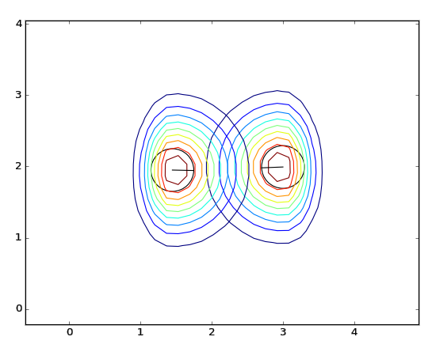
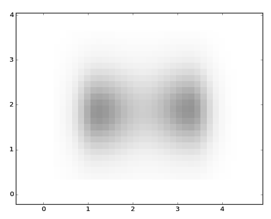
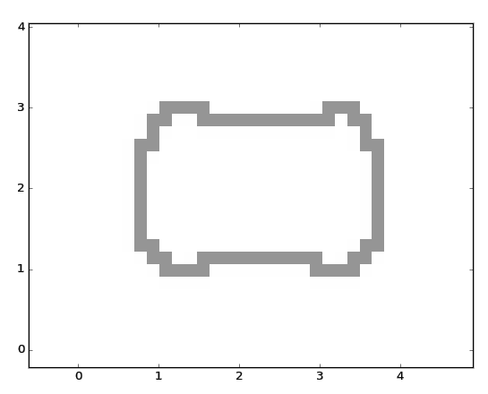

# Introduction to Social Navigation

01/06/2017

## About me

My name is Araceli Vega Magro, I am 23 years old and I am about to finish my Degree in Sound and Image in Telecommunications in the University of Extremadura

## Social navigation
During GSOC 2017 I'm going to work in social navigation for mobile robots. It's an interesting topic due to the increasing use of robots in different parts of society. In a near future we will probably see mobile robots navigating around us. Robots will need to differentiate humans from ordinary objects and be able to give them special treatment.

The main objetive of my work in GSOC is to provide robots the capability to behave in a socially acceptable manner. Making robots avoid groups of people or respect their personal space are some of the tasks I pursue to achieve this goal.

### What I have already done
I have already done some progress in my task:

First of all, I had to understand how RoboComp works and its navigation architecture. Once I have become familiar to them, I started coding.

#### Including humans in the simulation
As I'm going to work with simulations instead with a real robot, in first place I have created a set of components in RoboComp named _"FakeHuman0x"_ which include in the simulation tool provided by RoboComp. Each component has an user's interface that I have created to move the humans. I have also downloaded different meshes for each person in the simulation.

On the left you can see an example of simulation of a square enviroment with two humans. On the right there is an image of the user's interface created to move the humans in the simulation. 

 &nbsp; &nbsp; &nbsp;  

#### Personal space modelling
Afterwards, I have created a new component in RoboComp which models their personal space as an asymmetric Gaussian function. Why this kind of function? I have considered it's a good way to model the personal space because it takes into account that humans find more annoying robots navigating ahead them than behind or by the sides. 

In the next picture the Gaussian curves are represented, result of applying the personal space algorithm created to the previous example of simulation.

 

#### Individuals clustering
Finally, I have used a global density function to separate individuals into groups accordingly to their distances. This clustering algorithm takes as input the previously obtained Gaussian curves and the result is a set of polylines (ordered lists of points) which define the contours of forbidden regions for navigation where people are present.

In the next picture you can see the result of applying the density function to the previous Gaussian curves. The polyline obtained with the clustering algorithm is also shown:

 

### What I am planning to do next

There is still a lot of work to be done to achieve socially acceptable navigation. Here I explain some of the tasks I would like to do next:

* Modify the navigation architecture in order to include the personal space and the clustering of people. This will allow the robot to navigate avoiding groups of people and respecting their personal space.

* Unify all the _FakeHuman_ components into one, as well as improve the user's interface to allow to move humans to a specific position.

* Model the personal space of humans in a different way, for example using an ellipse, in order to compare differents types of modeling and the navigation results obtained with them.

* Improve the clustering algorithms taking into account the orientation of the people instead of only considering the distance between them. The robot will be able to navigate between two nearby people who are not looking at each other if their personal spaces allow it. 

* Include certain social rules in the path planning algorithms, such as navigate, whenever possible, to the right side of a person.

* Vary the personal space of a human based on his previous experience with the robot. In this way, if the robot knows a person, it can get closer than if the person is unknown. 

* * *
Araceli Vega Magro

