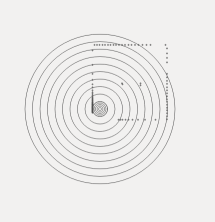
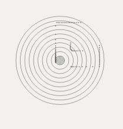
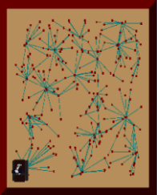
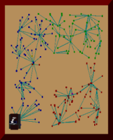
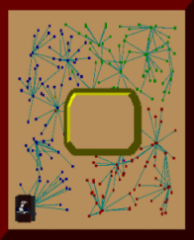
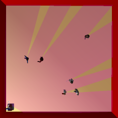
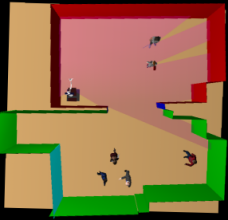
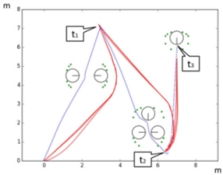
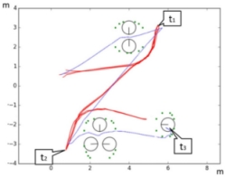

17/06/2017

# Modifications in the Navigation Architecture
 
I have modified the navigation architecture in order to include the personal space modelling and the clustering of individuals, as I explained in my last post. This has allowed the robot to navigate in a social manner in environments populated with people. Here is how I did it:

### Laser Modification

First, I have modified the laser of the robot. The laser of the robot is used to compute attractive and contractive forces, in order to avoid objets in the path optimization. So the modification is necessary if we want the robot avoiding the personal space modelling and the cluster of individuals.

For each angle of view of the laser, the distance from the robot to the polyline has been calculated. If the distance to the polyline is less than the distance detected by the laser, the laser is modified by taking the distance to the polyline as the new value.

In the next pictures you can see the laser after and before its modification.

&nbsp; &nbsp; &nbsp; &nbsp;  &nbsp;  &nbsp; &nbsp; &nbsp; &nbsp;  

### Modification of the free space graph

In the path planning, a free space graph is created. This graph is defined by a set of nodes and edges that describes the free space. The path planners use this graph to search for a path free of obstacles from the robot location to the target. It is required to modify the graph in order to consider the personal space and the cluster of individuals as occupied.

For its modification I have removed the edges and the nodes in the graph that goes through the calculated polylines, as I expained in the last post.

### Modification of the InnerModel

The InnerModel is a representation of the inner knowledge that the robot has of the world. As well as the free space graph, it is also used by the path planners in the path planning. I had include the calculated polylines in the InnerModel as planes that the robot acknowledges as obstacles to avoid.

In the next pictures is shown, from left to right: the free space graph without modifications, the graph after removing the nodes and edges, and the graph after modifying the InnerModel.

&nbsp; &nbsp; &nbsp; &nbsp;  &nbsp; &nbsp; &nbsp; &nbsp; &nbsp;  &nbsp; &nbsp; &nbsp; &nbsp; &nbsp; 

### Trials

I have tested the proposed algorithm in two different simulations where the robot had to avoid six people forming different groups. In the next pictures you can see the different choosen environments and the people in it.

&nbsp; &nbsp; &nbsp; &nbsp; &nbsp; &nbsp; &nbsp; &nbsp; &nbsp; 

Here are the results of applying the algoritm: 

&nbsp; &nbsp;  &nbsp; &nbsp; &nbsp; &nbsp; &nbsp; 

You can see in color green the polylines that represents the personal space and the cluster of individuals. The path taken by the robot without social skills is indicated in blue. The social path is in red. There are also marked in the pictures the different targets that the robot had to reach.

It can be seen that the robot has managed to dodge groups of humans, behaving in a socially acceptable way. However, there are still many things to do to improve the proposed algorithm.

* * *
Araceli Vega Magro
