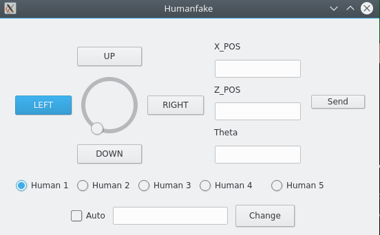
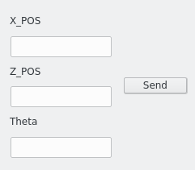
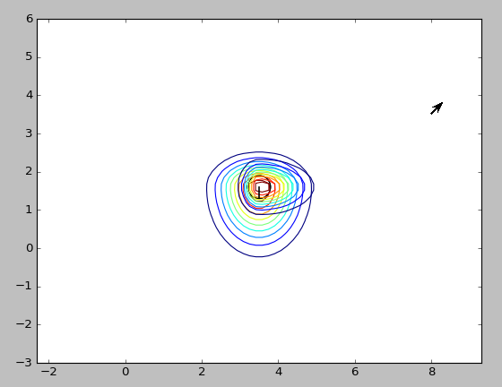
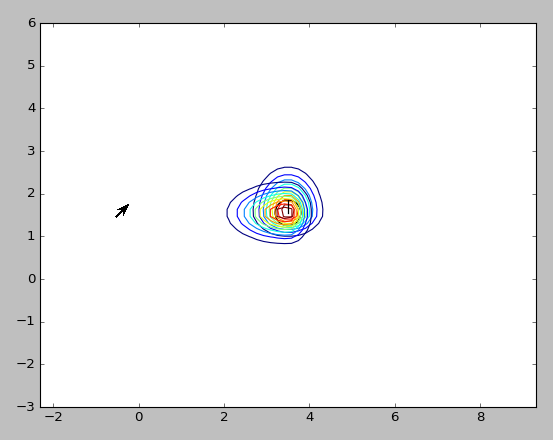
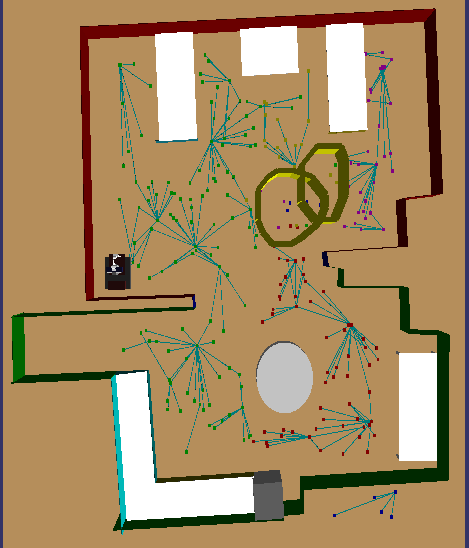

29/07/2017

# My Work So Far

My work so far has comprised of work in two separate things. The first being the fake human agent, the second being the navigation agent which depends on the trajectory as well as the gaussian components. Apart from these major contributions I have made a few minor bug fixes in fake human agent as well.

# Fake Human Agent

&nbsp; &nbsp; &nbsp; &nbsp; 

### Merging the 5 separate components

The first thing i did was to merge the five separate human components into one single human component. In order to control all the humans, five radio buttons were added to the UI which selectively control each human.
&nbsp; &nbsp; &nbsp; &nbsp; 

### Warping Feature

The usage of the joystick to manually move the person to the desired location was a cumbersome task, hence I further modified the component so that the selected person can be sent to a separate location by enterint the co-ordinates and hitting send into the box shown below.

&nbsp; &nbsp; &nbsp; &nbsp; 

### Velocity Change

The velocity of the human plays a major role when deciding the personal space gaussian, as the gaussian of a faster moving person would be bigger than that of a slower miving person so as to give him more space. In order to incorporate this in the gaussian component the velocity was added as an AGM parameter of the human which can be changed with the box below.

&nbsp; &nbsp; &nbsp; &nbsp; 

### Human Auto-Pilot

For modelling a human environment the most basic thing needed would be moving humans. So I added this feature where a human would move on its own without the use of the joy stick, to and fro between two given points. For using this feature the human needs to be selected from the radio button, next the auto box needs to be checked, followed by the entering the destination point in the XPOS and ZPOS text boxes and hitting send. This will make the human oscillate between the two points with his unique velocity which was stored in the AGM. Now when one human is moving we can choose another human via the radio buttons and do the same to have multiple moving humans. In order to stop a certain human, we just need to select the human and deselect the auto button,

# Navigation Agent

In this part I modified the existing personal space feature with a function of my own which overrules the existing gaussian function in the case the person in moving. This was done for the reason that a moving person needs a variable personal space.

### Pass On Right

It is regarded as a social convention that when two people are moving in the opposite direction in a hallway the courteous thing to do would be to pass on the right of the person. So in order to do this a gaussian with an increased deviation towards the left of the human was added so that the robot takes the path to the right.

### Velocity Based Personal Space

The personal space of a static person is different from that of a moving one and hence the personal space was decided by a function that i wrote to calculate the required deviations of the gaussian based on his velocity. With the pictures below you can see that a faster person has a wider gaussian and the slower a smaller one.
&nbsp; &nbsp; &nbsp; &nbsp; &nbsp; &nbsp; &nbsp; &nbsp; 

All my changes made were made so that Aracelis work runs alongside mine which can be seen in the picture below where there are two separate Gaussians. One for a moving person and the other for a stationary.

&nbsp; &nbsp; &nbsp; &nbsp; 

This has been my work so far. For the upcoing month I plan on adding documentation to all the features I added and will try to implement Human Intention Controls into shelly.

Anything I was able to do was thanks to Araceli and my Mentor Pedro with the assistance of Luis and Pablo.
Hence would like to express my heartfelt gratitude to these people.

* * *
Yohan M R

