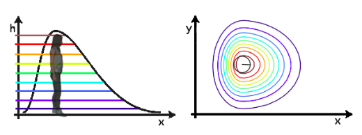
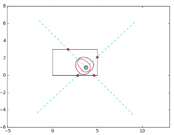
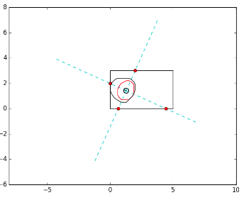

# Adaptive Personal Space

08/06/2018

As I introduced in my first post, the Social Navigation algorithm employed in Robocomp uses an asymmetric gaussian function to define the personal space of humans. The personal space is defined by σ_s, σ_r and σ_h, that represent the variance of the gaussian function along the sides, the rear and the front of the person, respectively. An example of personal space is shown in the next figure.

 

The problem of the algorithm is that the personal space of human has a fixed form and size, so I have created an algorithm to transform the fixed personal space of the humans into an adaptive space.

### Adaptable spatial density function

The main idea is to change independently the values of σ_s, σ_r and σ_h, in order to adapt the personal space to allow the robot to navigate around the person without problems.

First, the algorithm calculates the distances from human to the walls in the four directions of the person. Then, for each distance, it is calculated if the robot is able to navigate in this space. If not, the personal space is adapted by varying the corresponding variance of the asymmetric Gaussian function.

In order to measure distances to each wall, different straight lines along the orientations of the person are generated and it is calculated the intersection point of each line with the walls. That allows to calculate the distance of each wall to the human (d_i). Knowing this distance, it is possible to calculate if the robot is able to navigate between the wall and the human, as the diameter of the robot is known. 

Being d_r the diameter of the robot plus a safety margin and d_min and d_max the minimum and maximum distances that define the comfort zone. For each d_i, the algorithm calculates the distance: d_s = d_i - d_r

If d_min < d_s < d_max, the personal space would be reduced in that orientation of the human.  

If the personal space needs to be reduced, its necessary to select a value of σ that generate the desired distance to the personal space d_s. For this aim, the distances from human to the personal space with differents σ has been calculated, obtaining the next graph:

 

The behaviour of the σ with the distance can be approximated with the equation:
				f(x) = 1,2 · x^-0,97 

With the equation it is calculated the σ for each orientation of the person. Finally, the new gaussian of personal space is calculated with the new value of σ.

The next pictures show two different situations where the personal space needs to be reduced because the robot has not enough space to navigate. In black is shown the original personal space; in red the adapted personal space, that allows the robot navigation. 

  
 

This agorithm has been developed with python. The next step is to implement it withing the social navigation agent.

* * *
Araceli Vega Magro

