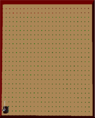
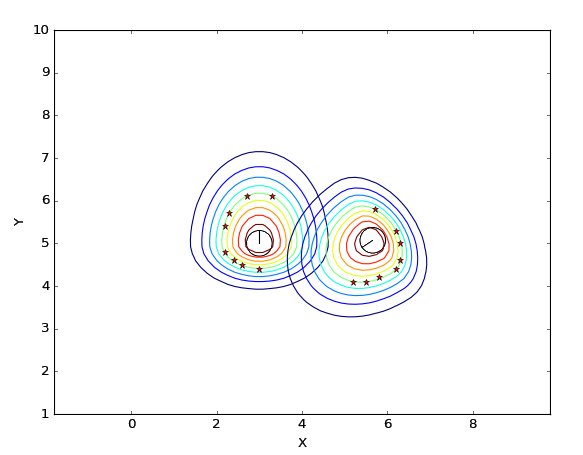
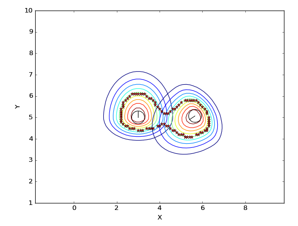

# Advances

27/06/2018

## Changes in the Navigation Agent 

As I explained in my first post, in the last year the Social Navigation Agent has suffered some modifications and it was necessary to integrate again the social navigation algorithm, developed in my last GSOC. 

Some of the changes performed in the component are listed below:

* In first place, the free space graph, that the robot uses to plan its path, was an irregular graph. This caused problems, as in certain cases, unconnected areas appeared in the graph and the RRT planner had to be used. Now it is used a regular graph, which solves this problem.

* Also, the planning algorithm has changed. Before it was used the PRM planner but now the Dijkstra algorithm is used, which searches for the shortest path from the initial position to the destination based on the free space graph.

Knowing these changes I'm going to explain the modifications I did in the component in order to integrate the social navigation algorithm.
 
## Modifications performed

In the previous version of the social navigation component it was also necessary to perform some modification in order to integrate the social algorithm. These modifications were explained in [Post2 GSOC 2017](https://robocomp.github.io/web/gsoc/2017/araceli/post2). 

It has been required to perform the same modifications, with some differences, due to the changes made in the component. 
 
#### Modification of the laser

It is necessary to modify the laser in order to compute attractive and contractive forces to avoid the personal space in the path optimization.

It has been done in the same form it was done last year, however, it has not been tested yet because there are problems with the function that calculates the repulsion forces to get away from the objects.
 
#### Modification of the free space graph

This is the main difference between the previous version of the component and the current version. In the pictures below can be seen the difference between the previous and the current graph.
 
   

The old graph was defined by a set of nodes and edges that described the free space. To modify the graph in order to consider the personal space and the cluster of individuals as occupied, it was required to remove the edges and the nodes that crossed the personal space. That caused some issues when the people moved because it was necessary to regenerate again the nodes and edges. This regeneration was a slow process.

Now the free space is represented by a set of nodes regularly distributed in the environment. These nodes are considered free or occupied. In order to take into account the personal space is only required to set the nodes contained in the personal space as occupied. When the person moves, the nodes that are no longer occupied by the personal space are set as free.

#### Modification of the Social Navigation Gaussian component.

In the previous version of the component was needed to modify the InnerModel to insert planes in the edges of the personal space. It was necessary because the InnerModel was used by the planning algorithm to compute the trajectory. Now it is only used the free space graph. 

Before it was needed less number of points to represent the polylines because the insertion of planes. With more points, more planes would have been needed to insert and the time to do it would have been higher. To reduce the number of points the ConvexHull was calculated. However, this caused some problems because, sometimes, space that were not occupied by the personal space was considered as it was. 

To solve this problem, the way the polyline is obtained has changed, now that the number of points is not longer a problem. Currently, the ConcaveHull is calculated to obtain the points of the polyline. With the ConcaveHull the form of the polyline is more accurated but it has more number of points.

In the next figures is shown the problem of applying the ConvexHull and how it has been resolved with the ConcaveHull. The figures show the cluster of two persons.

  

* * *
Araceli Vega Magro
