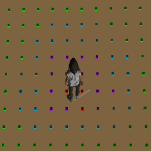
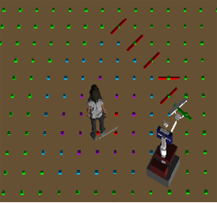
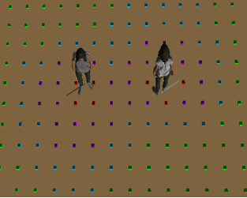
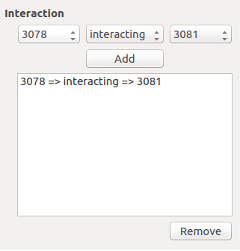
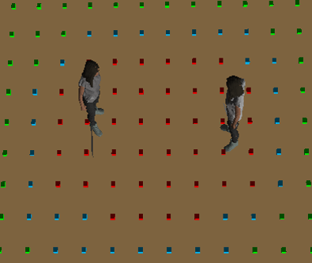

# A flexible way to consider the personal spaces

09/07/2018

## New Idea: Free graph space with costs 

After the study and modification of the free space graph, I have realised that there are a better way to "adapt" the personal space to the environment.

As I explained in my last post, the free space graph is represented by a set of nodes that are considered free or occupied. These nodes also have a parameter that represent the cost of each point. The robot plans the shortest path between the points of the graph taking into account the cost: the path is longer when the cost of the points are higher. Initially, all the points have cost = 1. 

Considering three spaces of different sizes around the person: intimate space, personal space and social space, the new idea consist in modify the cost of the graph according these spaces. The intimate space has been set to occupied, in order that the robot never crosses this area. The personal and the social spaces are set as free, but its costs have been increased, giving the personal space a higher cost than the social space. in this way, when the robot plans the shortest route, it will move away from the person, as crossing the personal and social spaces will mean that the path will be longer. 

This is a flexible way to adapt the spaces to the environment. The social and personal spaces are not considered occupied so if the robot doesn't have enouh space to navigate, for example in a corridor, if won't be blocked, but it will navigate through the social space, even if its cost is higher. If still doesn't have space, it will cross the personal space, but it will never cross the intimate one. 

Thanks to this idea, it is no longer necessary to derform the personal space in order to let space to the robot to navigate if it doesn't have enough. 
 
 &nbsp; &nbsp; &nbsp; &nbsp; &nbsp;   

In the figures can be shown the three spaces, in colour red is shown the intimate space, in purple, the personal space and in blue the social space. The points of the graph have been coloured according its costs. To determine the costs of each point, it has been calculated if the point is inside the polyline. 

 &nbsp; &nbsp; &nbsp; &nbsp; &nbsp;  &nbsp; &nbsp; &nbsp; &nbsp; &nbsp; 

The last picture shows that the planned path takes into account the costs so it moves away from the defined spaces around the person.

## Taking into account the personal interactions in the clustering.

The initial navigation algorithm uses a cluster algorithm in order to group the people in the environment according the distance. It is usefull but not always desirable, for example, in certain situations, the algorithm clusters persons even if they are not interacting to each other, what makes that the robot has less space to navigate. 

I have modified the navigation algorithm in order to cluster the people only if they are interacting. To this aim, the human agent has been modified to add interacting links between  persons. The navigation algorithm reads these links and separates people who are interacting from those who are not. If two people are interacting, the personal space of both is considered as occupied, so that the robot can not interfere in the conversation.
 
 &nbsp; &nbsp; &nbsp; &nbsp; &nbsp;  &nbsp; &nbsp; &nbsp; &nbsp; &nbsp;  

This picture shows two person who are not interacting so no clustering is done even if they are close. That allows the robot to navigate between them if it is necessary. 
 
 &nbsp; &nbsp; &nbsp; &nbsp; &nbsp;   

In the left can be seen the Human Agent interface, which adds the interacting link. In the right is shown the two interacting persons and the resulting graph. All the points of the graph inside the personal space are set as occupied. 

* * *
Araceli Vega Magro
