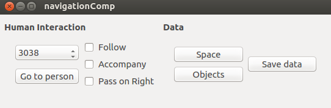

# Human blocking detector and other new functions

25/07/2018

## Human blocking detector

One of the main problems of the current navigation algorithm is that by giving humans their own space, there can be situations in which this space blocks the path of the robot.  In these cases it is necessary for the robot to approach the person who block him to request permission or collaboration. For this aim, it is required for the robot to be able to detect which humans block the road and which humans do not. The original navigation algorithm did not have any method for it, so I have created a new function to find out which humans block the path of the robot.

When the robot plans the trajectory towards its objective, it does so based on a free space graph, which has already been mentioned in previous posts. In this graph are included people in the environment, as well as their personal spaces. If the robot does not find a path to its goal, it calls the new function called checkHumanBlock. Below is explained the performance of this function:

1. The function uses an empty free space graph where the personal spaces are not included.

2. The route to the objective is planned based on this empty graph. If in this case a path is not found, it means that there are no humans blocking the road.

3. Otherwise, the personal spaces of each human  present in the environment are added one by one to the empty graph. These spaces are previously stored in a vector of polylines.

4. After adding each polyline, it is checked if this is the cause of the robot not being able to pass, planning again the path to the goal. If the robot does not find a route that means that the last polyline included is the one that blocks the path.

5. When it has been detected the blocking polyline, it is calculated which people are the owners of that personal space. For this, a polygon formed by the points of the polyline is created and it is calculated which humans are contained in this polygon. 

6. Finally, once it has been detected which humans block the road, his id is stored and will be used later by the high level planner to ask for permission or collaboration.

## Changes in the Social Navigation interface and new functions implemented

&nbsp; &nbsp; &nbsp; &nbsp; &nbsp;  &nbsp; &nbsp; &nbsp; &nbsp; &nbsp;  

The previous picture shows the new interface of the social navigation component. Four new functions have been implemented. These functions are explained below:

### Go to person

In the first place, this function has been created to allow the robot to approach a person with the objective of interacting with it. To do this, a button has been included that, when pressed, sends the robot to the front of the person. For the selection of the person a ComboBox has been created where the ids of the people present are inserted. This function will be used in the future along with the one explained above to approach people who block the path to ask permission or collaboration.

### Accompany and follow person

These functions have been created to allow the robot to follow or accompany the person. They are two similar functions, so I will explain them together. In the first place two exclusive CheckBoxes have been introduced, in such a way that if one is pressed, the other can not be. The person to be followed is selected or accompanied by the ComboBox that stores the ids of the people present. Each time the person moves, it is checked if one of these two options is selected. If so, the robot is sent to the side of the person if  accompany is selected or behind the person if follow is selected.

### Pass on right

Finally, a CheckBox called pass on right has been created. With this it can be selected the social behavior of passing on the right of the people. This function was introduced by Yohan, a student of the last GSOC. If it is selected this option, another gaussian curve turned to the left will be created which, when planning, will make the robot's route pass by the right of the people if possible. The gaussian curve will only apply to individual people and not to those who are maintaining an interaction. 

The following picture shows the new gaussian that makes the robot plan the shortest route going through the right of the person. It can be seen in green bars the path that the robot follows.

&nbsp; &nbsp; &nbsp; &nbsp; &nbsp;  &nbsp; &nbsp; &nbsp; &nbsp; &nbsp;  

* * *
Araceli Vega Magro
