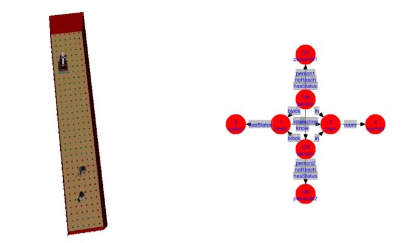
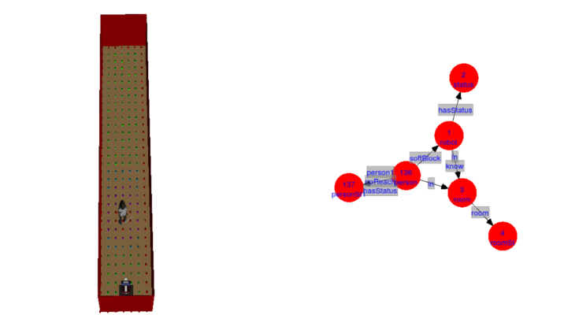

# Modifications in the DSR 

08/08/2018

## "Soft-Blocking" detection

As I explained in the previous post, certain situations can occur in which the robot can not navigate due to the personal space of humans. In the previous post it was explained how to detect the humans that blocks the path of the robot. However, there may also be situations in which the robot can pass, but the path is too close to the person. In these situations, the robot should know this to approach the person and ask permission to pass. In these situations, the blocking has been named as soft-blocking. 

To check if a person is "soft-blocking" the robot, the path to the goal is planned. If a path is found, it means that the person is not blocking the robot and then proceeds to check if it is soft-blocking the robot. The planned path consists of a series of points of the free space graph. A new function has been created in which it is checked if any point of the planned path crosses the personal space of each human present in the environment. If this occurs, the id of the person is stored in a vector. 

## Adding blocking and soft-blocking edges in the DSR

Once the people who block or soft-block the robot have been detected, it is necessary that the robot knows this information to later request permission. To do this, edges are added in the DSR between the person and the robot.

A new function has been created to add the links to the DSR. First, the ids of the people who block the robot are saved in a list. Every time the function is called, the ids of the people blocking the path are saved in a new list. If this list differs from the original, all the edges of the first one are deleted and the blocking edges are added between the robot and the persons of the new list. This function is only called if there are people in the environment.

In the next figure can be seen two person interacting who block the path of the robot. On the right can be seen the DSR in which block edges have been included between the two persons and the robot. In this situation, as the robot can not pass, "Block" edges are added.

&nbsp; &nbsp; &nbsp; &nbsp; &nbsp; &nbsp; &nbsp; &nbsp;  

In the next image is shown single person that does not block the path of the robot. However, it can be appreciated that the robot must pass very close to it, so the robot should ask permission in the first place. On the right can be seen that a "softBlock" link has been added to the DSR between the robot and the person.

&nbsp; &nbsp; &nbsp; &nbsp; &nbsp; &nbsp; &nbsp; &nbsp; 
