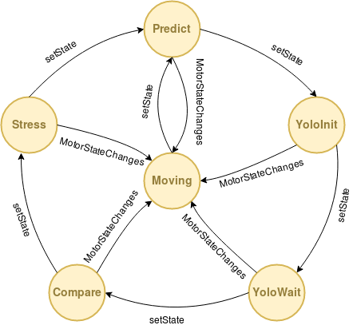

# My third post
12th June, 2018
## Deepening in the state machine
On the second post I talk about the state machine to control the system. At this post I am going to talk about these states to show what they do and what I have done.
Firstly, I am going to explain certain things that I did not tell before. To create an artificial consciousness, the first thing we need is "memory", the basis on which we will support the entire subsequent implementation. As we have already said, in the ideal case, this memory would be an .xml file in which the system can save the data during the execution, but, since all these data are not compatible with our file, we have made a hybrid between this .xml file from *innermodel* and the five auxiliary lists of type TObject. This type is an structure like this:
```C++
struct TObject
	{
		QString name; // Object name in innermodel
		std::string type; // Object type from YOLO
		bool explained; // True if object exists in the real world
		int idx; // Object number id
		std::vector<QVec> bb; // Bounding box
		std::vector<QVec> projbb; // Bounding box projection 
		float intersectArea; // Intersection area with YOLO Bounding box
		QPoint error; // Error from bounding box to YOLO
		QVec pose; // Object position over the table
		bool assigned; // Bool to check if object is assigned 
		float prob; // Probability of been the object detected by YOLO
		RoboCompYoloServer::Box box; // 3D box that contains the object
	};
  ```
These list support the things that *innermodel* can not store, like the bounding box important to know where is the object on the scene. The five lists are:
1. *listObjects*: total objects list that the robot controls as existing in the world.
2. *listYoloObjects*: objects list that Yolo server detects after analyzing the camera captured image at a certain time.
3. *listCreate*: new objects list that appear in a capture, either because, previously, Yolo server had not detected them or not with a probability higher than 35%, or because someone external has put on the field of vision of the robot a new object. These objects will be created at the right time.
4. *listDelete*: objects list that, in some previous capture, existed and no longer. It could be because Yolo server detected an object where it did not really exist, someone removed an object from the field of view of the camera or the memory that we loaded at startup was not completely updated.
5. *listVisible*: visible objects list at a given moment, that is, objects that at a moment enter complete in the field of vision of the camera. If, for example, the robot sees only part of the object in the capture, it is not taken as visible.

After contextualize, I can continue with the post.

### *Predict* state
This is the first state, where the machine starts. This initial state goes through the complete list of objects *listObjects* and, for each of them, it checks if it is within the limits of the capture of the camera, that is, if the robot would see it at that moment. If this condition is met, the box that is printed later on the green image is created, as shown in the next figure and, in addition, the object is added to the list of visible objects.


To perform this check, we obtain from the *innermodel* the camera on which we want to work, then, for each coordinate vector that forms the bounding-box of the object, it is transformed from the reference system of the object to the camera one and project on the camera.

If the coordinates that we obtain are delimited between 0 and 640, in the case of *x*, and 0 and 480, in the case of *y*, this object is in the vision scene at the moment in which we are calculating.

As you can see, what this introductory state really does, is a filter between the objects that the system will process or take into account in the next iteration of the state machine and those that do not, that is, the objects that enter within the vision plane of the robot and those that do not. These objects are synthetic, that is, they are the objects that the robot had stored in its "memory" as valid and well positioned, but then we must check whether this situation is real or not.

### *YoloInit* state
In this state, only the captured image of 640x480 pixels is sent to the Yolo server for processing. If the Yolo server works correctly, the image is sent through the proxy. If it does not work, for whatever reason, the state would return an exception, but the program would not stop.

### *YoloWait* state
If the Yolo server is working correctly, the results of the image processing are obtained, the list *listYoloObjects* is emptied and, for each object obtained from the Yolo server, an instance of type *TObject* is created and added to the list of Yolo objects. These objects are the ones that the camera is really seeing at the time of capture. Yolo, for each object, returns the type of object, the *(x, y)* coordinates of the upper left corner, the width and height and the probability of being the type of object that has been detected.

If the server does not work, the program returns an exception but does not stop.

### *Compare* state
At the beginning, the *listCreate* and *listDelete* lists are empty. Then, for each object in the visible list (synthetic objects), a candidate list called *listCandidates* is created. These candidates are of type *TCandidate*, a structure that stores a real number with the area of the candidate, a *QPoint* with the error and a pointer to the object of type *TObject* that is being treated. At the same time, for each object in the Yolo server list (real objects), if the object is of the same type, in our case "cup", and it has not yet been assigned to any of the synthetic objects, it is process. This processing consists of:
- A rectangle of type *QRect* is created with the coordinates of the real object.
- A rectangle of type *QRect* is created with the coordinates of the synthetic object.
- The intersection between both rectangles and the area of this intersection is calculated. The intersection is obtained by directly applying the *intersected* function of the class *QRect*, which returns a rectangle formed by the intersection of the previous two. From this rectangle, we can easily find its area by multiplying its width by its height.
- The displacement vector between the two rectangles is calculated, subtracting the center of both.
- If the area of the intersection is greater than zero and the displacement vector, measured by Manhattan distance, is less than twice the width of the rectangle of the synthetic object, a new candidate is created and added to the list of candidate objects ordering it from a larger area of intersection to smaller.

After completing this process, if the synthetic object has a candidate, a real object that is very close to its position, the first candidate real object is taken and the synthetic is marked as assigned and as explained.

In addition, if there is any visible object left unexplained, this synthetic object must be erased because, for some reason, it has disappeared in this iteration of the capture of the camera. This deletion is done later, for now, only the synthetic object is added to the list *listDelete*.

Finally, if there is any object left in the unallocated Yolo list, it means that there is an object that the system did not contemplate, but it has appeared in the scene. Then, a new instance *TObject* is created with the object type and the coordinates returned by the Yolo server. Finally, this new object is added to the object creation list *listCreate*.

### *Stress* state
In this state, three clearly differentiated processes are carried out: updating the position of the previously existing objects, deleting the objects that are no longer in the scene and creating the objects that have appeared for the first time in the scene.

Regarding the update of the position of existing objects, the list of visible or synthetic objects is taken and, for each object, if it is explained, that is, if there is an object in the real world similar to it and in a similar position.The *innermodel* or the "memory" of the robot is updated with the coordinates obtained in this iteration by the Yolo server. Before updating them, you must obtain the reference system that you want to update and then update it.

As for the deletion of objects, the list of objects to be deleted is scanned *listDelete* and, for each object of type *cup*, the node referring to this object is deleted from the .xml tree. Also, it is deleted from the list of objects visible at this moment and from the total objects of the world.

Finally, to create new objects, it is verified that the maximum number of objects that the robot can maintain in memory is not exceeded (in this case, it would be five, but it is a parameter that can be adjusted). If a new object can be added, the list of objects to be created is scanned *listCreate*, for each object, the coordinate transformation of the position of the object is obtained according to Yolo in the camera with respect to the table on the found, you get an own identifier that is not previously picked up by another object and the new object is created.
For the previous transformation we use the following code:
```C++
QVec ot = innermodel->transform("countertopA", n.pose, "rgbd");
```
Where *pose* is the coordinate vector of the position of the object, "countertopA" is the name of the table in the *innermodel* and "rgbd" is the name of the camera in the *innermodel*.

This new object of type *TObject* can not be added to the .xml, but its coordinates do, as a new transformation that hangs from the transformation of the table on which the object is located in the internal representation tree:
```C++
innermodel->newTransform(to.name, "", innermodel->getNode("countertopA"), ot.x(), ot.y(), ot.z(), 0, 0, 0);
```
Where *to.name* is the name of the new object, the parent node is the one returned by *getNode* and *x*, *y* and *z* are the coordinates of the new object.

In addition, a generic bounding box is created as we said at the beginning of 80x80x80mm and it is projected on the camera, if this projection is outside the limits of the capture, the tree node of the .xml must be deleted because it is not completely visible. This check is very important because, if not, as in the edges of the captured image the Yolo server usually fails more, errors occur in our system. Finally, if the object is fully visible and has been created correctly, it is added to the lists of visible objects and total objects in the world.

### *Moving* state
This state, as we have explained previously, is only an auxiliary state in which the state machine is maintained when the motors of the robot's neck are moving. It is necessary because it allows to stop processing what is captured during the movement: distorted images that add errors to our system. It is the way to keep the system active but unprocessed, until the capture of the camera is stable again.
Its only functionality is to go to the state *Predict*. If the motor were still moving in the next iteration, the state machine would go directly to *Moving*, because the movement check of the motors is prior to the execution of any state. Then it would revert to *Predict* until the motors finish their movement.

A scheme of the state machine would be:

