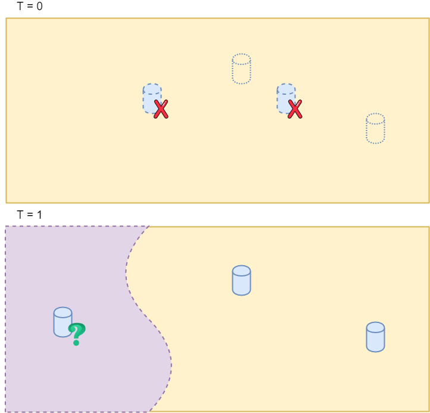
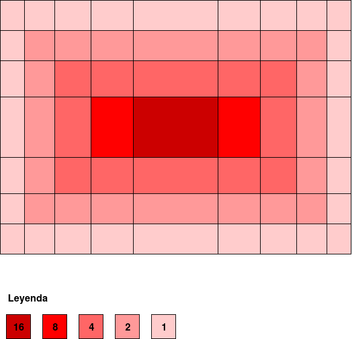

# My fifth post
4th July, 2018

## First improvement: thermal map
### The problem
With the first approach we have a problem. If we preload an enviroment with two cups on the table, the camera would start by locating these two, but, if they does not exist and it detects two new cups, then, the timers would start. They would alternate attention, then, if a part of the table had not been watched at the beginning, it would has never been looked. You can see it on next image:

The purple zone has never been visited, so the system don't know anything about it. It can not control if there is an object or not.

### The implementation
To improve the camera move, I modified the initial approach of having a counter for each object. Instead, I added a calorific map that controls the movement of the camera from one place to another on the table, this way, it does not leave areas unvisited, or only visit areas where there is or has been an object.

This map is presented as follows:
- The object control plane is reduced to the table on which the robot is focusing its attention at the start of the program.
- This plane is divided into 40x40 cells in coordinates of the table. That is to say, a grid is proposed on which the temperature value will be modified as if it was a thermal map.
- Each cell of the previous ones, has an initial value of temperature to zero that will increase or decrease depending on the situation of the objects on the table at each moment and the position of the camera.
- The map will be continuously cooled with a consistent constant descent temperature for the entire map, except for the areas where an object is located. Cells that touch an object will cool more quickly because they require, in principle, more attention.
- The map will heat up depending on the area where the camera is focused with a Gauss function. This means that, if a cell is into the projection of the camera at a certain time, this cell will see its temperature increased depending on its position in the image. If the cell is on an edge, it will heat up less than if it were in the central part of the image that would get hotter.
- The camera must always move towards the coolest areas of the table to not leave any part of the table plane unvisited.

To create the map, I used the class *std::unordered_map <Key, Value, KeyHasher>* , where *Key* is a pair that stores the *(x, y)* coordinates of the upper left corner of each cell in which the table is divided; *Value* is a structure that stores the *(x, y, z)* coordinates of the cell and its temperature; and *KeyHasher* is the hash code used to index the map.

Initially, we must fill in the map to know the position of each cell and, later, to be able to process them. It starts by dividing the table into cells of 40x40 mm and storing the coordinates of its upper left corner and its temperature to zero.

The method of the main thread that decided if the camera was moving according to the timers, must be modified to use the thermal map as a guide for the movement. At this moment, all the cells of the map of the table to which attention is being paid are traversed and the one with the lowest temperature is calculated. When the temperature of the cell with the lowest temperature is lower than a fixed threshold, the rotation angles that the camera needs to point to this cell are calculated. In this way, we go through all the zones of the table updating the *innermodel*. At the same time, the simulation of *innerviewer* is shown what is added or deleted in the .xml.

To move the camera depending on the map I have created three methods:
- *getMotorState()*: takes the position of the engines, calls the *findPointAttention()* method, and then the *centerAttention()* method. If this position varies from the previous one, it changes to the state *Moving*.
- *findPointAttention()*: this is the method that actually travels the map looking for the lowest temperature. When it finds it and is less than a fixed threshold, it must modify an attribute of the component called *posAttention*, which is in charge of storing the position at all times to which the robot must look at world coordinates.
- *centerAttention(): it focuses the attention of the robot, that is, modifies the position of the engines that is necessary to mantain the zone with lower temperature, or in other words, *posAttention*, always focused on the image that the robot captures through the camera.

#### Heating function

The Gauss heating function has been simulated with an implementation that calculates where each cell of the table is perceptible at that moment by the camera and according to its position with respect to the projection in the plane of the chamber heats up more or less. Visually, this function would be shown as in the following image:

On the camera capture the different cells of the grid of the table that is observed at that moment would be projected and, according to the position within the filter in which they were, the temperature would increase in one way or another. In the central part, as can be seen, the cells would be heated with greater intensity than at the edges, exponentially.

#### Cooling function
To cool, we need to take the position of each object on the table and calculate according to its dimensions (80x80x80) which cells of the calorific map would be touching. These cells would be the ones that would cool at a higher speed, although the rest of the map would cool down, as I said, constantly up to a fixed threshold.

These variations in temperature are what finally follows the algorithm of the system that moves the position of the engines. The camera always moves to the coldest areas of the map so that there are no unsupervised areas.

#### Results
The result of applying the functions of cooling and heating on the map is better than the previous form of timers, because those only depended on the objects that had previously detected or that were pre-loaded. In this way, if the camera accidentally detected objects in areas of the table visible at some point in the execution, it took them into account, but if they were not visible to the system, or preloaded, it would not know about their existence because it would leave areas of the table unexplored. With this improvement, we get that, although there are no objects in an area of the table, it is fully explored by getting more accurate information or more information.

To see the code [visit this link](https://github.com/ljmanso/objectDetection2/tree/dcec037616af845a8b0a6761df8927297686ec92).
