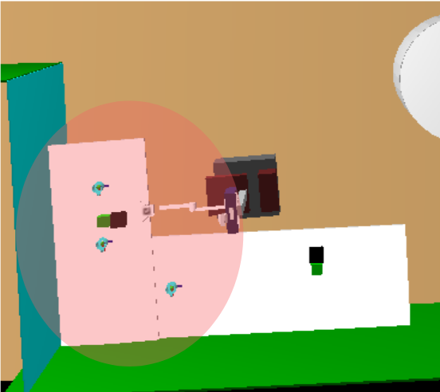

# My sixth post
19th July, 2018

## Second improvement: new object level
### The problem
Until now, the robot can only pay attention to a table, but if it sees something over another table it is able to integrate it into its memory but, in a bad way, because it thinks the cup is over the only table it knows. It does not know that exists another table, so it refers the cup to the only one it knows. Also, it only can move a bit to the right and to the left, so it is not possible to watch all the environment. So we think in add a new level, the tables level. This new level allows the robot to really control where the cups are, not only refers to a table, but to the tables it handles.
### The implementation
The second improvement that has been raised in the system is that the robot is able to control other tables in its environment and not only focus on one. This new level, would allow us in the future to continue ascending so that at the end the robot is able to control all its environment. Just as the type of objects we control so far is small, the type of surfaces to support these objects is also reduced with this second improvement, only the tables are taken into account, no other surface such as a bookcase or other furniture is handled by the moment.
To achieve a new level I have created a new structure that is the one that would handle the different tables in the environment. The structure would be the following:
```C++
struct Table
    {
      map tableMap;
      int id;
      QVec pose;
      QVec dim;
      long temperature;
      QString name;
      TObjects listObjects;
      TObjects listYoloObjects;
      TObjects listCreate;
      TObjects listDelete;
      TObjects listVisible;
    };
```
As we can see, this structure contains the previous lists to control the objects. These lists, now, belong to each table because attention differentiates one table from another, therefore, each table must only answer for the objects that are on it. We also have for each table the temperature map that controls the movement of the engines and the camera. In addition, we store the position and dimensions of the table, its name, its identifier and a number that contains the global temperature of the table. To load all this information, when starting the program, we read from *innermodel* what we need, such as the dimensions of the table, the name ...

With the temperature parameter the system must decide which table to look at. To make the decision to change the table, a threshold is necessary to indicate when the temperature is low enough to have to attend another table. The route is quite limited because the motors only allow 180º of movement, that is, 90º to the right and 90º to the left. As we do not yet have control of the base of the robot, we can not move other engines and we do not have the possibility to explore other areas of the environment.



First, you must load the lab tables that we are going to use into a table vector, which is an attribute of the class so that all methods have access to it. To do this, instances of type *Table* are created and the content is read from the *innermodel* to load all the necessary information.
Second, we create an integer named *processTable* attribute of the class. This number keeps every times the identifier of the table to which the robot is paying attention. This integer varies when the temperature of any table exceeds a set temperature threshold.

Getting it to pass from one table to another supposes a method added to the main thread so that it is executed as many times as the *compute* method is executed. This method is called *changeTable()* and is executed within the *getMotorState* method just before looking for the point of attention and centering it. This algorithm runs through the vector of complete tables and for each one of them it checks if it is the table to which attention is being paid. If so, the temperature will increase and, if not, it will decrease. This algorithm also checks for each table that the fixed threshold is not exceeded, negative in this case, because the lower the temperature, the longer it has been unattended. When the temperature of a table is lower than the set threshold, the integer *processTable* is updated with the identifier of the new table and the angles of rotation that the motors must move to point towards the table that requires attention. As already mentioned, this movement is limited, if the table is beyond its reach, Shelly can never get to see it.

To see the code [visit this link](https://github.com/ljmanso/objectDetection2/tree/f9c2c506ffcd7643711326cb980053b636f8498a).
