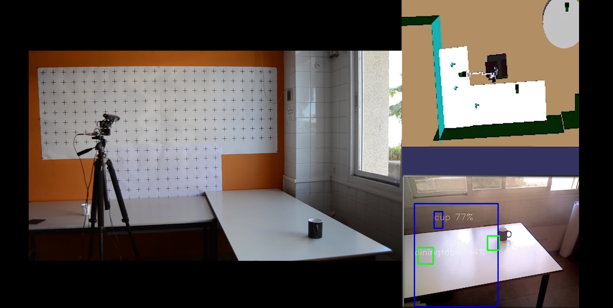
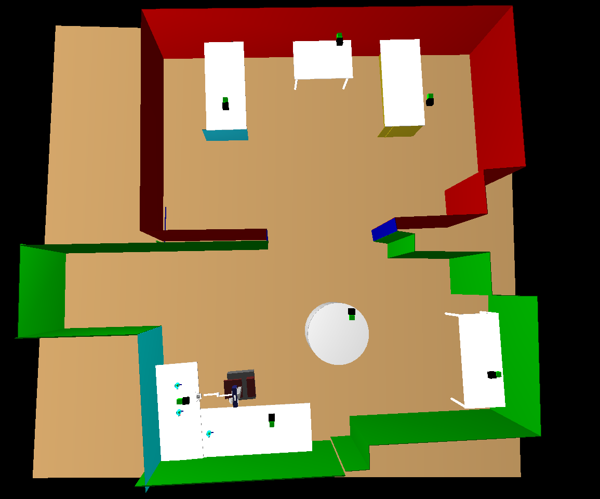
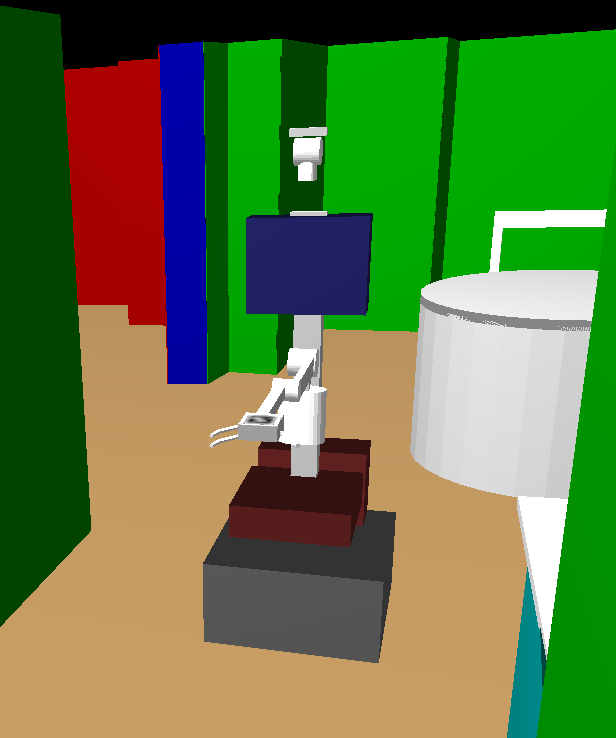
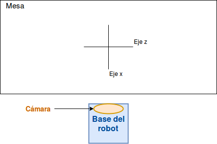

# My seventh post
1st August, 2018

This last month I’ve been doing the tests to try out the system. There are a lot of test because it is a complex system which must guarantee all its cases of use.

## Results
In this post we will expose the experiments carried out to prove the validity of our system and its operation. We will start by analyzing the test scenarios and, later, the tests themselves.

### Test scenario
During the development of the system, there are several significant inflection points: the initial creation without the engines with their testing phase, the expansion of the system by adding the movement of the engines, the improvement of the system with the thermal map and the improvement by adding a new highest level of objects.
To test the proposed attentional control system, a series of experiments has been conducted within the *RoboLab*'s research apartment. This scenario includes two tables forming an “L”, as can be observed in figure 1. The robot head (camera and neck) has been mounted on a tripod, since, for these experiments, it is not necessary to use the robot base.

For each experiment, a video has been recorded showing the robot behaviour in three different views. Previous figure shows an example snapshot. In this figure, three different parts can be distinguished: the real environment (left), the internal representation of the environment (top-right) and the robot camera capture (bottom-right).
As for the software, the first test scenario was on a state machine with only five states: *Predict*, *YoloInit*, *YoloWait*, *Compare* and *Stress* . These are the states that actually obtain the image, process it and handle the information. When this simple detection functioned correctly, we began to add the movement of the engines, integrating the state *Moving* to the state machine. From here, we carry out the convenient tests.
In both scenarios, we must bear in mind that the XML file that we load must contain the representation of the environment that surrounds the robot, with exact measurements. For example, the height, width and length of the tables in the simulation should be the same as in the real world, measured on it. In this case, we have more information than necessary, because the file that we load, called “autonomyLab.xml”, contains a representation of the complete testing laboratory, as can be seen in the following figure:

To see this simulation, we use the RCIS tool from RoboComp that allows us to visualize the loaded file in three dimensions.

As we discussed earlier, this simulation requires both the laboratory simulation file and the base of the robot *Shelly* with which we are working. This second simulation is an XML file, which contains a tree of components that compose the robot. The result of executing the base shows the simulation of the robot:

For our experiments, we just need to know the situation of the robot in the world, of the tables in the world and their respective axes of coordinates. The axes of the apartment are not centered. The *x* axis with the *z* form the floor plan of the room, while the *y* axis is the vertical axis of the simulation. In turn, the coordinate system of the test tables is centered on the tables with their axes aligned with those of the world, *x* and *z* forming the plan of the board of the table and *y* the vertical axis , as already commented. The initial table with respect to the robot would look like this:

At the beginning of the execution of our system, the robot is well positioned, because we have adjusted the values of the simulated world with those of the real one, so that the testing environment is as close as possible to the real one. The initial position is in front of the initial table where the cups are located.

Also, when starting the program, the position of the engines is always modified to put them at (0,0), so that the system always starts with the same initial values.

### Experiments
#### Initial experiments
We start by making static captures of the camera, therefore, the system can only detect changes that take place in its vision scene, it can not take into account any of the objects that it does not perceive by the camera. If there is a glass on the table that is observing the robot but outside its field of vision, it will load it from the XML file, but it will not be able to verify its existence in the real world. This is our case, in which the robot only perceives one cup even though there are two in the model and it loads both when starting the simulation.
In the first test configuration, the simulated world only has one cup on the table and is in its field of view. The cases that may appear are:
- In the real world there is no object in its field of vision. Then, the robot deletes the node corresponding to the cup from the XML file and updates its list of total objects. It also removes it from its visible list and updates the *innerviewer* by deleting the simulation cup.
- There is an object in the real world.
    - This object may be in a position very similar to the one stored in the *innermodel*, so it only updates its position, and it is added to the list of visible objects.
    - It may be that the object is in a completely different position than the one stored in the XML file, then, delete the old object from the *innermodel* and create a new one, because it takes it as new, so it is added, replacing the previous one, the list of total objects, the list of visible objects and the *innerviewer*.
    - The last possibility is that the Yolo server does not correctly detect the object or is just within the limits of the capture, which as we have observed, causes many errors and we do not take it into account, that is, it is treated as if the real object does not exist and is deleted from the list of total objects and *innerviewer*.
    
- In the real world there is no object at the beginning, but then someone adds it. At this case, the simulation would start by checking the object that we obtain when reading the XML file. Since it is not there, it deletes it from the system. Afterwards, someone puts a new cup on the table in his field of vision, then, it detects the introduction of the hand in the image and the cup that would be added to the *innermodel* and the *innerviewer* in the position that receive the Yolo server system.

- In the real world there is the object, but throughout the test someone removes it. The system would begin by correctly detecting the object, but when it disappears, it perceives that change and updates its model by erasing the cup from its field of vision.

- In the real world there is more than one object.

- If one of the objects looks enough like the memory loaded, it is taken as the old one and the rest is positioned in the XML file according to the data obtained by the Yolo server.

- If none of the objects is in a situation similar to the one loaded, the old object is deleted and new detected ones are added to the memory, to the system lists and to the *innerviewer* in the positions obtained by the server of Yolo.

Among the most frequent problems that we have encountered is the problem that Yolo does not correctly detect an object. This problem is derived from the lighting of the environment in which the robot is located. As the system is subject to changes in light, we have equalized the image, increasing the contrasts of the obtained captures and obtaining better results with the Yolo server.

#### Experiments with engines

In this second experimental section, movement is added to the camera, so that the robot can control more parts of its environment. The initial approach was that the system modified its resting state only when something caused it to move, for example, the timer that each object had. Thus, when the timer of a table object exceeded a fixed threshold, the position of that object was obtained, that of the motors and what each would have to move to be able to position in the center of the image that object that had the most time without being attended. The movement was made and returned to the state *Predict*.

This caused two possible errors:
- The first was that it left areas of the table unexplored, because if there was no object in an area, nothing was going to make the robot look at that area during execution.

- In turn, this problem implied another, if there was an object in a part of the table without exploring, the system could never know of its existence, because it would never explore that area of the table.
In this type of tests, therefore, information could only be obtained from objects that were initially loaded in the *innermodel* or from objects that were randomly found in the field of view of the camera at some time and were correctly detected by Yolo.

#### Experiments with the thermal map

To correct the two previous errors, we added the thermal map. This map is a grid projected on the plane of the table, which indicates more or less hot areas. The camera should always move towards the coldest areas, that is, the whole table will be scanned, leaving no part unvisited and, therefore, no unidentified cup.

By adding this thermal map you can already perform more complex and explanatory tests.
The aim of the first experiment is to test the ability of the robot to track objects. The expected behaviour is that the robot keeps attention fixed on an object during the time it is moving. This implies that the robot has to continuously recalculate the position of its engines to maintain the object centred on the image. The thermal map plays an important role in this behaviour, since moving objects intensely cool a new area of the table that makes the camera to move and centre on this new attention point. If the object ceases its movement, the robot holds the attention for a few seconds, but then it diverts it to another colder area of the table. To perform this test, we have used a single cup that has been moved on the table with the help of a person.
The video of this test is available in the following [link](https://youtu.be/TZZbTtW21vE).

The second test consists of alternating attention between two cups. To do this, two cups are initially placed on a table in the internal representation. The robot begins observing its environment, detects the position of the first cup it finds and focuses on it. Since the cup is not moving, the robot can divert its attention to other colder zone. As there are two preloaded cups, the map will cool those areas more intensively until it checks that they do not exist in the real world. When the robot stops attending to the first cup that has been found, attention is directed to the new coldest zone, which is the area of the synthetic cup of the internal representation. If it finds a real cup on the way, it focuses on it until its temperature increases enough to divert its attention again. Then, it goes back to find the first cup that remains in the same position. This behaviour continues for a while alternating between both cups until other areas of the table demand attention, i.e., present a very low temperature in the thermal map. Then, the camera focuses in a new selected area, which correspond to the coldest cell in the table map. Since there is no other object in this third area, it heats up quickly and the previous cups captures the attention again. If, after looking at this third zone, a third object was found, attention would alternate among the three existing objects.
Results from this test are available through the following [link](https://youtu.be/bkswvoK188M).

For the third experiment, the previous two tests have been combined: maintenance of attention and \textit {tracking} with more than one object. The experiment starts with the robot tracking a moving cup. At a certain moment, the cup stops moving and a new cup appears in the scene. Since this cup has not been seen before, it obtains the focus of attention. Then this second cup starts moving. Although both cups are still in the scene, the one that is moving is the one that captures the attention, since it varies the zone of minimum temperature. When the second cup stops moving, attention returns to the first cup. If the first cup starts moving again, it keeps the robot attention until it stops. We stop one cup next to the other. This implies that both must receive the same degree of attention, because both of them are static. Then, attention starts alternating. A video with the results of this experiment can be found at the following [link](https://youtu.be/DoxEQk\_JEi0).

To complete the experiments, we have tested the robot behaviour in situations in which attention must be divided among different tables. Thus, now the system can pay attention to more than one table, but only to one at a specific time. This means that the focus is on a single table, even if the system captures more information and keeps updating its environment.

Changing the focus of attention from one table to another is produced when the minimum global temperature goes under a certain threshold. When this happens, it means that there is another table that requires more attention. Then, the system analyzes the map of the new table and look for the coldest area, which is where the camera will move. In this experiment, when the camera reaches the second table, it is empty. Then, a cup is added and it gets the focus of attention. The attended table is maintained for a while until the first table again requires attention. The attention time on each table can be adjusted.
In the following [link](https://youtu.be/kT-OAfUe6FA) a test with a small time interval in the table change can be found.
