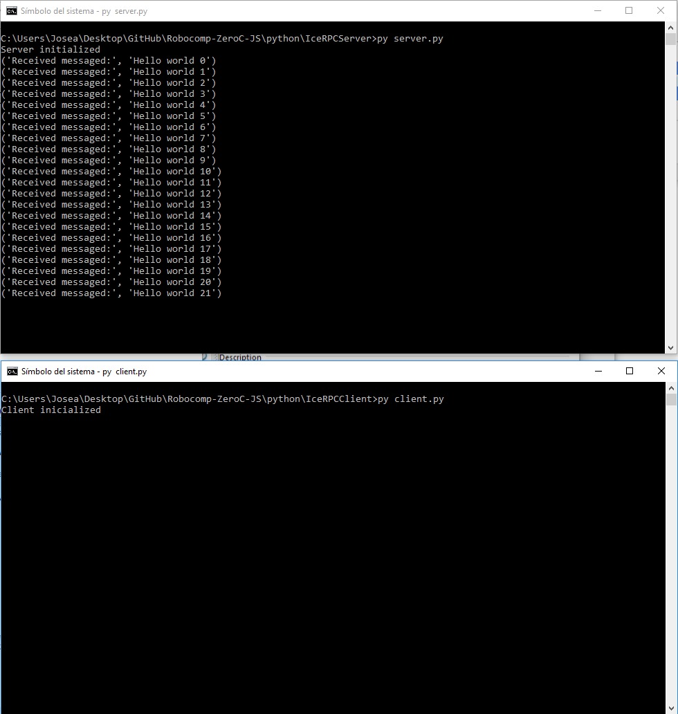

# First steps with ZeroC Ice

May 20, 2018

## Introduction

The first step to create a component in ZeroC Ice in Python. For this we will create three differents parts, the interface, a server and a client. We will define each of the parts below. I would like to thanks to RoboComp’s team their support.

## Interface

An interface is a collection of named operations that are supported by an object. Clients issue requests by invoking operations.
Our initial test file, only has a method: printText with a string parameter, that is the text string that we are going to send through Ice middleware

```
module RPCConection {

   interface TextServer {
       int printText(string name);
   };

};
```

Our interface file can be converted to several programming languages such us C++, Python or JavaScript, using the slice2 tool. In our first example we will need to convert it to Python, so we have to use slice2Py. 
I would like to note that all the methods defined in the interface have to be implemented by the server.

## Server

An Ice server is any program that implements an operation. Servers are passive entities that provide service in response to operation invocations from clients.
On the server, we define a class that will implement the methods defined in the interface file. To do this, the class inherits from the object defined in the interface.

```
class Server(RPCConection.TextServer):
```

As we have said before, the class that implements the interface should define every methods that we have included in the interface. (in this example it is only one)

```
 def printText(self, text, current=None):
        print("Received messaged:", text)
        return 1
```

In our example, our method “printText” receives a text string in the variable called “text” and his content is shown on the screen using print function and the method returns 1.
Once created the object that is in charge of receiving the requests, we need to create the server itself:

First of all,  we should create a variable of the class that implements the server:

```
object = Server()
```

Initialize the Ice module

```
# Ice initialization
ic = Ice.initialize(sys.argv)
```

Secondly, we should define an adapter and indicate the type of connection and the port where we are going to listen

```
# Network name and port to be published
adapter = ic.createObjectAdapterWithEndpoints("RPCConection", "default -p 9000")
```

Then, we define the name with which our server will be identified in the network (“RPCServerName”)

```
adapter.add(object, ic.stringToIdentity("RPCServerName"))
```

We started the adapter

```
adapter.activate()
```

The previous command launch up the server. The server will keep running until a closing message arrives. In our example this never happens, so we have to kill the process

```
ic.waitForShutdown()
```

## Client

An Ice client is any program that invokes an operation on an Ice object. In other words, clients are active entities that issue requests for service to servers.

First, we load the Ice file on the client side

```
# Load Ice interface file
Ice.loadSlice('RPCConection.ice')
import RPCConection
```

In our client, we create a basic class with the unique function of sending a text string

```
# client to call RPCServer
class Client():
    proxy = None  #proxy to server
    count = 0
    def __init__(self, proxy):
        print ("Client inicialized")
        self.proxy = proxy

    def process(self):
        self.proxy.printText("Hello world " + str(self.count))
        self.count += 1
```

The proxy object that we passed as a parameter in the creation will be responsible for connecting to the server. For us, this is transparent, we only have an instance of the other class. It completely frees us from the management of network communications and also takes charge of type conversions if necessary. This is one of the fundamental advantages of using Ice.
Now, we need to create a connection proxy to the server in main program (script). As you can see, the creation process is quite similar to the server part

```
# Ice initialization
ic = Ice.initialize(sys.argv)
```

The next step is to transform the proxy chain (one string) into an object. It is necessary to use the same name used in the network adapter, the type of connection and the port in which we are going to connect

```
# proxy object from string
proxy = ic.stringToProxy("RPCServerName:tcp -p 9000")
```

Now we convert the proxy to the object that we need. For this, we have to write the module and the interface information

```
# create proxy
proxyServer = RPCConection.TextServerPrx.checkedCast(proxy)
```

Finally we pass the proxyServer object to the client and now we can send messages. In this example we implemented an infinite loop to test it

```
# Client object
client = Client(proxyServer)
while True:
  client.process()
  time.sleep(1)
```

## Conclusion

As a result, we can see in the following image our localhost state. As you can see, the server is started, and after the client is launched, the server start to receive the messages sent by the client. 

 

