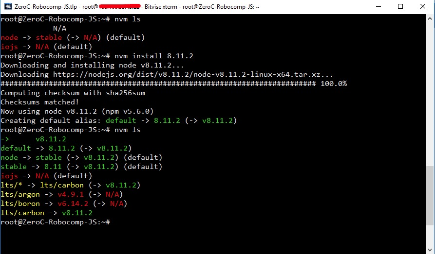

# Add Javascript to ZeroC Ice

Jun 10, 2018

## Introduction

Once we have created both the server and the client for ZeroC Ice in python (see post XXX), we are ready to create a new Javascript client implemented in NodeJS, which uses the interface file created for the previous step.

## Interface

In the illustrative example described in the previous post, our interface file had only one method, printText with a String parameter. The first task is, that we have to do is convert it to Javascript. For this we first installed the slice2js library, using NPM (Node Package Manager).

```
npm install -g slice2js
```

Once installed, we simply have to go to the interface path and execute the following command:

```
slice2js RCPConection.ice
```

This command translates our interface file to the JavaScript language. Ready to be used by our ZeroC Ice client in Javascript.

## Server

As server we will continue using our class developed in Python. Its function is to be able to check the connection of a ZeroC Ice server in python, with a ZeroC Ice client in Javascript.
Therefore, we only have to execute the next command:

```
py server.py 
```

## Client

Once we have both the Interface file and the server running in Python, we create the client in Javascript, using NodeJS. For this, we need to install and configure NodeJS on our machine.

### NodeJS

A good and brief description of NodeJs can be found in Wikipedia:
Node.js is an open-source, cross-platform JavaScript run-time environment that executes JavaScript code server-side. Historically, JavaScript was used primarily for client-side scripting, in which scripts written in JavaScript are embedded in a webpage's HTML and run client-side by a JavaScript engine in the user's web browser. Node.js lets developers use JavaScript to write Command Line tools and for server-side scripting—running scripts server-side to produce dynamic web page content before the page is sent to the user's web browser. Consequently, Node.js represents a "JavaScript everywhere" paradigm, unifying web application development around a single programming language, rather than different languages for server side and client side scripts.

To use NodeJS in our machine, we install it using NVM (Node Version Manager) that will help us to keep the different versions of NodeJS organized in our machine. Therefore the first thing will be to install NVM, to then install the latest stable version of NodeJS

NVM Install
```
curl -o- https://raw.githubusercontent.com/creationix/nvm/v0.33.11/install.sh | bash
```

NodeJS Install
```
nvm install v8.11.3
```

 

Now we have installed on our NodeJS machine and we can start implementing our ZeroC Ice client in NodeJS.
### Develop the Client

First, we will be to create a project with NPM. For this, from the terminal, we execute the command:

```
npm init
```

This command creates a main JS file, from our NodeJS project, and a package.json file to describe our project, the version, and the mandatory dependencies to execute our project properly.

```
{
  "name": "icerpcclient",
  "version": "1.0.0",
  "description": "ZeroC Ice - NodeJS client",
  "main": "client.js",
  "scripts": {
    "test": "echo \"Error: no test specified\" && exit 1"
  },
  "author": "Joanes04",
  "license": "ISC",
  "dependencies": {
  }
}
```

The next step, it is install the dependencies that we will need in our project. The only package we will need in this case, will be Ice, so we will install it:

```
npm install Ice --save
```

Consequently, our package.json file will be as follows:

```
{
  "name": "icerpcclient",
  "version": "1.0.0",
  "description": "ZeroC Ice - NodeJS client",
  "main": "client.js",
  "scripts": {
    "test": "echo \"Error: no test specified\" && exit 1"
  },
  "author": "Joanes04",
  "license": "ISC",
  "dependencies": {
    "ice": "^3.7.1"
  }
}
```

Once we have created our NodeJS project, we write our code that will be responsible for creating the client, and communicate with our server created in Python.
First, we need to include the libraries for our project, in this case ICE and our RPCConnection interface file:

```
var Ice = require('ice').Ice;
var RPCConection = require("./RPCConection").RPCConection;
```

Once included, we declare our communicator and our proxy to generate our client in Javascript:

```
var communicator = Ice.initialize(process.argv);
var base = communicator.stringToProxy("RPCServerName:tcp -h localhost -p 9000");
```

Finally, we perform the casting of our interface file and we can use the methods declared in that file as if they were a variable:

```
RPCConection.TextServerPrx.checkedCast(base).then(
    function (printer) {
        printer.printText("Hello world from JS ");
        communicator.destroy();
    }, function (error) {
        console.log(error);
    });
```

Our JavaScript client to ZeroC Ice is ready! We can check the connection with our server (written in Python). 
