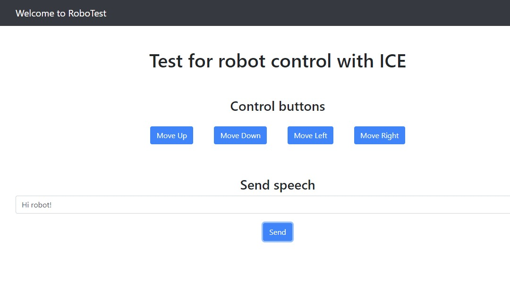
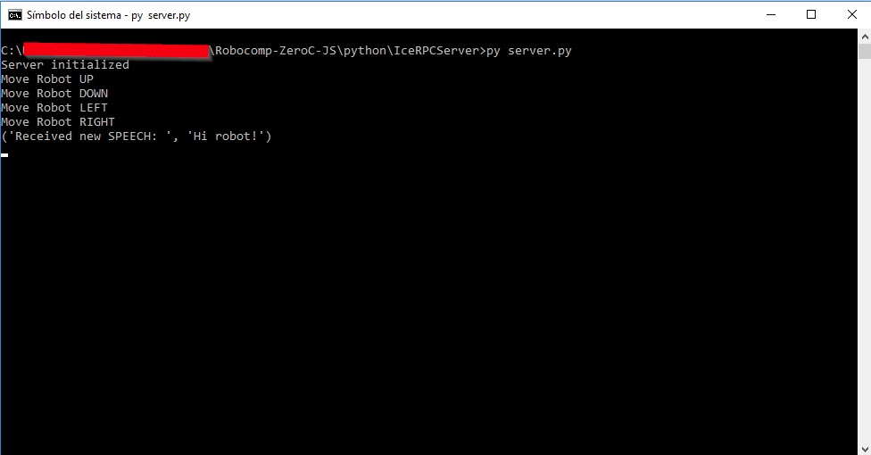

# First Web application ZeroC Ice

Jul 10, 2018

## Introduction

In the previous posts we showed how to create a Javascript client implemented in NodeJS. We are going to create a new client, that uses a new interface file, that can be run in a browser, that is, a web application using ZeroC Ice.

## Interface

First, we created a new interface file, adding new methods:

```
module RPCConection {

    interface RobotServer {
        int printUp();
        int printDown();
        int printLeft();
        int printRight();
        int printSpeech(string name);
    };

};
```

## Server

The server, as before, has been developed and runs in Python, but we need to define the new methods of the interface:

```
   def __init__(self):
        print ("Server initialized")

    def printUp(self, current=None):
        print("Move Robot UP")
        return 1

    def printDown(self, current=None):
        print("Move Robot DOWN")
        return 1

    def printLeft(self, current=None):
        print("Move Robot LEFT")
        return 1

    def printRight(self, current=None):
        print("Move Robot RIGHT")
        return 1

    def printSpeech(self, text, current=None):
        print("Received new SPEECH: ", text)
        return 1
```

## Client

Once we have both the Interface file and the server running in python, we create the client in Javascript, which will be a very basic application using the Bootstrap and Jquery framework for functionality and styles.
First of all we create a basic structure, for that we create the following directories and files:

```
css/          # app global css variables and theme
js/           # app global javascript file
interface/		# Interface file definition
vendor/       # shared module (common frameworks) 
gulpfile.js		# toolkit for automating painful or time-consuming tasks in your development
index.html    # html entry point
```

Once the structure of our project is created, we would like to point out its most important aspects.

### index.html

Index.html contains five buttons, which make calls to functions defined in our app.js. file. These functions will be used to call the methods defined on the interface. The future target of the first four buttons is to move the robot, in the typically four directions of the 2D spaces, left, right, up and down, and, the last one is set the speed.

```
<button type="button" onclick="moveUp();" class="btn btn-primary arrow">Move Up</button>
<button type="button" onclick="moveDown();" class="btn btn-primary arrow">Move Down</button>
<button type="button" onclick="moveLeft();" class="btn btn-primary arrow">Move Left</button>
<button type="button" onclick="moveRight();" class="btn btn-primary arrow">Move Right</button>
```

On the other hand, one of the most important parts of our index.html file is the inclusion of the Scripts for the correct use of ZeroC Ice. For this we first include the Ice.js and then our interface file already converted to Javascript.

```
<script src="https://cdnjs.cloudflare.com/ajax/libs/ice/3.7.1/Ice.js"></script>
<script src="./interface/RPCConection.js"></script>
```

### app.js

In this file, we first create our communicator and our proxy. It is important to note that the connection through the proxy will be made by WebSocket and not by TCP, using port 9000

```
const communicator = Ice.initialize();
const proxy = communicator.stringToProxy("RPCServerName:ws -h localhost -p 9000");
```

Now we define the functions that are called from the Index.html by means of the buttons.

```
async function moveUp() {
    try {
        const test = await RPCConection.RobotServerPrx.checkedCast(proxy);
        await test.printUp();
    }
    catch (ex) {
        console.log(ex.toString());
    }
    finally {
        // if (communicator) {
        //     return communicator.destroy();
        // }
    }
}

async function moveDown() {
    try {
        const test = await RPCConection.RobotServerPrx.checkedCast(proxy);
        await test.printDown();
    }
    catch (ex) {
        console.log(ex.toString());
    }
    finally {
        // if (communicator) {
        //     return communicator.destroy();
        // }
    }
}

async function moveLeft() {
    try {
        const test = await RPCConection.RobotServerPrx.checkedCast(proxy);
        await test.printLeft();
    }
    catch (ex) {
        console.log(ex.toString());
    }
    finally {
        // if (communicator) {
        //     return communicator.destroy();
        // }
    }
}

async function moveRight() {
    try {
        const test = await RPCConection.RobotServerPrx.checkedCast(proxy);
        await test.printRight();
    }
    catch (ex) {
        console.log(ex.toString());
    }
    finally {
        // if (communicator) {
        //     return communicator.destroy();
        // }
    }
}

async function sendSpeech() {
    try {
        const test = await RPCConection.RobotServerPrx.checkedCast(proxy);
        await test.printSpeech(document.getElementById("speech").value);
    }
    catch (ex) {
        console.log(ex.toString());
    }
    finally {
        // if (communicator) {
        //     return communicator.destroy();
        // }
    }
}
```

## Conclusion

To finish, we launch our web application using our Gulp tool. Gulp.js is a build system that allows you to automate common development tasks, such as minifying JavaScript code, reloading the browser, compressing images, validating code syntax, etc.
Therefore, we now proceed to verify that it connects perfectly to our server in Python, and we obtain the expected behavior when pressing the different buttons.
The next step, will be try to get to move the robot’s base.

 

 


