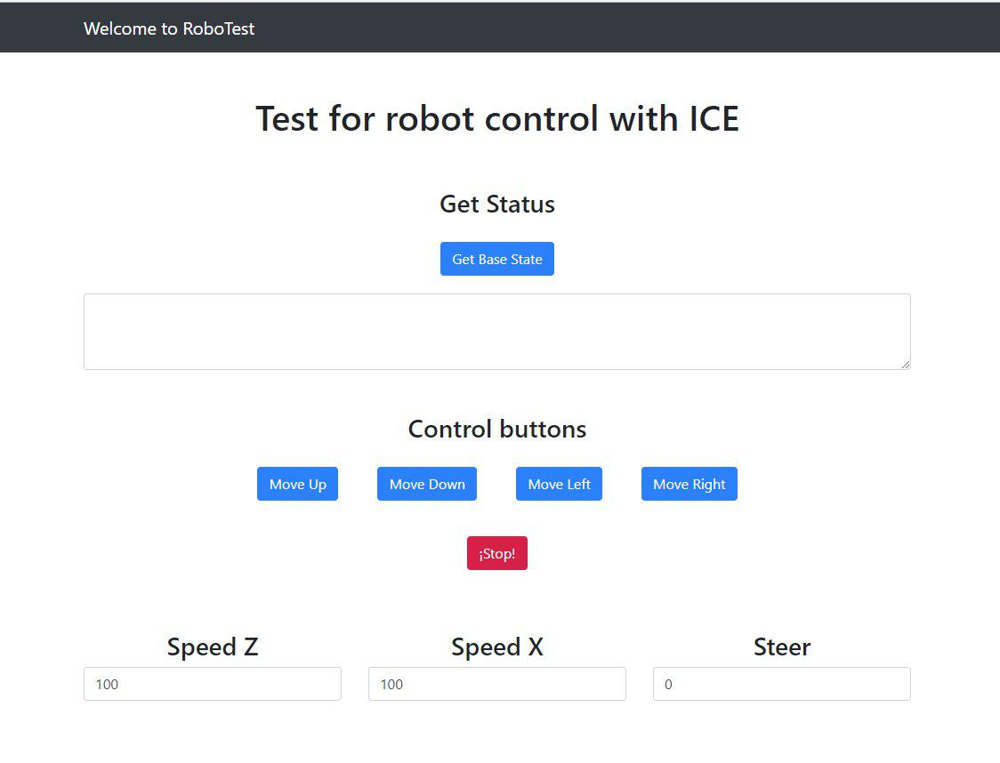

# Connection with the robot: Demo Test
Aug 10, 2018

## Introduction

As a final goal of our stage in the Google Summer of Code we want to be able to interact from a web client with the RoboComp simulator (RCIS). We would like to point out that, just as we have been able to move the robot in simulation, we can do it with the real robot, since communication with the real robot and with the simulator are transparents.
Therefore, in this last post we show how we achieved it and we attach a video of the client's functioning and the robot movement in the simulator, of course, in real time.
--- Finally, and thanks to Robolab team, we have been able to move a real robot!! An amazing gift to close my participation in GSOC 18. See the video on ----

## Interface

Due to we want to connect with the Robot, we need an interface file that uses the Robot to "interact" with it. That's why we use the following interface file

```
module RoboCompOmniRobot{

	["cpp:comparable"]
	struct TMechParams{
		float temp;
		float maxVelAdv;
		float maxVelRot;
		string device;
		string handler;
	};

	interface OmniRobot{
		void  getBaseState(out RoboCompGenericBase::TBaseState state)throws RoboCompGenericBase::HardwareFailedException;
		void  getBasePose(out int x, out int z, out float alpha)throws RoboCompGenericBase::HardwareFailedException;
		void  setSpeedBase(float advx, float advz, float rot)throws RoboCompGenericBase::HardwareFailedException;
		void  stopBase()throws RoboCompGenericBase::HardwareFailedException;
		void  resetOdometer()throws RoboCompGenericBase::HardwareFailedException;
		void  setOdometer(RoboCompGenericBase::TBaseState state)throws RoboCompGenericBase::HardwareFailedException;
		void  setOdometerPose(int x, int z, float alpha)throws RoboCompGenericBase::HardwareFailedException;
		void  correctOdometer(int x, int z, float alpha)throws RoboCompGenericBase::HardwareFailedException;
	};
};
```

## Server

The server is running on a server that we have set up especially for this test, in one of the servers of the University of Extremadura. The server will be running a RoboComp’s Robot Simulator and "waiting" for requests to perform movements.

## Client

Continuing with the same "post3" structure, we continue to develop our Web application to interact with the Robot using the new interface. To do this, we modified our index.html file and our app.js file

### index.html

Our index.html will now have the "Up, Down, Left, Right and Stop" movement buttons. We have added Stop to avoid problems.

```
<button type="button" onclick="moveUp();" class="btn btn-primary arrow">Move Up</button>
<button type="button" onclick="moveDown();" class="btn btn-primary arrow">Move Down</button>
<button type="button" onclick="moveLeft();" class="btn btn-primary arrow">Move Left</button>
<button type="button" onclick="moveRight();" class="btn btn-primary arrow">Move Right</button>
<button type="button" onclick="stop();" class="btn btn-danger arrow">¡Stop!</button>
```

We have also added a button and a text box, to know the status of the Robot, and that will be updated by the app.js file (will be explained later)

```
<div class="col-lg-12 text-center">
        <h3 class="mt-5"> Get Status </h3>
        <button type="button" onclick="getBaseState();" class="btn btn-primary arrow">Get Base State</button>
        <textarea class="form-control" id="status" rows="3"></textarea>
</div>	
```

```
   <div class="row">
      <div class="col-lg-4 text-center">
        <h3 class="mt-5"> Speed Z</h3>
        <input type="number" min="0" value="100" step="1" id="speedZ" class="form-control" placeholder="Speed Z" aria-label="speedZ"
          aria-describedby="basic-addon1">
      </div>
      <div class="col-lg-4 text-center">
        <h3 class="mt-5"> Speed X</h3>
        <input type="number" min="0" value="100" step="1" id="speedX" class="form-control" placeholder="Speed X" aria-label="speedX"
          aria-describedby="basic-addon1">
      </div>
      <div class="col-lg-4 text-center">
        <h3 class="mt-5"> Steer</h3>
        <input type="number" min="0" value="0" step="0.01" id="steer" class="form-control" placeholder="Steer" aria-label="steer"
          aria-describedby="basic-addon1">
      </div>
    </div>
```

### app.js

In this file, we create our communicator and your proxy, which will be used by the methods of said file.

```
const communicator = Ice.initialize();
const proxy = communicator.stringToProxy("omnirobot:ws -h 158.49.247.121 -p 9000");
```

Now we define the functions that are called from the Index.html by means of the buttons.

```
async function getBaseState() {
    try {
        const test = await RoboCompOmniRobot.OmniRobotPrx.checkedCast(proxy);
        await test.getBaseState()
            .then(result => {
                var status = document.getElementById('status');
                status.innerHTML = 'X : ' + parseInt(result.x) + '\n' + 'Z : ' + parseInt(result.z) + '\n' + 'Alpha : ' + result.alpha;
            });
    }
    catch (ex) {
        console.log(ex.toString());
    }
    finally {
        // if (communicator) {
        //     return communicator.destroy();
        // }
    }
}

async function moveUp() {
    try {
        const test = await RoboCompOmniRobot.OmniRobotPrx.checkedCast(proxy);
        await test.setSpeedBase(0, + document.getElementById("speedX").value, 0);
        setTimeout(function () { test.stopBase(); }, 500);
    }
    catch (ex) {
        console.log(ex.toString());
    }
    finally {
        // if (communicator) {
        //     return communicator.destroy();
        // }
    }
}

async function moveDown() {
    try {
        const test = await RoboCompOmniRobot.OmniRobotPrx.checkedCast(proxy);
        await test.setSpeedBase(0, - document.getElementById("speedX").value, 0);
        setTimeout(function () { test.stopBase(); }, 500);
    }
    catch (ex) {
        console.log(ex.toString());
    }
    finally {
        // if (communicator) {
        //     return communicator.destroy();
        // }
    }
}

async function moveLeft() {
    try {
        const test = await RoboCompOmniRobot.OmniRobotPrx.checkedCast(proxy);
        await test.setSpeedBase(- document.getElementById("speedZ").value, 0, 0);
        setTimeout(function () { test.stopBase(); }, 500);
    }
    catch (ex) {
        console.log(ex.toString());
    }
    finally {
        // if (communicator) {
        //     return communicator.destroy();
        // }
    }
}

async function moveRight() {
    try {
        const test = await RoboCompOmniRobot.OmniRobotPrx.checkedCast(proxy);
        await test.setSpeedBase(+ document.getElementById("speedZ").value, 0, 0);
        setTimeout(function () { test.stopBase(); }, 500);
    }
    catch (ex) {
        console.log(ex.toString());
    }
    finally {
        // if (communicator) {
        //     return communicator.destroy();
        // }
    }
}

async function stop() {
    try {
        const test = await RoboCompOmniRobot.OmniRobotPrx.checkedCast(proxy);
        await test.stopBase();
    }
    catch (ex) {
        console.log(ex.toString());
    }
    finally {
        // if (communicator) {
        //     return communicator.destroy();
        // }
    }
}
```
## Results 

Our web application is ready to interact with the robot, we control the actuators of the mobile base and receive their status. The following figure shows an overview of the Web interface, however, it is recommended to see the following videos with the actual operation of the entire system developed in this project.

 

## General Conclusion 

This last post culminates the work developed during the GSOC 18, I am proud of my progress and of everything I learned, as well as, grateful to Google and the RoboLab team of the University of Extremadura, for giving me the opportunity to participate in the project.
From a technical point of view, I have learned a number of new knowledge about Node.js, ZeroC Ice and RoboComp, which will help me to grow up in my quality as a programmer. The abstraction of the Programming Oriented to Components, mixed, with a language of scripting like JavaScript to be able to realize control tasks of a robot in real time, seems to me incredible.
It shows me the flexibility and capacity of the software when technologies are chosen well, and also the development of the project allows me to concretize it in an objective, in my opinion, achieved.
In the same way, I open my mind to other ways, for example, to try the integration and monitoring of sensors on board to Arduino or Raspberry Pi, with the idea of checking whether it is useful to use ZeroC Ice for communication between the sensor and the server.
Tangentially, I discovered during the project: Mqtt. I would like to make a comparison between ZeroC Ice and Mqtt and get a personal insight into the pros and cons for it use in the growing IoT world.


