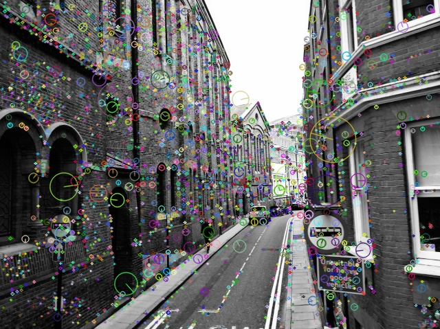
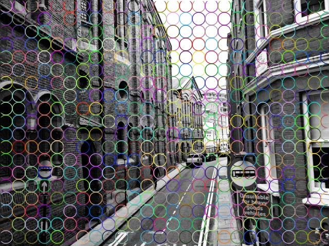
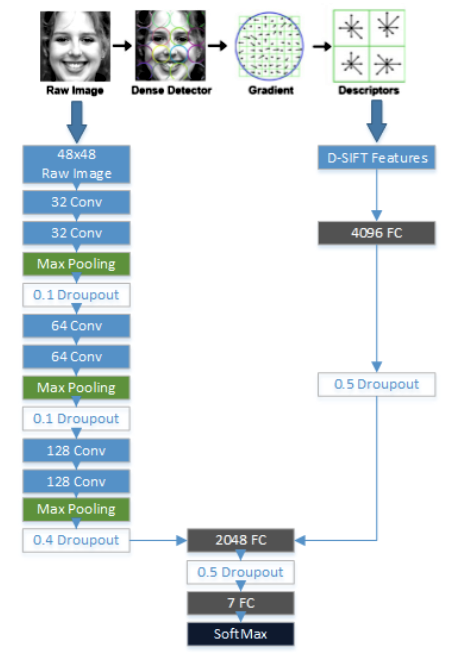

# The CNN-DSIFT Model

11th June, 2018

While I was studying about emotion recognition using facial expressions, I came across several interesting research papers. All these papers tackled the problem in different ways, using various machine learning and image processing techniques. One of the works that really interested me was by [Connie T., Al-Shabi M., Cheah W.P., Goh M. (2017)](https://link.springer.com/chapter/10.1007/978-3-319-69456-6_12), which uses a combination of a Convolutional Neural Network (CNN) and Scale Invariant Feature Transform (SIFT).

## SIFT and Dense SIFT

The Scale Invariant Feature Transform (SIFT) is an algorithm used to identify key points in an image. These key points are detected using Difference of Gaussians (DoG) filtering. For each key point, a key point descriptor is obtained, which is a histogram of local gradients around the key point.

Dense SIFT(D-SIFT) is an extension to SIFT, in which SIFT descriptors are computed over dense grids in the image and not just at the key points.

|||
|:----------------------:|:------------------------:|
|SIFT Features           |D-SIFT Features           |

For the emotion recognizer, I have used a combination CNN and D-SIFT.

## CNN-DSIFT Model

This model makes use of features extracted from the CNN, as well as the dense SIFT feature descriptors for classifying emotions. The architecture proposed in the paper is shown below. I used a slightly modified version of the below architecture.

||
|:--------------------------------:|
|Image from Connie T., Al-Shabi M., Cheah W.P., Goh M. (2017) Facial Expression Recognition Using a Hybrid CNN–SIFT Aggregator.|

## Training the Classifier

I trained the model on the FER2013 dataset, for classifying the emotions into 6 classes: Happiness, Sadness, Anger, Surprise, Fear, Neutral. The number of images available for the 7th class: Disgust, were extremely low as compared to those of the other classes, due to which I have not considered this class for now.

I divided the dataset into 3 sets: Training, Validation and Test. The training set is the set of images using which the model actually ‘learns’. The Validation and Test sets are used to check if the model is able to generalize well on unseen data.

I could replicate the training results obtained in the paper, achieving an accuracy of 75% on the test set. The test set consisted of 3900 images, from the FER2013 dataset. However, this trained model did not work well in practice i.e. during prediction in real time. This was due to the fact that several images in the FER2013 were labelled incorrectly. Also, a large number of images were repeated.

I spent almost 3 days in correctly labelling the images. This was a mammoth task as the dataset consisted of an average 6k images per class!

I trained the model again after cleaning the dataset. This time, the test accuracy did not go beyond 56%. However, in practice, this model worked way better than the previously trained model. It is able to detect extreme facial expressions quite well. That is, a slight sadness or anger in the expression may not be detected well, but extreme sadness or anger gets detected well.

**Some sample images from the FER2013 Dataset**

||||
|:---:|:---:|:---:|
|Happiness|Sadness|Fear|
||||
|Surprise|Anger|Neutral|

* * *
Sayali Deshpande

