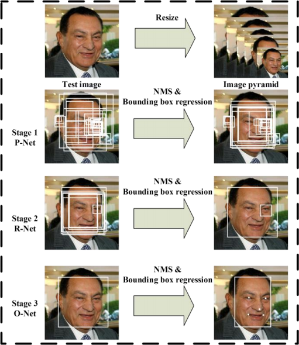
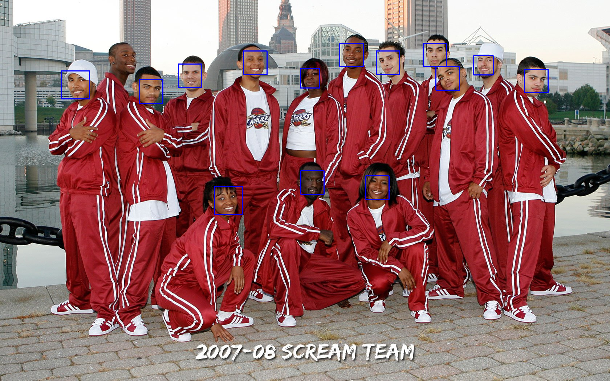

# Face Detection and Alignment

June 10, 2019

In order to identify people around itself, a robot first needs to detect humans and then identify them. In order to achieve this a **Face Detection and Alignment Module** plays a very important role which takes image as an input, and returns the bounding box across possible human faces. 

## Face Detection
I considered two popular and accurate face detection implementations for this module.

### [Multi-task Cascaded Convolutional Networks (MT-CNN)](https://arxiv.org/pdf/1604.02878.pdf)
This framework consists of three cascaded convolutional networks which performs the following operations:

**P-Net (Proposal Network)**
This convolutional network is used to obtain the candidate windows (bounding box) for human faces. A non-maximum suppression algorithm is used to merge the common windows.

**R-Net (Refine Network)**
The output of P-Net passes through the R-Net which rejects the false cases. Thus only bounding boxes which contain faces or some portion of face passes to the next stage.

**O-Net (Output Network)**
This helps in predicting the facial landmarks such as eyes, nose and lips for each face. These facial landmarks are defining characterstic of the face and are further used in the face alignment.

This process can be easily understood through this [image](https://arxiv.org/pdf/1604.02878.pdf) which explains the complete pipeline in brief.

### Dlib Implementation
dlib is a python library which contains an inbuilt face detection and alignment module. It uses a 68 dimensional vector to represent a face and is more accurate in face alignment. However it performs poor in cases of multi people and occlusions. Also since it regresses over larger number of variables, it is inefficient compared to MT-CNN in terms of speed. Here is a small comparison between both the implementations:

| |   | 
|:----------------------:|:------------------------:|
|MTCNN Implementation    |dlib Implementation       |

## Alignment
Features extracted from the **Face Detection Module** are further used to align the images in the dataset. This is a very crucial data pre processing technique in case of face detection which can significantly improve the results. So this is done by making the eyes lie on a fixed horizontal line by applying an affine transformation on the bounding box image.

For the coming week I am implementing the GUI for the Face Detection Module which will allow the user to interact with the module such as adding images/labels to the data, running the face detection module on images or camera feed etc.

***
Aditya Aggarwal
