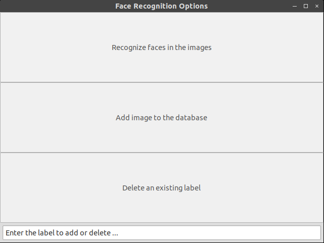

# FaceIdentification and FaceIdentificationClient Component

28th June, 2019

In this post I will discuss the GUI for the Face Identification Client Component and the various functionalities that I plan to implement. I will also elaborate on the CDSL and IDSL files of **FaceIdentification and FaceIdentificationClient** component and how one can test it.

## Face Identification Client Component GUI

So this component allows user to interact with the component in the following 3 ways.



- Recognize faces in the images:

Allows user to select image from the local system and runs the Face Recognition on that image. Then it saves the image in the current directory with the bounding boxes and name of the person labelled. Currently it shows 'Unknown' for each face.

- Add image to the database:

Add images for existing/new person in the database. Enter the label of the person in the text box and then select the image to be added. These labels are permanently stored in the database.

- Delete an existing label:

Allows user to specify a label which should be permanently deleted from the face recognition database.

## Creating the components

Now I will discuss the dependencies of each of these components and the interfaces which can be used by other components to interact with it.

**faceidentification.cdsl**
```
import "FaceIdentification.idsl";

Component faceidentification
{
	Communications
	{
		implements FaceIdentification;
	};
	language Python;
};
```

So as we can see the FaceIdentification component is not dependent on any other component. However it has 3 different methods which can be used by other components for communication. These are described in the following IDSL file.

**FaceIdentification.idsl**
```
module RoboCompFaceIdentification
{
	sequence<byte> ImgType;

	struct TImage
	{
		int width;
		int height;
		int depth;
		ImgType image;
	};

	sequence<TImage> FaceImages;

	sequence<string> FaceLabels;

	interface FaceIdentification
	{
		idempotent void addNewFace(FaceImages faceImg);
		idempotent void getFaceLabels(FaceImages faces, out FaceLabels faceNames);  
		idempotent void deleteLabel(string faceLabel);
	};
};
```
This component has 3 methods with the following functions:

- addNewFace : Adds new faces in the database.
- getFaceLabels : Returns a list of labels for the corresponding images.
- deleteLabel : Deletes the label from the database.

Now moving forward to the client component. It is the main component which the user will interact with. Here is the cdsl file for the same.

**faceidentificationclient.cdsl**
```
import "CameraSimple.idsl";
import "FaceIdentification.idsl";

Component faceidentificationclient
{
	Communications
	{
		requires CameraSimple;
		requires FaceIdentification;
	};
	language Python;
};
```

This component takes the image from the CameraSimple component and also interacts with the FaceIdentification component. It also creates a GUI and displays real time camera feed with faces identified. Currently it shows 'Unknown' for all the detected faces but in the future posts, I will discuss how the recognition part works.

## Testing the Component

My current repository can be found [here](https://github.com/adityaaggarwal97/robocomp-robolab/tree/faceidentification). The robocomp repository can be found [here](https://github.com/adityaaggarwal97/robocomp/tree/faceidentification). One can clone this in order to test the component. 

*Make sure TensorFlow, OpenCV, PIL and wx python(for GUI) libraries are installed in order to run the component.*

```
cd robocomp/components/robocomp-robolab/components
```
Open 2 new terminals.

Terminal 1:
```
cd camerasimple
python src/camerasimple.py --Ice.Config=etc/config
```

Terminal 2: 
```
cd faceidentification
python src/faceidentification.py --Ice.Config=etc/config
```

Terminal 3: 
```
cd faceidentificationclient
python src/faceidentificationclient.py --Ice.Config=etc/config
```

Now one can see the captured frames with a bounding box and person's name (currently 'Unknown') on top of the bounding box. Another pop up window will open which allows user to Add/Delete labels or Recognize faces in the images. Currently Add/Delete functions are not implemented and will be included in the upcoming posts. However, Recognize faces in the image is up and working.

*PS: I would really like to thank Pilar Bachiller and Sayali Deshpande, my mentors for this project, for being very supportive and helping me whenever I faced any problem.* 


* * *
Aditya Aggarwal
