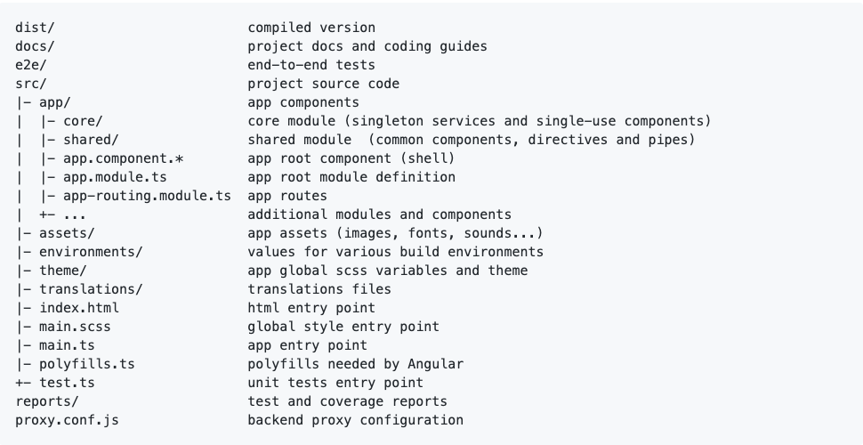
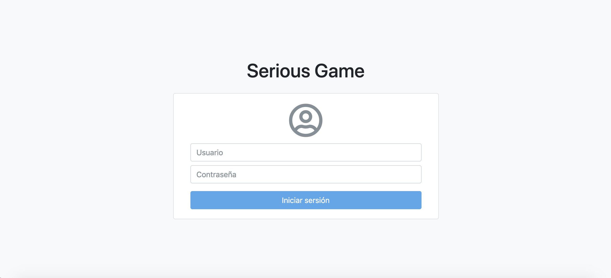
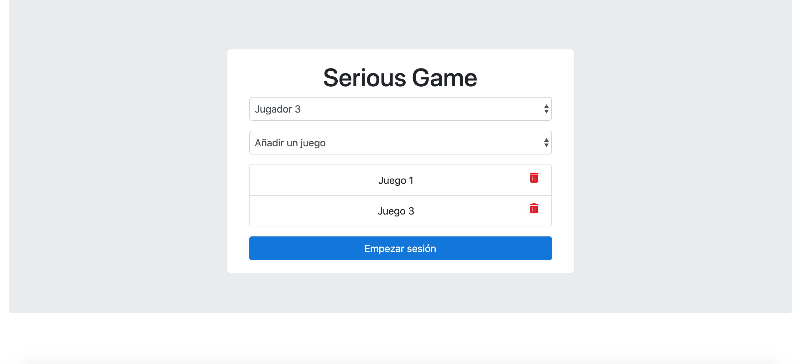
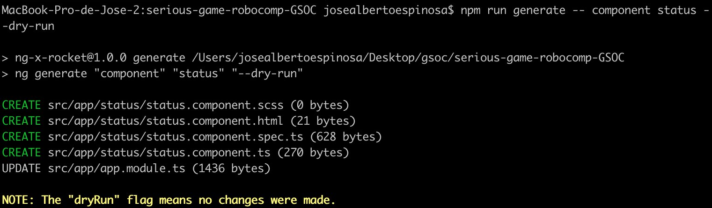
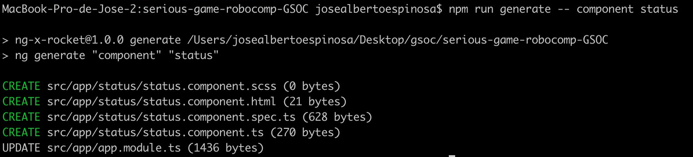
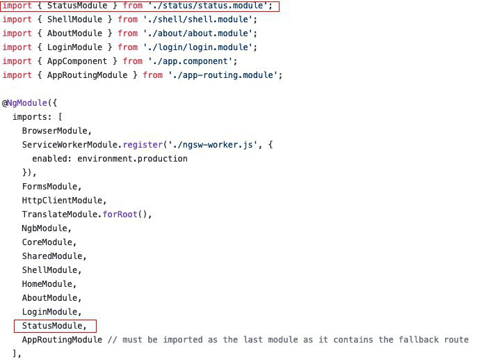
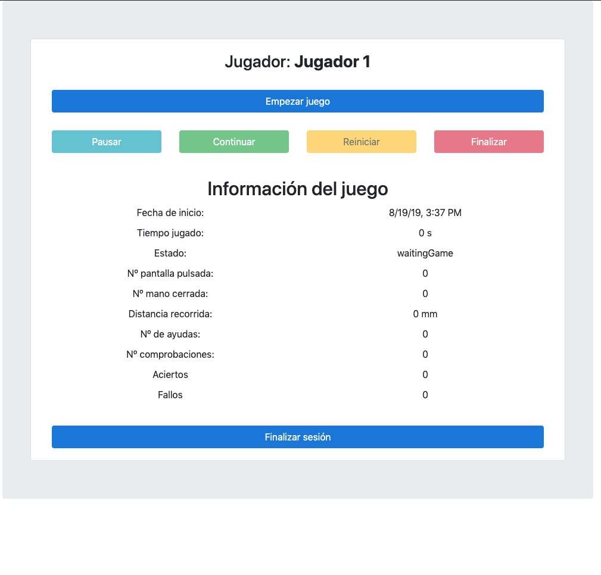

# Developing a Serious-Game using RoboComp: Web project

12th August, 2019

## Introduction

In this post we will explain how the implementation of the web version of the component developed by RoboComp staff has been carried out. This component was previously analyzed ([see post2](https://robocomp.github.io/web/gsoc/2019/alberto_andujar/post02)). I will also point out the most relevant implementation decisions, as well as some of the tools used.

## Creating the web project using Ngx Starter Kit

I have learned from the community and, also, from the RoboComp's staff the importance of best practices in software development. Therefore, I chose the Ngx Starter Kit tool to create the web application skeleton. In a few words, Ngx Starter Kit, allows me to create an organized and coherent project structure, which undoubtedly facilitates an orderly and easily readable development of the code. In addition, include by default in your project fundamental libraries of third parties and very common in the development of web projects, such as BootStrap or Font Awesome.



## Developing modules and components 

In this section I will describe the modules and components adapted or developed within the initial structure of the web project.  
It should be noted that all components are in the src/app path of the project. In addition, all components contain three key files, an .html file to develop the web page itself using html5, a .ts file, called controller and written in TypeScript, where the logic of the component resides and a .scss to define the styles.

### Login

Based on the previous analysis of the application ([see post2](https://robocomp.github.io/web/gsoc/2019/alberto_andujar/post02)), the first thing we must develop is the login process. It should be noted that the version used of ngx-starter-kit provides us with a generic login component. Therefore, we simply have to modify it to adapt it to our needs.



### Home

There is also another component created by default to host our initial screen or home. In our case and in a similar way to that described above, we write the code to adapt it to the needs of our serious game.



## Adding your own component: Component Status

The status component has the general functionality of maintaining the state of the game. It is responsible for monitoring the development of the game. Therefore, its main function is to keep updated the parameters that define the game at runtime, such as the score, the start date of the game or the playing time.

**Command**
```
npm run generate -- component status --dry-run
```

The flag, --dry-run is used to simulate the behaviour of the command. This option prevents CLI from making changes to the file system. Instead, it will print everything you would have done in the console. This way we can check if the command really does what we want.



Once we have made sure that the command works properly, we proceed to delete the flag dry-run and to create our component.

```
npm run generate -- component status 
```



In the previous image we can see that UPDATE appears in the last line. This means that apart from the creation of the files mentioned in the previous section, the command updates the information of the file app.module.ts with the data of the new component. Within this file the class AppModule is defined, it could be said that it describes how the parts of the application fit together. Each application has at least one Angular module, the root module with which you can start the application.



In addition to monitoring, this component also offers an interface for managing the execution of the game. The final result is shown in the following image (frontend). It basically consists of a series of buttons that allow you to control the flow of execution. This type of buttons are located at the top and bottom of the screen. Reserving the central space to show the information related to the monitoring or development of the game.


