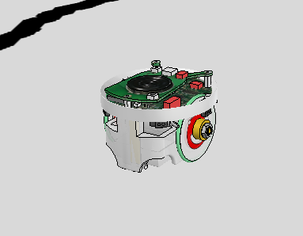
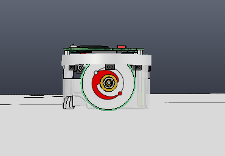
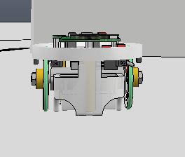
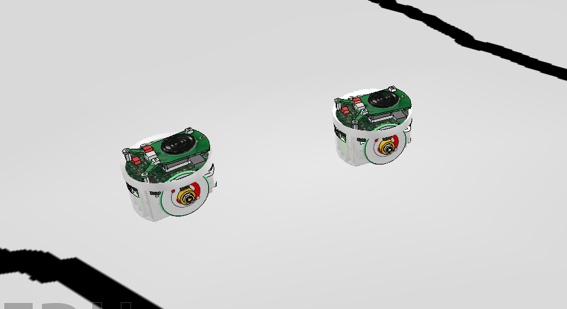
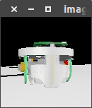

# First post

23th June, 2019


## Objectives

- [x] Choose a simulator to work with it.
- [x] Investigate the simulator and learn how to use it's API.
- [x] Recreate a simple verbal communication example


## Simulator selection 

In order to make the first delivery, I've reviewed some simulators to simulate some possible scenes. The possible simulators are: 

- Argos3
- V-REP

[Argos 3](https://www.argos-sim.info/) is designed to simulate robot swarms.  

[V-Rep](http://www.coppeliarobotics.com/) is a simulator of general purpose.

There is a [benchmark](http://lenkaspace.net/downloads/Pitonakova_simulatorsComparison.pdf) comparing Argos3 vs V-REP used for swarm robotics scenes simulation. According to this benchmark I should use Argos3 but it doesn't have a remote API so I will use V-REP.


## Simple verbal communication example

In order to practice with the remote API of V-REP, we will create an example with two robots. The robots should have at least two components, a camera and a led light. V-REP has some available models that meet this requirements, so the choosen one is the E-Puck model.


### E - Puck







### Description of the scene




The scene will have 2 e-pucks, one of them will send a message turning on and turning off a led and the other one will try to read this behaviour using its camera. The first one will be called Epuck1 and the second one will be called Epuck2. The scene is in the .ttt file inside *verbal_communication_epuck* folder.

### Description of Epuck1's behaviour

It's actions consists in turning on and turning off it's led, waiting at least 3 seconds to change it.

```python
    def compute(self):
        self.rb.set_front_led(2)
        self.rb.set_body_led(2)
        time.sleep(3)
```

In order to train with V-REP, I'm working with already created Epuck libraries that uses this model. Epuck1 import a library created by [*Manuel Martín Ortiz* and *Martin Knopp*](https://github.com/RL-LDV-TUM/epuck-vrep)  

To control Epuck1 a class named *Controller* was implemented. The Controller class works with a simple schedule. It starts the control with the *start()* method.

 

```python
def start(self):
    self.init_work()
    while True:
    	self.compute()
        self.rb.step()
```

- The *init_work()* method will contain the actions that it will needed before starting the simulation.

- The *compute()* method will contain the actions that the robot will make in the simulation. It's called in each simulation's step.
- The *rb.step()* method makes the next step in the simulation.


### Description of Epuck2's behaviour

The Epuck2's behaviour is coded like it was a script. This script just connects to the ePuck2 model, capture frames from the camera and compares with the previous one to know if the led has changed it's state. When the scripts find a change increments a counter. 



That's not a good practice because it could have errors if something else in the frames changes. To make better solutions, we could use KMeans algorithm to recognize groups of colors in the image.


The behaviour could improve using Computer Vision techniques.


### Executing the example

The simulator should load the scene from *verbal_communications_epuck* folder.

To connect remote scripts, the simulator must have opened ports 19998 and 19997.

Watch out with the V-REP API import, you probably need to change the source folder.

In two terminals:

```bash
# first terminal 
cd verbal_communications_epuck
python2 epuck1.py
```


```bash
# second terminal
cd verbal_communications_epuck
python epuck2.py
```


### Requirements

- Opencv >= 4.1.0
- Numpy
- Pillow


### Video

[](https://www.youtube.com/watch?v=tRkDntU9X4U)
