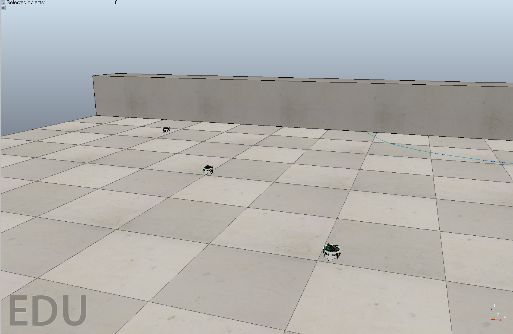
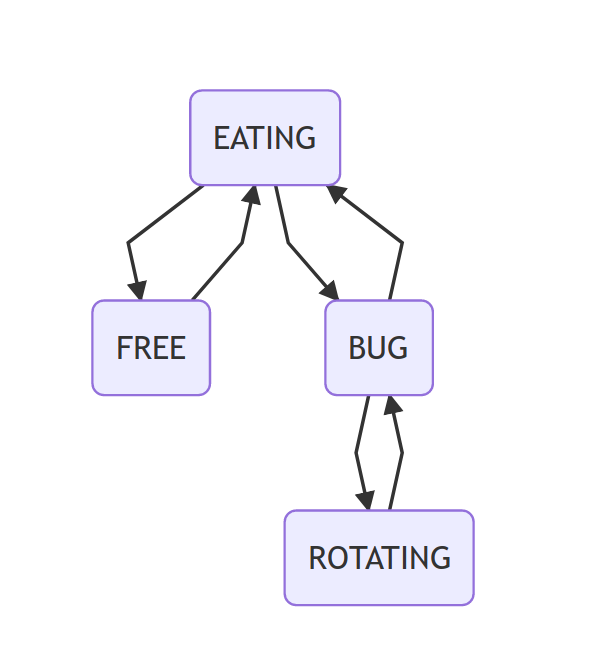
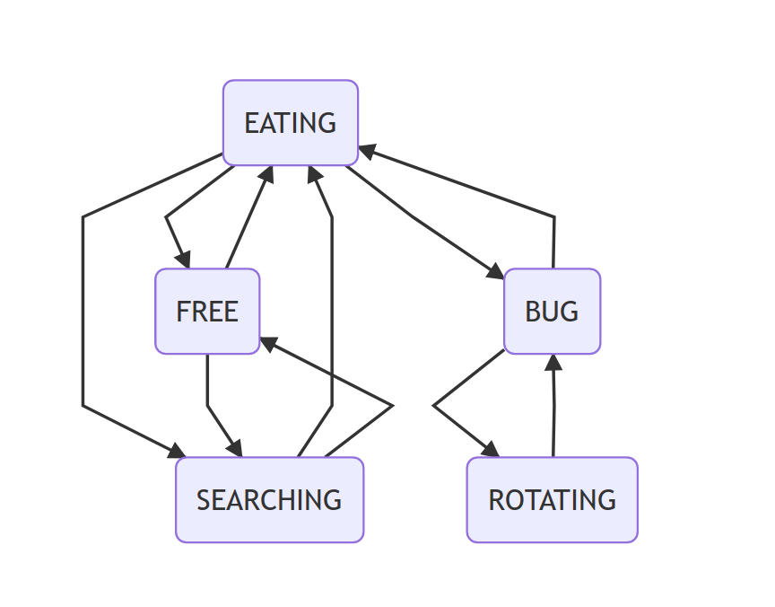

# GOOGLE SUMMER OF CODE: FINAL DOC


## INDEX

1. Research into V-REP.
2. Creating a differential robot handler for V-REP.
3. Creating a differential robot component for RoboComp connected to V-REP.
4. Creating examples with communicated robots using RoboComp and V-REP.


## RESEARCH INTO V-REP

In GSoC's firsts weeks, I've been studying V-REP and how to use it to create some examples. V-REP is a robotic simulator for general purpose, it has some features like having a library with some robot models, stuff models or the possibility of executing Lua code to control the scene. This simulator can be controlled with remote code opening some port and using its API. This API has a lot of methods, but it can be problematic when it needs to use some different ports sending orders to the same scene. After making some tests, the result it's that it's possible to use some robots in the same scene so it can be used for the initial purpose but V-REP is a heavy software, so it's recommended not to use more than 4 robot models in the same scene.

## CREATING A DIFFERENTIAL ROBOT HANDLER FOR V-REP

In the first stage of GSoC, the objective was to create a verbal communication between 2 robots using LED lights inside V-REP. To reach that, we need to use a robot model that fulfill the next requirements:

- A differential base
- Some programmable LED lights
- A camera

There are some robot models to use without loading it in V-REP, so I selected E-Puck.

### E-Puck

> The **e-puck** is a small (7 cm) [differential wheeled](https://en.wikipedia.org/wiki/Differential_wheeled_robot) [mobile robot](https://en.wikipedia.org/wiki/Mobile_robot). It was originally designed for micro-engineering education by [Michael Bonani](https://en.wikipedia.org/w/index.php?title=Michael_Bonani&action=edit&redlink=1) and [Francesco Mondada](https://en.wikipedia.org/wiki/Francesco_Mondada) at the ASL laboratory of Prof. [Roland Siegwart](https://en.wikipedia.org/wiki/Roland_Siegwart) at [EPFL](https://en.wikipedia.org/wiki/EPFL) ([Lausanne](https://en.wikipedia.org/wiki/Lausanne), [Switzerland](https://en.wikipedia.org/wiki/Switzerland)). 
> The e-puck is [open hardware](https://en.wikipedia.org/wiki/Open_hardware) and its onboard software is [open-source](https://en.wikipedia.org/wiki/Open-source_software), and is built[[1\]](https://en.wikipedia.org/wiki/E-puck_mobile_robot#cite_note-producer-1) and sold[[2\]](https://en.wikipedia.org/wiki/E-puck_mobile_robot#cite_note-resellers-2) by several companies.
>
> 
>
> From Wikipedia, link [here](https://en.wikipedia.org/wiki/E-puck_mobile_robot).


### EXAMPLE

The example consists in the creation of a scene that only contains 2 E-Pucks (ePuck1 and ePuck2) and ePuck1 will turn on and turn off one of its LEDs and ePuck2 will catch it with the camera and treat it as a message. 

The ePuck1 is controlled by a *handler* class created from zero to use in the following stages of GSoC.

The ePuck2 is just a script that uses OpenCV and numpy to use the camera.

For more information, the first evaluation's post is [here](https://github.com/robocomp/web/blob/master/gsoc/2019/jose_manuel_agundez/post02.md).

#### PROBLEMS

- V-REP hasn't got any LED component, it's just a light in a relative position of the robot model, so it's impossible to use from any remote API call. To modify the led state you need to create an LUA function inside the model script that makes that, so it could be a problem in the future.
- The V-REP Remote API ports could be sometimes really slow.
- Using verbal communication implies to use Computer Vision algorithms, so it requires computation capacity.


## CREATING A DIFFERENTIAL ROBOT COMPONENT FOR ROBOCOMP CONNECTED TO V-REP


For the second and third stage, the objective is to create a robot handler for V-REP implemented as a RoboComp component. The RoboComp organization suggested using an EV3-LEGO model to implement in V-REP. After some research this model couldn't be used because it has some troubles:

- There isn't a lot of information about the robot.
- The model in V-REP is complex so it will increase the computation capacity.

After trying to solve them, the model was changed to E-Puck, so the handler of the previous stages could be recycled.

#### Generating the component

To generate the component, we know that the model has some features and we need to implement all of it.

The CDSL:

```c++
Component ePuck
{
        Communications
        {
                implements DifferentialRobot, Camera, Laser;
                };
        language python;
};
```

The folder generated by RoboCompCDSL: 

```bash
.
├── DoxyFile
├── ePuck.cdsl
├── etc
│   └── config
└── src
    ├── cameraI.py
    ├── differentialrobotI.py
    ├── epuck_controller.py
    ├── ePuck.py
    ├── extApi.o
    ├── extApiPlatform.o
    ├── genericworker.py
    ├── __init__.py
    ├── laserI.py
    ├── main.py
    ├── remoteApi.dll
    ├── remoteApi.so
    ├── specificworker.py
    ├── toolkit.py
    ├── vrep_client_controller.py
    ├── vrepConst.py
    └── vrep.py
```

Now, we need to implement each method generated in specificworker.py. That's not just calling our methods from the controller created previously.

#### GetBasePose()

```python
    #
    # getBasePose
    #
    def getBasePose(self):
        x, z, alpha = self.handler.get_base_pose()
        return [x, z, alpha]
```

The handler was modified to have exactly the result of getBasePose(). In V-REP, the *alpha* value it needs to be calculated because of the remote API call returns the orientation defined by 3D Euler Angles ([link to wikipedia]( https://en.wikipedia.org/wiki/Euler_angles)) So we just take the angle between the *z-axis* and the *Z-axis*.


#### stopBase()

```python
    #
    # stopBase
    #
    def stopBase(self):
        self.handler.stop_base()
```

The handler just puts both wheels in speed 0.


#### SetSpeedBase()

```python
    #
    # setSpeedBase
    #
    def setSpeedBase(self, adv, rot):
        self.handler.diff_vel(adv, rot)
```


```python
    def _to_differential_vel(self, vel, omega):

        R = self.robot_wheel_radius
        L = self.robot_wheel_base_length

        vel_left = ((2.0 * vel) - (omega * L)) / (2.0 * R)
        vel_right = ((2.0 * vel) + (omega * L)) / (2.0 * R)

        return vel_left, vel_right

    def diff_vel(self, v, omega):
        vel_left, vel_right = self._to_differential_vel(v, omega)
        max_ = max([vel_left, vel_right, 179.9])
        vel_left = (vel_left / max_) * 179.9
        vel_right = (vel_right / max_) * 179.9
        self.set_speed_left(vel_left)
        self.set_speed_right(vel_right)
```

The differential robot implements setSpeedBase, that takes advance speed and rotation speed as parameters. The trouble is V-REP doesn't have this remote API call. After some research, the implementation of the algorithm was made. It needs to use some model information like the wheel radius or the distance between the wheels. One of the problems with the EV3-LEGO was that this data wasn't possible to find. In the e-Puck web, we can find all the measures that we need.

##### Links to differential speed information

- http://www.mayfeb.com/OJS/index.php/CON/article/view/156
- http://planning.cs.uiuc.edu/ch13.pdf


#### How to use

1. Open V-REP
2. Open a port in V-REP simulator
3. Implement an e-Puck model inside the scene
4. Copy the .lua code of the component inside the e-Puck main script (the icon next to the name)
5. Start the component (check before if the V-REP IP and port are correct)
6. Start the simulation in V-REP


#### GSoC collaboration

In this component,In this part of the project I have been working with my GSoC partner [Nikhil Bansal](https://github.com/nikhil3456) as we both needed to do a similar task. Thank you for your help and understanding. 


## CREATING EXAMPLES WITH COMMUNICATED ROBOTS USING ROBOCOMP AND V-REP


### Description

The example consists of 3 robots that simulate animal behaviors. Each robot will go to the feeder and it will eat. After eating, the robot will move freely in the scene until it needs to eat again. Not everyone can eat simultaneously, so each individual needs to check if it can eat or it needs to wait.


### Scene

The scene consists of a gray block named *comedero (feeder)* and 3 e-puck robot models. It's a simple scene due to the computation limits.

 




### Individuals

Each individual is represented with an e-puck robot model. It was implemented in a RoboComp component in previous stages of GSoC. The behavior of the individuals is created using a state machine.


#### State machine



- **EATING** : The *eating* state consists of the move to the feeder and stays there for a while.
- **FREE**  : The *free* state moves the robot without an objective in the scene.
- **BUG** : It's a state that avoids the obstacles. *(Bug algorithms)*.
- **ROTATING** : This state is created to aid the BUG state.


### Nonverbal communication example


#### Description

The nonverbal communication example uses signals inside the simulation. These signals consist of a simulation variable that everyone can use. In this case, we create a variable that counts how many robots are in the eating zone, so everyone knows the availability of the feeder.


#### Implementation

Both methods are implemented in *epuck_controller.py*.

```python
def get_swarm_data(self):
        signal_name = "signal"
        res, signal_val = vrep.simxGetStringSignal(self.client_id, signal_name, vrep.simx_opmode_blocking)
        if res <= 8:
            return signal_val if signal_val != '' else '0'
        else:
            err_print("GET SWARM DATA", parse_error(res))
            raise Exception("ERROR IN GET SWARM DATA")
    

    def set_swarm_data(self, val):
        signal_name = "signal"

        res = vrep.simxSetStringSignal(self.client_id, signal_name, val, vrep.simx_opmode_blocking)
        if res != 0:
            err_print("SET WARM DATA", parse_error(res))
            raise Exception("ERROR IN SET WARM DATA")
```


- GetSwarmData() : Getter of the signal.
- SetSwarmData() : Sets the signal value.


#### How to use

1. Start V-REP simulator and open the non_verbal_comm folder's scene.
2. Check if the ports are open, each component will use a different port.
3. In each ePuck component, check if the IP and port are the correct (in specificWorker.py constructor)
4. In each ePuckVREP folder, execute python2 src/ePuck.py etc/config
5. Start simulation.
6. Slow down simulation as lower as possible.


### Verbal communication example


#### Description

The verbal communication example tries to do exactly what the previous example does. The difference is that verbal communication uses physical signals that each robot makes, in this case, is turning on some LEDs to show the other robots that it is eating at that moment.

#### State machine




The new state is *SEARCHING*.

- **SEARCHING**:  The searching state finds eating robots. If there are two robots already eating, the current state change to Free, but if there is an available position to eat the current state will change to Eating. The searching action makes the robot rotate 360 degrees to search LED lights. The robot finds the LED lights using artificial vision algorithms.


##### CV algorithms

As it was written before, the robots uses it's LED lights to show everyone that it's eating. To achieve the communication, each robot uses different LED colors and process the camera image with a band-pass filter to obtain the colors that we were searching.


#### Implementation

```python
    def searching_action(self):
        
        x, y, alpha = self.getBasePose()
        
        print "SEARCHING", alpha
        print "MOVE", self.searching_move 

        # Posible position of eating zone
        angle_rot = -.8
        if self.searching_move == 0:
            self.setSpeedBase(0, angle_rot)
            if alpha < 0:
                self.searching_move += 1
        elif self.searching_move == 1:
            self.setSpeedBase(0, angle_rot)
            if alpha < -1.4:
                self.searching_move += 1
        elif self.searching_move == 2:
            self.setSpeedBase(0, angle_rot)
            if alpha > 0:
                self.searching_move += 1
        elif self.searching_move == 3:
            self.setSpeedBase(0, angle_rot)
            if alpha > 1.4:
                self.searching_move += 1
        self.found.extend(self.find())
        self.found = list(set(self.found))
        if (len(self.found) > 1):
            self.start_free_action()
        else:
            if self.searching_move == 4:
                self.start_eating_action()
```


#### How to use

It works exactly like verbal communication.

1. Start V-REP simulator and open the verbal_comm folder's scene.
2. Check if the ports are open, each component will use a different port.
3. In each ePuck component, check if the IP and port are the correct (in specificWorker.py constructor)
4. In each ePuckVREP folder, execute python2 src/ePuck.py etc/config
5. Start simulation.
6. Slow down simulation as lower as possible.


### DIFFERENCES BETWEEN EXAMPLES

These two examples represent different strategies to communicate a robot swarm. The nonverbal communication is really clever but it needs a communication channel with the other robots. The verbal communication doesn't need a communication channel because it uses the data catched in it's environment, but there are some possible instances that this strategy will fail and, the computation cost is bigger normally.

#### 


## Annex

_Thank to the organization and my colleagues for the opportunity_