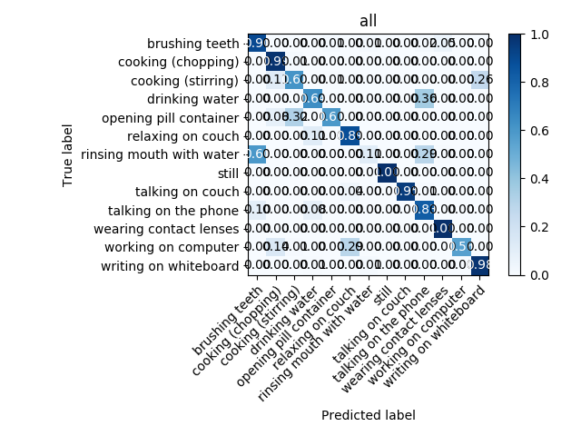

I finished the following points from last post's target:

- Improving Feature Vector:
- [x] Quality check on PARAFAC

- Machine Learning methods for improving accuracy
- [x] Transfer Learning
- [x] Multitask Learning
- [x] Ensemblence of neural networks

- [x] Final tunning
- [ ] Implement in RoboComp

## Results:

The extraction of a feature vector using tensor decomposition method PARAFAC did not met my expecations (yet). 
It extracted a feature vector that gave only 20 % accuracy to the classifiers I was using. 
I believe that we should continue looking for a proper feature vector,
because I think this is the essential step to reach a perfect classification. With a proper feature vector, I
suppose that almost any classifier would work correctly. 
An example that motivates my suposition is the Fisher's iris data set: any machine learning technique applied to this dataset works very well.

Transfer learning results surprised me. Due to random weight initialization, I started getting only 70 % accuracy in the living room environment! Imagine the preocuppation a felt. It proved that the activity recognition function has some local minima in which my neural network gets stuck sometimes. But with transfer learning, weight initialization is chosen, general features that had been learned in another environment are transfered to a new environment, helping our neural network work properly on any environment chosen.

Ensemblence learning made my network robust. It is composed of several classifiers of the activities, which are merged at a later stage into a big model that learns the activity a person is performing due to the predictions of the previous classifiers. The classification improved by 1-2%.

What is left to do is to implement it in RoboComp directly, with joint data obtained by an Astra camara. I do not have an Astra camera, but one of my mentors offered to provide an output file of the Astra camera, so that I can adapt my code to online data. Additionally, the expansion of classification to a wider range of activities needs to be done, since currently my network works only on 3-4 activities. Until now, the accuracy achieved for all 11 activities from CAD-60 data set is 76%.

This summer was fun, and this project inspires me to continue contributing and developing the acitivity recognition model, and getting closer to the tool for active and assistive living for elderly and people in need. The development of this project excites me and Google Summer of Code passed my expectation. It was amazing! I recommend it to anyone that enjoys coding.
