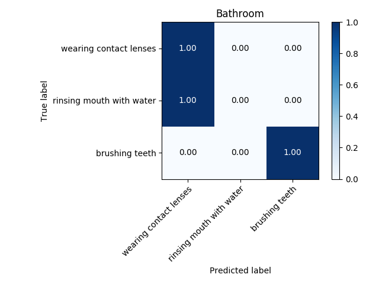
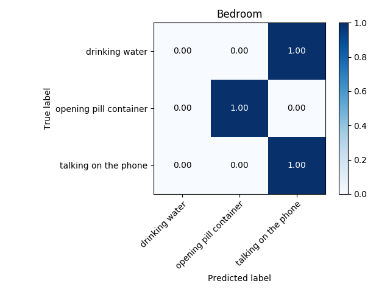
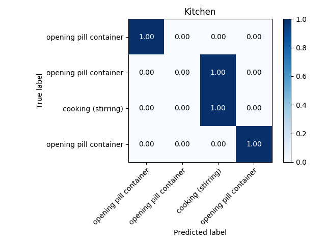
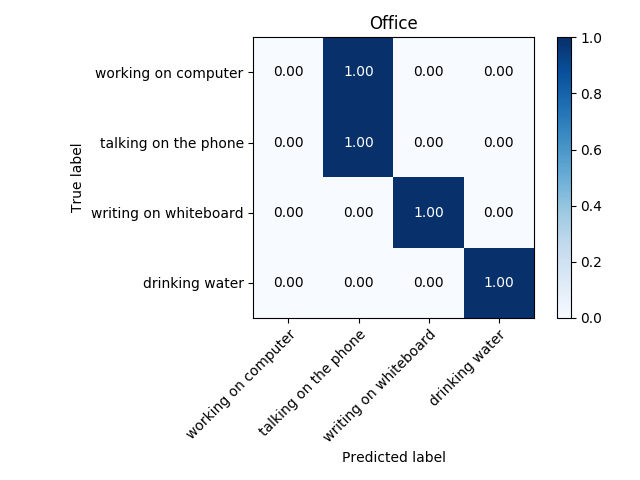

## Summary

The most difficult part for the Human Activity Recognition (HAR) task, as well as for any classification challenge is to find a representative set of features. In my challenge, the HAR challenge, this task is particularily difficult; what features represent a human activity uniquely? Moreover, we have a restricted set of features due to privacy reasons. The set of features consist of only position of joints of the person's skeleton.

Some datasets consist of 20 skeleton joints, other with 15, and some others have only 7 joints. What quantity is better to have? Moreover the joints themselves have several ways of being represented: either by their spatial position or, for a complete overview, their spatial position together with the orientation of each of the joints (e.g. an extended hand is placed upwards or downwards). 

The dataset we worked on CAD-60, downloadable from [here](http://pr.cs.cornell.edu/humanactivities/data.php). It is composed of 15 joints, and the features that I extracted for activity recognition are inspired on the ones my mentor [Diego Faria](https://cs.aston.ac.uk/~fariad/) explains in his article **"A  Probabilistic  Approach  for  Human  EverydayActivities  Recognition  using  Body  Motion  from  RGB-D  Images"** found in [here](https://cs.aston.ac.uk/~fariad/publications/ROMAN14_0187_FI.pdf). The feature vector Diego Faria proposes consists of 14 entries:
- Distance of both hands to head
- Distance between hands
- Distance between shoulders and hips
- Distance between feet and hip
- Movement of right hand in x and y
- Movement of left hand in x and y
- Movement of right elbow in x and y
- Movement of left elbow in x and y
- Movement of head in x and y

One tiny comment: I also trained the models taking the z coordinate movement, as I would imagine that it could play a role in some differentiation, for example, a person drinking water or a person talking on the phone, as from skeleton point of view these two activities are very similar. The accuracy did not either improve or worsen. Therefore, we will consider only the movements in the xy-plane.

A drawback of the described feature vector is that it only represents one frame, i. e. an instant of the activity in the video. Hence it is not surprising that the trained SVM performed badly; the accuracy was lower than 60%. Therefore I crafted an additional set of features that could better represent the whole activity. First, my algorithm takes a subset of frames (how many frames to take is another hyperparameter to be tunned). I suggested to take the "extreme" ones: the frames where the movement changes direction. In those frames the position change must be nearly zero (I focus only on the displacement of hands). By taking 7 frames of video with lowest displacement of hands, the accuracy of the model increased more that 20% in each environment, achieveng accuracies between 75-85%. The highest accuracies were obtained using a Convolutional Neural Network. Still with the eye on goal, I hope to achieve an accuracy that is higher than 95%.

## Further steps
- [ ] Continue tunning the hyperparameters of the model. 
- [ ] Add PCA analysis in the selection of features.
- [ ] Train a districted neural network to compare its results with CNN. Also to respect time order, train an LSTM.
- [ ] Train on other databases.
- [ ] Use Lie group for a manifold representation of the activities
