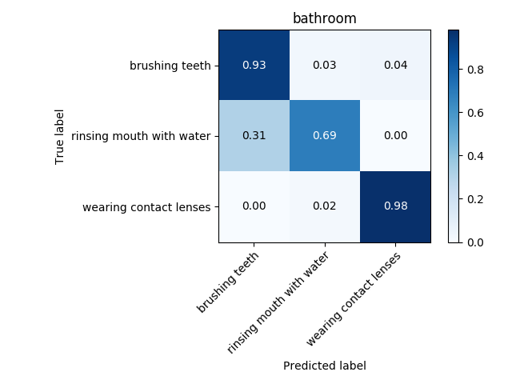
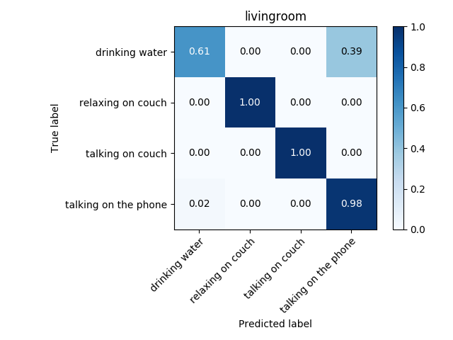
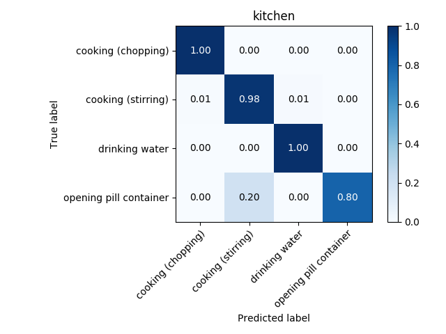
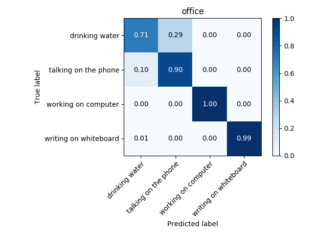

In last post we extracted a set of features from whole video and obtained accuracies between 75% and 85%. This accuracies are obtained on a test set of only four or five elements, therefore not very representative. In addition, the algorithm is too "expensive": to determine the activity a person is performing the algorithm uses a 10-second or sometimes a one-minute long video, which is not necessary. The shorter the used video is, the better, since the algorithm determines the person's activity faster, therefore it is more desirable to us. That is why I made a partition of video data, and trained on the obtained partition.

## How is the partition made?

Usually a second of video is composed of 24 frames. Suppose you have a video of 1000 frames, and say you want to divide it into subvideos of 24 frames, i.e. subvideos of one second. Then we extract from the original video 24 consecutive frames iteratively, i.e. the first subvideo would be composed of frames 1 to 24, the second -- 2 to 25,  the third of frames 3 to 26 and so on. After performing this from one video you would obtain 1000-24 = 976, hence you would have expanded the training set and the test set by nearly a thousand times! After doing that, I improved the accuracy drastically, as you can see in figures below.

The actual quantity of frames needed is another hyper parameter to tune.
I have tuned hyperparameters for each environment separately, obtaining a different set of best performing hyperparameters and a different model (Two models were tested: CNN and LSTM). 
It is very probable that transfer learning will improve model accuracy, since features of each activity across environments are very similar between each other; they are all skeleton movements. Therefore this technique will be tested. Transfer learning is sometimes used as a feature extractor, after which  another classifier is trained. 

One other way of obtaining a good feature vector is using PARAFAC, also known as CANDECOMP, which is a generalization of PCA but on data that has mode than two dimensions. Unfortunately, the outcome of the classifier using this technique shows extreme overfitting, resulting in an accuracy as low as 20%. I will give more details on next post after investigating the outcome thoroughly.

The ultimate goal is to make a unique algorithm for all activities, independently on the environment. Techniques similar to transfer learning will be implemented for best classification. Lastly Ensemble Neural Networks will be used to choose correctly between CNN and LSTM. All the mentioned work is already in process and should be completed by the end of this week, which will converge into another post.

The final task of this amazing summer of code program is to integrate the code into RoboComp, just before the code submission to Google. The left few weeks will be very intense, but exciting and fulfilling,  demonstrating a fruitful summer.

## Next steps

- Improving Feature Vector:
- [ ] Quality check on PARAFAC

- Machine Learning methods for improving accuracy
- [ ] Transfer Learning
- [ ] Multitask Learning
- [ ] Ensemblence of neural networks

- [ ] Final tunning
- [ ] Implement in RoboComp

