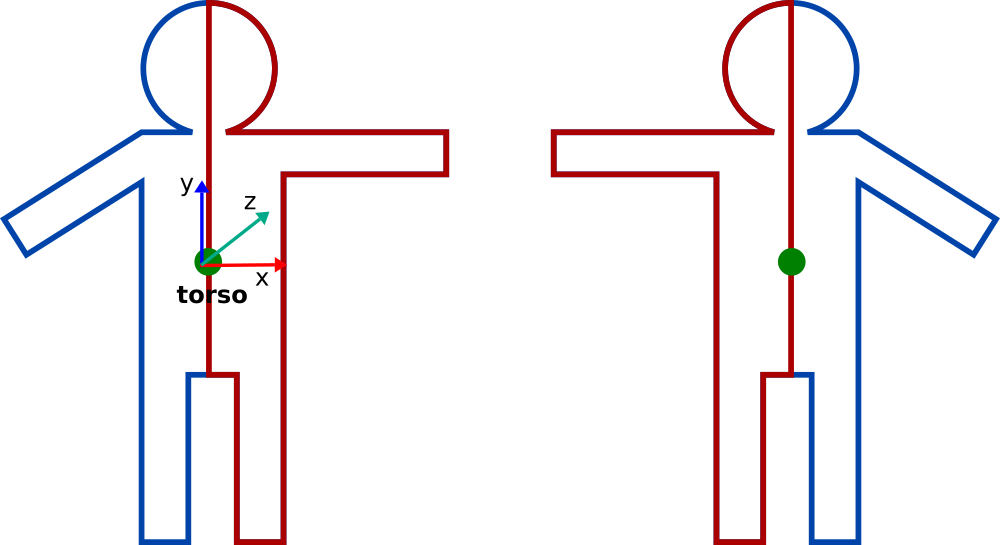
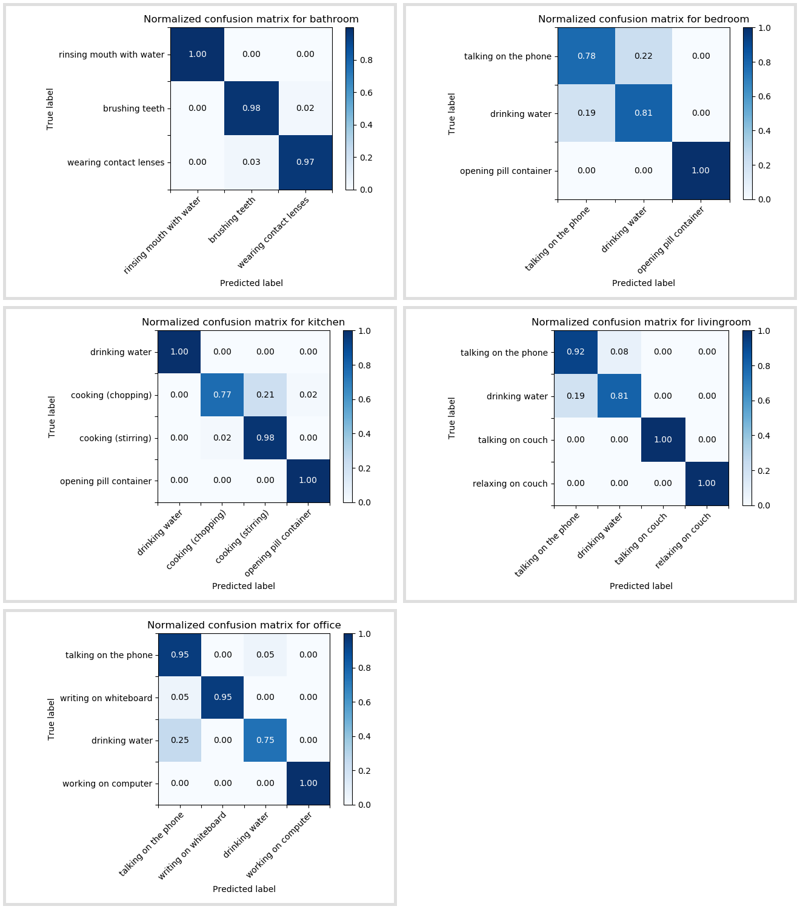

# Improving accuracy of activity recognition

July 22, 2019

The goal of the phase was to improve the accuracy of the classifiers and to experiment with different approaches to classification. In this post, I will explain how we improved the approach described in the previous post, which does classification based on hand-crafted features. The achieved accuracy is in line with the state-of-the-art [results](http://pr.cs.cornell.edu/humanactivities/results.php). 

## Data augmentation

[CAD-60 Dataset](http://pr.cs.cornell.edu/humanactivities/data.php) is a smaller dataset with only 4 subjects performing the actions. One out of the four subjects is left-handed, therefore, the assumption is that using more data, which is horizontally mirrored during training could improve the performance of the classification. In order to produce flipped data, skeletons were first centered at the torso joint and then for all the remaining joints x coordinate was multiplied with -1, so that all joints on the left of the torso center end up on the right from it and vice versa. The flipped data was added to the training data, doubling its amount. The validation data however is not flipped, only the training data. 
  
This step improved mean accuracy by 5%, increasing it to 65%. Feature selection and dimensionality reduction however did not result in any significant improvement, therefore it was decided to move from frame-by-frame classification to classification based on sequence of frames to take advantage of the temporal information.
  

## Sequence classification

CAD-60 as mentioned is a smaller dataset, however, each action sequence is rather long, consisting of many frames, therefore, I first cut every sample into sequences of equal shorter length. The length of the sequence is a hyperparameter, at the moment it is equal to 120 frames. As the next step I sample n frames at equal frequency from the cut samples. The frequency of sampling is also a hyperparameter, at the moment it is equal to 30. In other words, if there are 25 frames in a second, from clips of slightly less than 5 seconds, I sample 4 frames approximately every second (a bit more than a second). From one sequence of 120 frames, it is possible to produce 30 examples, where each example consists of 4 frames.  
For each of the 4 frames the same set of features is extracted. Currently a set of 15 features is used. The best accuracy achieved so far is 93%.
 

***
MF
