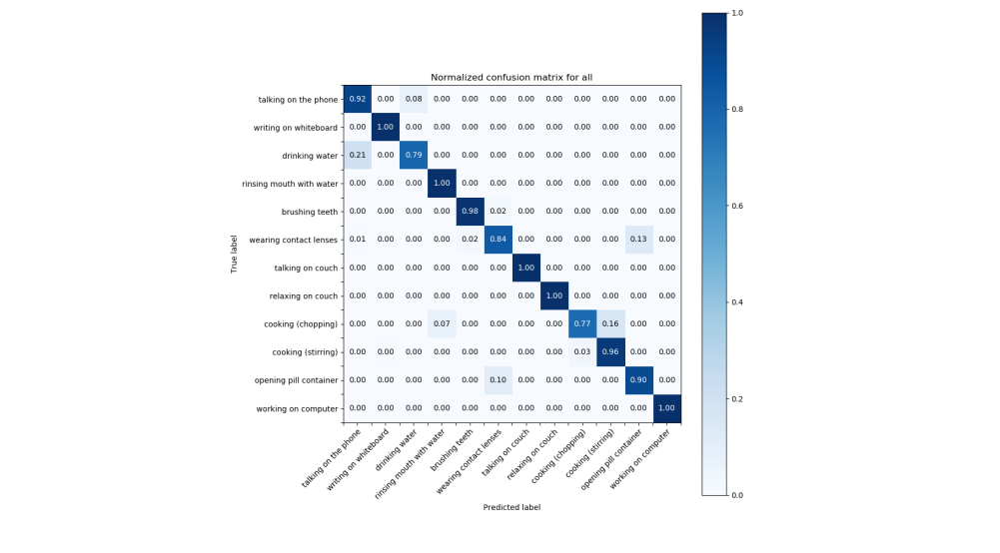

# CNN and Transfer learning

Aug 10, 2019

The approach described in the previous blog posts based on hand-crafted features and SVM helped to achieve mean accuracy of 93%. Previously, the training and evaluation was done for each of the environment separately. However, for the ready component we want to use one single model for inference, hence we will train all 12 activities at once. Our approach proves to work well for this case and achieves 94% accuracy.
  
Our next experiment is to apply deep learning for activity classification task. For this, we choose CNN from the work of of [Li et al. (2018)](https://arxiv.org/abs/1804.06055). With skeletons data we care not only about spatial properties, for example combination of different positions of joints, but also about temporal properties of the activity. This requires careful selection of the architecture of Neural network, the selected architecture offers a sound approach, suggesting to move the joints dimension to the channels to avoid the situation when we focus on features learned from the neighboring joints, but miss out more 'global' joints co-occurrence. Given that we only have few data, this architecture is also attractive due to its relative low number of parameters.  

## Transfer learning 

[CAD-60 Dataset](http://pr.cs.cornell.edu/humanactivities/data.php) contains only 60 samples, each of them is however a rather long sequence of frames, so that cutting the samples into shorter sequences of 100 frames each with an overlap of 50 frames results in 1286 samples. Only 32 frames are however used for training and evaluation. In our SVM classification we use sliding window sampling to cut several samples out of shorter sequences, however with our NN approach, high number of similar samples (and neighboring frames usually are very similar) results in overfitting, so we have to skip some frames when sampling to make sure samples are not too similar. In our SVM approach we also increased the number of training samples by using the same samples but horizontally flipped. With NN approach however, either sampling or increasing training samples by augmentation should be used as it again resulted in overfitting. Augmentation however can be applied during training as modification of the sample fed to the network, i.e. every time a sample is accessed with a 50% chance horizontal flipping will be applied to it. This does not increase the number of training samples, but helps to combat overfitting.  
This data is still not enough to train a CNN, but transfer learning can be applied to solve this problem. We need to first train a model on a larger dataset and then can reuse the learned weights to fine-tune the network on CAD-60. This means we will not do training on CAD-60 from scratch, but rather load the model trained on the larger dataset and continue training from where we stopped but now using CAD-60. Another way to apply transfer learning could be to use the convolutional layers as fixed feature extractors, i.e. after loading the pre-trained model, we can freeze the convolutional layers, and only train the last fully connected layers. This however did not work for our case, the network was not learning, which may be an indication that the data between the two datasets is not sufficiently similar, so we stick with fine-tuning, where all layers are retrained.  
  

## Dataset for pre-training

The dataset used for pre-training the model is [NTU RGB-D dataset](http://rose1.ntu.edu.sg/datasets/actionrecognition.asp). It is selected as the largest dataset providing human joints data for the activity recognition. Comparison with CAD-60 is provided below.  

 | Dataset Name | Link | # subjects | # classes | # views | # joints |  # total samples | 
 | --- | --- | --- | --- | --- | --- | --- | 
 | NTU RGB-D | [link](https://github.com/shahroudy/NTURGB-D) [link2](http://rose1.ntu.edu.sg/Datasets/actionRecognition.asp) | 40 | 60 | 80 | 25 | 56680 | 
 | CAD-60 |  [link](http://pr.cs.cornell.edu/humanactivities/data.php) | 4 | 12 | - | 15 | 60 |   

NTU RGB-D dataset is a much larger dataset, not only in terms of number of samples, but also number of classes is 5 times higher, hence when loading the the pre-trained model for fine-tuning on CAD-60, the last fully connected layers are changed, as their capacity is too big for our needs.   
The number of joints in the datasets is also different, but CAD-60 joints are subset of NTU RGB-D joints, therefore, we can simply use only those joints of the NTU dataset, which coincide with CAD-60 re-arranging them in the same order. We also apply centering of data at torso as in the previous approach, for pre-training the 32 frames are cut from the random part of the sequence. The accuracy achieved during pre-training on NTU dataset was 82.4%, it was achieved at epoch 393. Fine-tuning start from this point. 

## Results

The network is trained four times, every time different subject (actor preforming the activities) is used as the validation data. The mean accuracy across all 4 is slightly more than 83% depending on which of the methods for sampling and augmenting described above is used. Below are the confusion matrices for each of the validation folds, the mean accuracy for this case is 83.29% with accuracies for each fold ranging from 72.8% to 89.7%.
  
  

## References

1. Amir Shahroudy, Jun Liu, Tian-Tsong Ng, Gang Wang, "NTU RGB+D: A Large Scale Dataset for 3D Human Activity Analysis", IEEE Conference on Computer Vision and Pattern Recognition (CVPR), 2016 [pdf](https://www.cv-foundation.org/openaccess/content_cvpr_2016/papers/Shahroudy_NTU_RGBD_A_CVPR_2016_paper.pdf)
2. Chao Li, Qiaoyong Zhong, Di Xie, Shiliang Pu, "Co-occurrence Feature Learning from Skeleton Data for Action Recognition and Detection with Hierarchical Aggregation", IJCAI 2018 [pdf](https://arxiv.org/pdf/1804.06055.pdf)

***
MF
