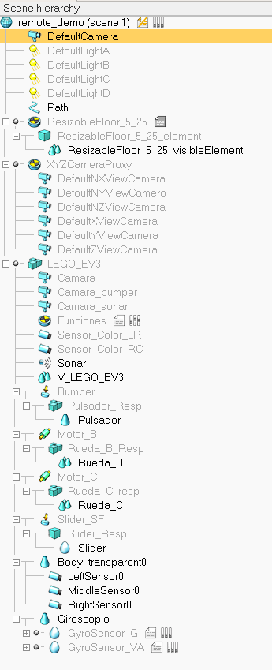
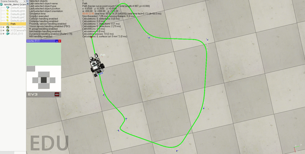

# Integrating V-REP with RoboComp as an external simulator and as an in-the-loop simulator

July 22, 2019

## Goals:

  ### Convert scene files of RoboComp written in XML to .ttt scene file types supported in V-REP

  - The scene files (like simpleworld.xml) of RoboComp are in .xml format, so, our goal is to convert these xml file to the filetype supported by V-REP.
  - V-REP supports binary file format with .ttt extension.
  - **Advances:**
    - Asked the concerned question in V-REP forum: [XML/text to .ttt(binary files) supported by V-REP](http://www.forum.coppeliarobotics.com/viewtopic.php?f=9&t=7949). The following are the methods suggested to convert existing xml files into ttt file:
      - V-REPs SDF plugin can be used in some way, since, V-REP can import SDF files (which are basically XML files conforming to the SDF specification) via the SDF plugin.
      - We can write some simple XML importer via an [add-on function](http://www.coppeliarobotics.com/helpFiles/en/addOns.htm). With the help of an add-on function that ships with V-REP: vrepAddOnFunc_minimalisticImporter.lua
        Then we can use a Lua XML parser (preferably a pure-Lua, such as [SLAXML](https://github.com/Phrogz/SLAXML) for instance).

## Validation test of the V-REP integration

  ### The idea is to use the Lego EV3 as the target robot in V-REP, a simple 2mx2m planar space with walls and a line drawn on the floor so it can follow it.

  - For the testing, we required V-REP model of Lego EV3 robot. We found two model files for the Lego EV3 robot:
    - [LEGO_EV3_GROUP](./LEGO_EV3_GROUP.ttm)
    - [LEGO_EV3_MERGE](./LEGO_EV3_MERGE.ttm)
  - Using the LEGO_EV3_MERGE model file, the following scene hierarchy was created in the V-REP scene:
    - 
  - And, the following is the sped up demo of the Lego EV3 robot being controlled by controller to follow a line on the floor:
    - 

## Documentation
  ### To guide the developers on how to use V-REP Remote API to control the behaviour of the scene:
  
  - **Advances:**
    - Here, is the basic introduction to V-REP, and a tutorial on  V-REP Remote API:
      - [https://github.com/nikhil3456/V-REP/blob/documentation/tutorial/V-REP_API.md](https://github.com/nikhil3456/V-REP/blob/documentation/tutorial/V-REP_API.md)

***
Nikhil Bansal

