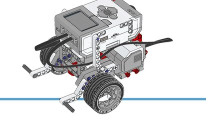

# Integrating V-REP with RoboComp as an external simulator and as an in-the-loop simulator

July 22, 2019

[](https://nodesource.com/products/nsolid)


## Goals:

  ### Convert scene files of RoboComp written in XML to .ttt scene file types supported in V-REP

  - The scene files (like simpleworld.xml) of RoboComp are in .xml format, so, our goal is to convert these xml file to the filetype supported by V-REP.
  - V-REP supports binary file format with .ttt extension.
  - **Advances:**
    - Asked the concerned question in V-REP forum: [XML/text to .ttt(binary files) supported by V-REP](http://www.forum.coppeliarobotics.com/viewtopic.php?f=9&t=7949). The following are the methods suggested to convert existing xml files into ttt file:
      - V-REPs SDF plugin can be used in some way, since, V-REP can import SDF files (which are basically XML files conforming to the SDF specification) via the SDF plugin.
      - We can write some simple XML importer via an [add-on function](http://www.coppeliarobotics.com/helpFiles/en/addOns.htm). With the help of an add-on function that ships with V-REP: vrepAddOnFunc_minimalisticImporter.lua
        Then we can use a Lua XML parser (preferably a pure-Lua, such as [SLAXML](https://github.com/Phrogz/SLAXML) for instance).


## Validation test of the V-REP integration

  ### The idea is to use the Lego EV3 as the target robot in V-REP, a simple 2mx2m planar space with walls and a line drawn on the floor so it can follow it.

  - For the testing, we required V-REP model of Lego EV3 robot. We found two model files for the Lego EV3 robot:
    - [LEGO_EV3_GROUP](./LEGO_EV3_GROUP.ttm)
    - [LEGO_EV3_MERGE](./LEGO_EV3_MERGE.ttm)
  - Using the LEGO_EV3_MERGE model file, the following scene hierarchy was created in the V-REP scene:
    - 
  - And, the following is the sped up demo of the Lego EV3 robot being controlled by controller to follow a line on the floor:
    - 

## Documentation
  ### To guide the developers on how to use V-REP Remote API to control the behaviour of the scene:
  
  - **Advances:**
    - Here, is the basic introduction to V-REP, and a tutorial on  V-REP Remote API:
      - [https://github.com/nikhil3456/V-REP/blob/documentation/tutorial/V-REP_API.md](https://github.com/nikhil3456/V-REP/blob/documentation/tutorial/V-REP_API.md)

## Create a controller using RoboComp bridge components to control a EV3_Lego
  
  - The [component](https://github.com/nikhil3456/robocomp/tree/V-REP_testing/components/EV3_VREP) has a DifferentialRobot interface (see DifferentialRobot.idsl on robocomp interfaces). The component also has all of the necessary methods to implement the interface successfully.

  - For testing, the EV3_LEGO robot is used with the following V-REP model-types:
    1. [LEGO_EV3_GROUP](./LEGO_EV3_GROUP.ttm)
    2. [LEGO_EV3_MERGE](./LEGO_EV3_MERGE.ttm)

  

  - The following are the components that makes up the model:

    ```python
    __COMPONENTS = {
            'robot': 'LEGO_EV3',
            'camera': 'Camara',
            'camera_bumper': 'Camara_bumper',
            'camera_sonar': 'Camara_sonar',
            'sensor_color_LR': 'Sensor_Color_LR',
            'sensor_color_RC': 'Sensor_Color_RC',
            'sonar': 'Sonar',
            'bumper': 'Bumper',
            'motor_b': 'Motor_B',
            'motor_c': 'Motor_C',
            'slider': 'Slider_SF',
            'giroscope': 'Giroscopio'
        }
    ```

    - The robot has two motors named "Motor_B", and "Motor_C" which are used to control the movement(rotation and translation). And, it also has two sensors for sensing the surroundings.

  - The V-REP scene act as a Server and the corresponding client logic is implemented in [vrep_client_controller.py](https://github.com/nikhil3456/robocomp/blob/V-REP_testing/components/EV3_VREP/src/vrep_client_controller.py). This is the code snippet to initialize the client in robocomp component to connect to V-REP server:

    ```python
    class VRepClientController:
    def __init__(self, host, port):
        self.host = host
        self.port = port
        self.client_id = -1
        self.console_id = -1
        self.debug = False

        self.connect()

        if not self.is_connected():
            if self.debug:
                err_print(prefix="COMPONENT CREATION",
                          message=["CANNOT CONNECT TO REMOTE API"])
            raise Exception("CANNOT CONNECT TO REMOTE API")
    ```

  - [remote_demo.ttt](https://github.com/nikhil3456/robocomp/blob/V-REP_testing/components/remote_demo.ttt) is the V-REP scene file for testing the robot.

  - [EV3_LEGO_controller](https://github.com/nikhil3456/robocomp/blob/V-REP_testing/components/EV3_VREP/src/EV3_LEGO_controller.py) is the python file containing the functions used to control the robot.

  - The compute function in [specificworker.py](https://github.com/nikhil3456/robocomp/blob/V-REP_testing/components/EV3_VREP/src/specificworker.py) has the logic for the robot to follow a line in the scene. This file basically calls the function in the file [EV3_LEGO_controller](https://github.com/nikhil3456/robocomp/blob/V-REP_testing/components/EV3_VREP/src/EV3_LEGO_controller.py) to control the robot.

***
Nikhil Bansal

