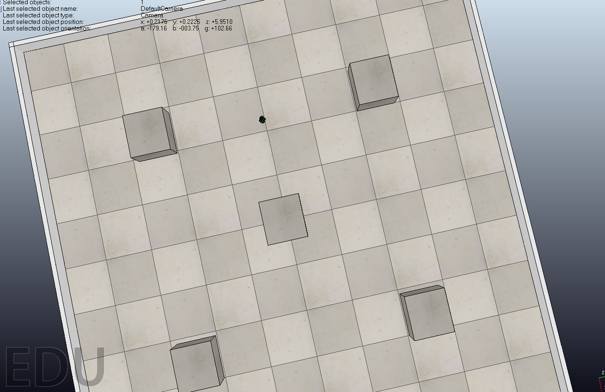

# obstacleAvoidanceVREP Component

25th August, 2019

This post will describe how to create **obstacleAvoidanceVREP** component and implementing various functionalities to it. This component will serve as client to laserVREP and differentialRobotVREP components and thus communicates with each of them to make the differential robot avoid obstacles.

## obstacleAvoidanceVREP controller

This component communicates with laserVREP component to get data(distance, angle) of the obstacles within the scanning area (simulated on V-REP). And, using that data it determines the directions to move so as to avoid obstacles.
The below image shows the V-REP scene used for testing the obstacleAvoidanceVREP Component:



The compute method in specificworker.py file of  obstacleAvoidanceVREP component calls the **getLaserData()** method of laserVREP component to get the data about the obstacles(simulated on V-REP).

Using the data (which is list of tuples (distance, angle) ), obstacleAvoidanceVREP component determines which direction to move, for example:
- if the closest obstacle is less than 50cm and its in -30 to 30 degree angle it rotates and change the direction.

to turn to the determined direction, obstacleAvoidanceVREP component calls the **setSpeedBase(self, adv, rot)** method of differentialrobotVREP component.

The code for the above logic looks like this:

**NOTE:** This is a very naive algorithm for avoiding obstacles, a more refined and proper algorithms could be used for better results. As, this components is just for testing the compatibility of laserVREP component with RoboComp, I didn't implemented such algorithms. 


```python
laserData = self.laser_proxy.getLaserData();
obstacleData = [(laserData[i].dist, laserData[i].angle) for i in range(len(laserData))]

# rotational velocity
rot = 0.7

# distance and angle corresponding to closest obstacle
distance, angle = min(obstacleData)
if distance < 50 and -30 <= angle <= 30:
    self.differentialrobot_proxy.setSpeedBase(0, rot)

```
And, here is the gif to show the robot avoiding obstacles:


## Creating the components

Now I will discuss the dependencies of each of these components and the interfaces which can be used by other components to interact with it.

### First, lets discuss the server components for our obstacleAvoidanceVREP component:

- differentialrobotVREP component:

    **differentialrobotVREP.cdsl**
    ```
    import "DifferentialRobot.idsl";

    Component differentialrobotVREP
    {
        Communications
        {
            implements DifferentialRobot;
        };	

    	language python;
    };
    ```

    So as we can see the differentialrobotVREP component is not dependent on any other component and it will be used as a server. However it has 8 different methods which can be used by other components for communication. These are described in the following IDSL file.

    **DifferentialRobot.idsl**
    ```
    import "GenericBase.idsl";

    module RoboCompDifferentialRobot
    {
      struct TMechParams
      {
        int wheelRadius;
        int axisLength;
        int encoderSteps;
        int gearRatio;
        float temp;
        string device;
        string handler;
        float maxVelAdv;
        float maxVelRot;
      };

      interface DifferentialRobot
      {
        void getBaseState(out RoboCompGenericBase::TBaseState state) throws RoboCompGenericBase::HardwareFailedException;
        void getBasePose(out int x, out int z, out float alpha) throws  RoboCompGenericBase::HardwareFailedException;
        void setSpeedBase(float adv, float rot) throws RoboCompGenericBase::HardwareFailedException;
        void stopBase() throws RoboCompGenericBase::HardwareFailedException;
        void resetOdometer() throws RoboCompGenericBase::HardwareFailedException;
        void setOdometer(RoboCompGenericBase::TBaseState state) throws RoboCompGenericBase::HardwareFailedException;
        void setOdometerPose(int x, int z, float alpha) throws RoboCompGenericBase::HardwareFailedException;
        void correctOdometer(int x, int z, float alpha) throws RoboCompGenericBase::HardwareFailedException;
      };
    };
    ```

    As you can see in the above idsl file, the differentialrobot offers an interface **setSpeedBase** . We will use this interface to change the direction of robot and to move the robot using our obstacleAvoidanceVREP component.

- laserVREP component
  

**laserVREP.cdsl**
```
import "Laser.idsl";

Component laserVREP
{
    Communications
    {
        implements Laser;
    };

    language python;
};
```

So as we can see the laserVREP component is not dependent on any other component and it will be used as a server. However it has 3 method which can be used by other components for communication. These are described in the following IDSL file.

**Laser.idsl**
```
import "GenericBase.idsl";

module RoboCompLaser
{
  sequence<int> shortVector;

  /** \struct TCamParams
  *@brief struct camera params
  */
  struct LaserConfData
  {
     string driver;     // Underlying hardware: HokuyoURG/Gazebo
     string device;     // Laser device: hardware dependent
     int staticConf;    // 0 means it has a dynamic laser configuration
     int maxMeasures;   // Total number of possible measures (Laser specific)
     int maxDegrees;    // Angular measurement range degrees (Laser specific)
     int maxRange;      // Maximun distance measurable mm (Laser specific)
     int minRange;      // Minimun distance measurable mm (Laser specific)
     int iniRange;      // (0-totalRange) Initial measuring position
     int endRange;      // (0-totalRange) End measuring position
     int cluster;       // (0-99) Number of neighboor positions grouped
     int sampleRate;    // Adquisition period in msecs
     float angleRes;    // Angle resolution
     float angleIni;    // Initial angle
  };

  /** \struct TData
  *@brief Data laser
  */
  struct TData
  {
    float angle;
    float dist;
  };

  sequence<TData> TLaserData;

  /** \interface Laser
  *@brief interface Laser functions
  */
  interface Laser
  {
    /** @brief Get laser data */
    TLaserData getLaserData();
    
    /**@brief Get laser data and base local state */
    TLaserData getLaserAndBStateData(out RoboCompGenericBase::TBaseState bState);
    
    /**@brief Return relevan comp params
    * @return struct LaserConfData
    */
    LaserConfData getLaserConfData();
  };

};
```

As you can see in the above idsl file, that the Laser offers an interface **getLaserData()** . We will use this interface to get the data about the obstacles and then using that data determine the direction in which to move the robot in our obstacleAvoidanceVREP component.

### Now moving forward to the client component. It is the main component which will implement the logic for the robot to avoid obstacles. Here is the cdsl file for the same.

**obstacleAvoidance.cdsl**
```
import "DifferentialRobot.idsl";
import "Laser.idsl";

Component obstacleAvoidance
{
    Communications
    {
        requires DifferentialRobot;
        requires Laser;
    };  

    language python;
};
```

As explained earlier, this component communicates with laserVREP component to get data on obstacles. And, using that data it determines the directions to move so as to avoid obstacles.

## Testing the Component

My current repository can be found [here](https://github.com/nikhil3456/V-REP/tree/master/components). For testing copy the folders *laserVREP*, *differentialrobotVREP*, *obstacleAvoidanceVREP* inside robocomp/components/. And the scene file can be found [here](https://github.com/nikhil3456/V-REP/blob/master/components/hexapod/obstacleAvoidanceDemo.ttt).

**NOTE**: I have used the same *differentialrobotVREP* component as the one I used with *keyboardcontroller* component with no change. I only changed the port in etc/config.


```
cd robocomp/components/
```
Open 4 new terminals.

Terminal 1: 
```
1. Open the scene obstacleAvoidanceDemo.ttt in V-REP.
2. Now, start the scene. That will start the server with two socket at 19999, 19998.
```

Terminal 2:
```
cd differentialrobotVREP
python src/differentialrobotVREP.py --Ice.Config=etc/config
```

Terminal 3: 
```
cd laserVREP
python src/laserVREP.py --Ice.Config=etc/config
```

Terminal 4: 
```
cd obstacleAvoidanceVREP
python src/obstacleAvoidanceVREP.py --Ice.Config=etc/config
```


Now, switch to the V-REP simulator and see the robot avoiding obstacles.

*PS: I would like to express my sincere gratitude to my project mentors Pablo Bustos, Nicolás González Flores, and José Manuel Agúndez for being very supportive and helping me whenever I faced any problem.* 

* * *
Nikhil Bansal
