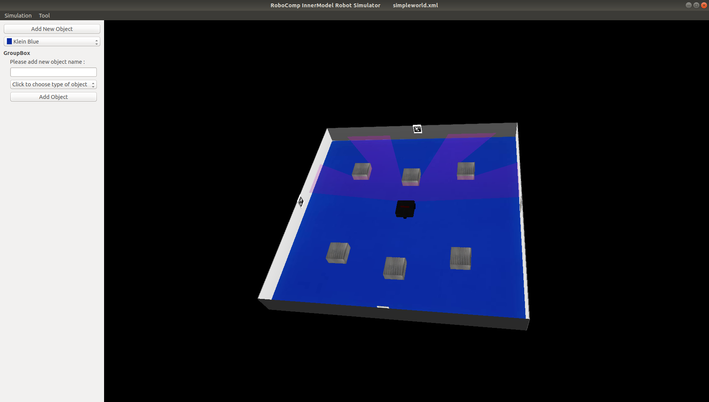
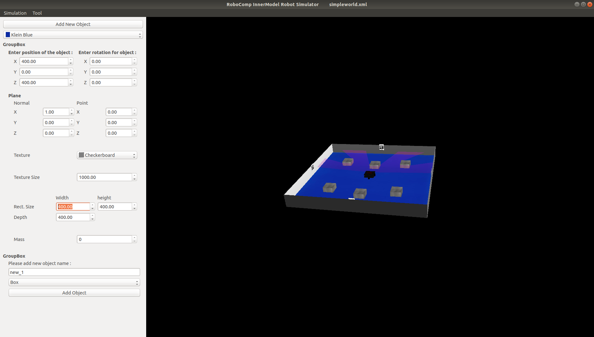
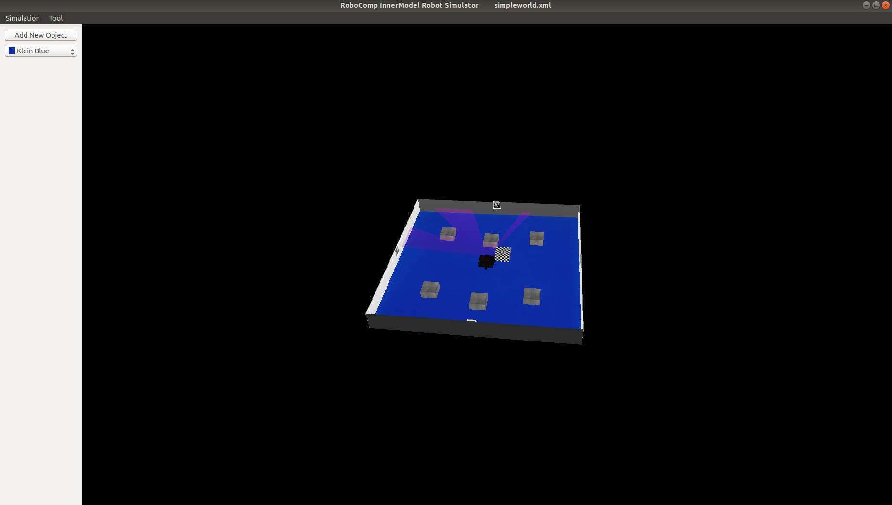
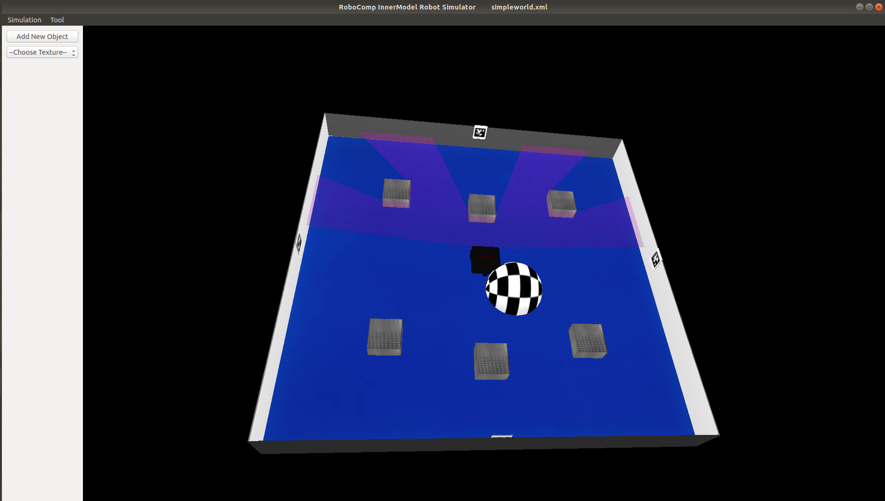
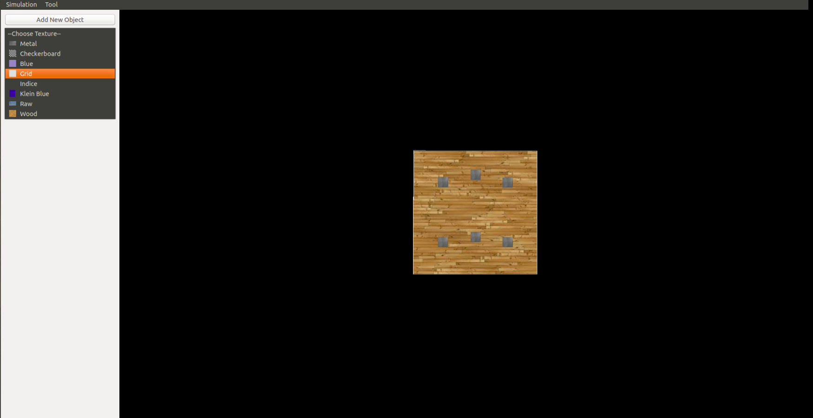

# Object Addition, Texture Change and Tree Viewing Option
June 19, 2019
	RCInnerModelSimulator now has the option to add object of box shape and sphere shape with any specifications. User can also view the tree of the scene and can also change the texture of the floor.

## Object Addition
After getting acquainted with Qtcreator, C++ Object Oriented Programming and Open Scene Graph. I started with designing the GUI, which will take all the necessary inputs required to add object like object position, rotation, dimensions, texture, etc. After this I wrote code for object addition but when I tested it, object wasn't getting added. Even after some debugging error existed, then I decided to add Tree viewing option. Tree implementation was done in order to see whether object was even getting added. After tree implementation I saw that object was getting added, it was just not getting visible in the scene. After sharing this with Sparsh Sir, he told me that I need to reload the scene. So, finally after writing code to reload scene, object was getting added. :)

Now I needed to explore InnerModel Library to add sphere. Then I made required changes in innerModel library and then accordingly used them in my code to add sphere.

*Step 1: Enter new object name and select type of object*

*Step 2: Enter properties of the object*

*Result: Object Added*

*Sphere object addition output*

*Texture Change Dropdown*

## Floor Texture Change
I added this functionality to change texture of the floor. I also added Icon of corresponding texture in the GUI so that user has a clear understanding of which texture is getting added.

## Modified GUI for non-expert user
After talking to my mentor Pilar Ma'am, she told me to make GUI for a non-expert user hence I changed my GUI which is easy to use and simple to understand for the user. Thereafter I made necessary changes to the code and in the GUI.
