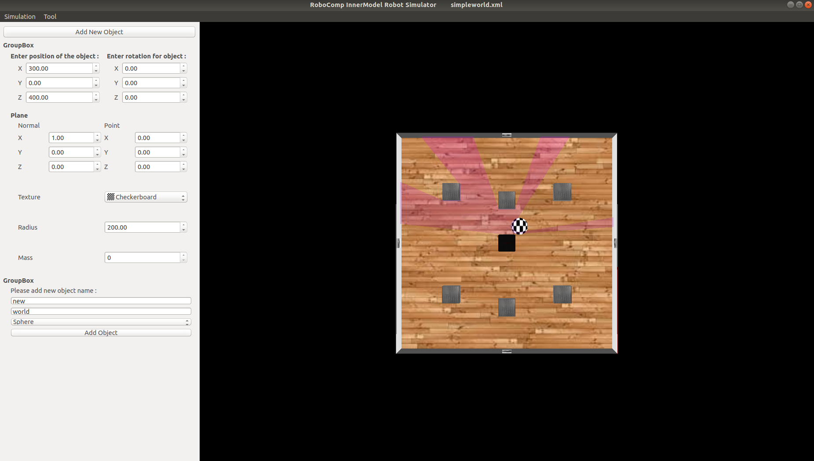
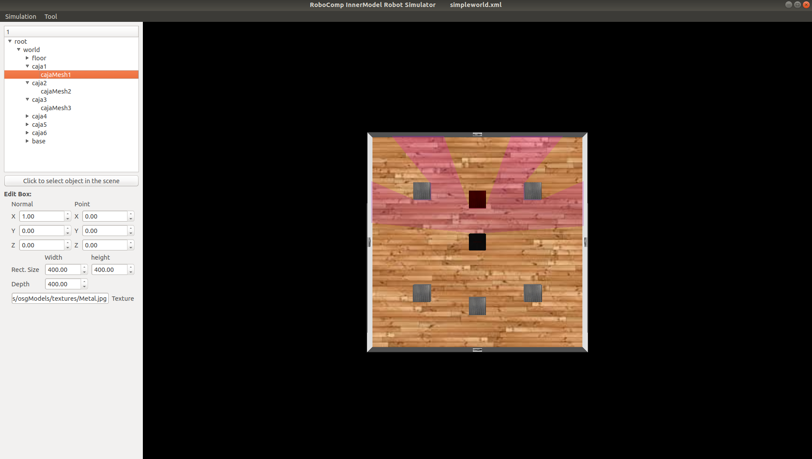

# Dynamic Object Addition, Object Properties Alteration and Linking scene and tree to highlight corresponding object that are selected in tree and vice versa 
July 22, 2019
	RCInnerModelSimulator had the option to add object of box shape and sphere shape with any specifications. User can also view the tree of the scene and can also change the texture of the floor. Now user can also add object of cone and cylinder shape. 
	Manytimes users want to change the properties of already existing objects in the scene. Therefore functionality to edit existing objects/nodes has been provided. Accompanying this feature a must have feature was to highlight selected object in the scene that is selected in the tree whose property needs to be changed is also added.

## Change Object properties dynamically
Previously user had no idea of how the object will look in the scene when added. Thus there were chances that the object added by user will not be what he/she wanted or thought. Therefore, I have added a feature where user can edit the properties of the object he/she added. User can change the texture, dimensions, positionand rotation of the object dynamically. This feature not only works for objects such of plane or transform type rather it works for everything that is present in the scene from camera to robot.
	
But even after adding this feature it was bit frustrating for the user to not able to see what exactly will be added when he inputs dimensions, position and texture of the object. Therefore my Mentor Pilar Ma'am suggected me to modify object addition in such a way that we have default values in dimensions, position and texture of the object and that object gets added in first place when we select 'type of object' that needs to be added. Thereafter user can dynamically change the properties of object and finally added the object of his choice. 

To accomplish this task of dynamically changing properties of node changes were made to innerModelviewer file in innerModel library.

## Add object with a preview feature
Thus object addition has been provided with a feature to preview what exactly is getting added.

## Linking tree and scene in order to find corresponding objects in scene that are selected in tree and vice versa 
When a user wants to change the properties of an object in scene he/she should know which object he has selected in the scene before changing it's properties. Therefore a node in the scene will get highlighted when a corresponding node is selected in the tree and the same also works vice versa.

RGBD window removal still need to be completed and remove node feature will be implemented. To smoothen the user experience drag and drop feature will be also added and many more things will be added to provide user a wonderful experience of using the simulator. :)
