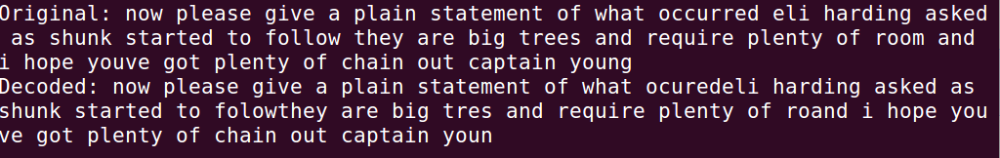

## Connection Temporal Classification(CTC)

25 July , 2020

 ##### ASR decoding is mainly composed of two major steps: 
  1.The mapping.
  2.The searching.
  
 In the mapping, we map the acoustic information of an audio frame to a triphone state. This is the alignment process. This is a many-to-one mapping. It maps 
 multiple audio frames to the same triphone state.The alignment maps acoustic information to a phone. Then, we search for the phone sequence for the optimal word 
 sequence.
 
 Deep learning opens the door for an alignment-free one-to-one mapping which maps an audio frame to a relatively high-level component. Then, we can search for it. 
 This gives us a head start and bypasses the complicated alignment process. That is the core concept of CTC. The CTC (Connectionist Temporal Classification) decoder
 works by taking the probability matrix that is output by the model and walking over it looking for the most likely text sequence according to the probability 
 matrix. If at time step 0 the letter “C” is the most likely, and at time step 1 the letter “A” is the most likely, and at time step 2 the letter “T” is the most
 likely, then the transcription given by the simplest possible decoder will be “CAT”. This strategy is called greedy decoding.
 
 This is a pretty good way of decoding the probabilities output by the model into a sequence of characters, but it has one major flaw: it only takes into account 
 the output of the network, which means it only takes into account the information from audio. When the same audio has two equally likely transcriptions 
 (think “new”vs “knew”, “pause” vs “paws”), the model can only guess at which one is correct. This is far from optimal: if the first four words in a sentence
 are “the cat has tiny”, we can be pretty sure that the fifth word will be “paws” rather than “pause”. Answering those types of questions is the job of a 
 language model, and if we could integrate a language model into the decoding phase of our model, we could get way better results.

## Language Modelling

The language model provides context to distinguish between words and phrases that sound similar. ... In speech recognition, sounds are matched with word sequences.
Ambiguities are easier to resolve when evidence from the language model is integrated with a pronunciation model(in DeepSpeech we use CTC decoder)  and an acoustic model.

#### Beam scoring with a language model

Integrating the language model into the decoder involves querying the language model every time we evaluate an addition to the transcription. Going back to the 
previous example, when looking into whether we want to choose “paws” or “pause” for the next word after “the cat has tiny”, we query the language model and use 
that score as a weight to sort the candidate transcriptions. Now we get to use information not just from audio but also from our language model to decide which 
transcription is more likely. 

## Final Output of ASR

