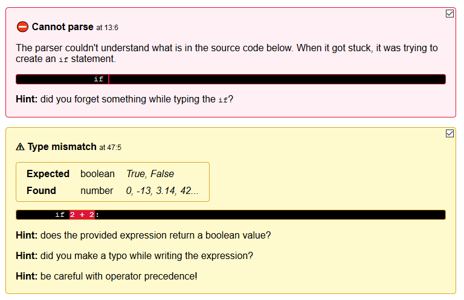
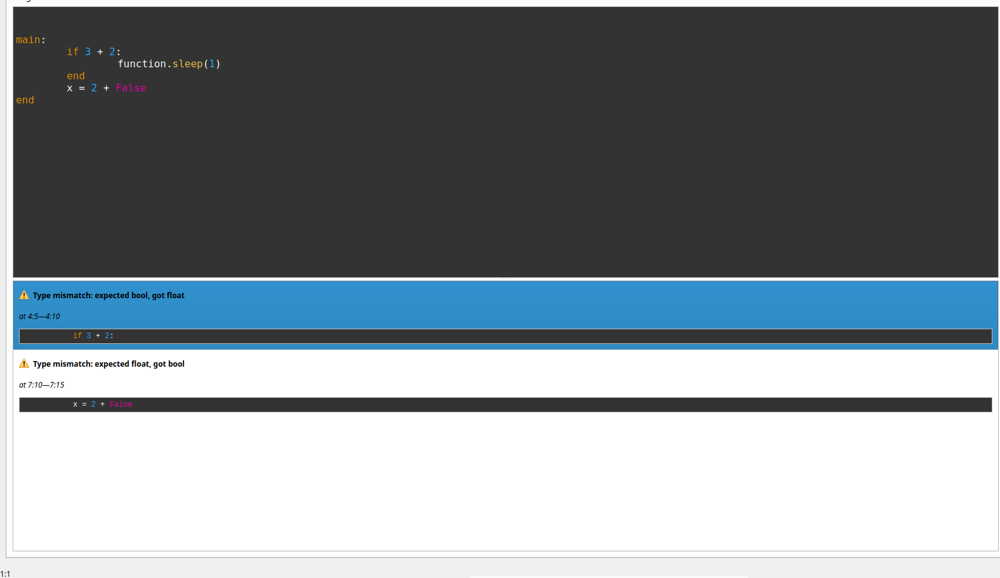

Planning and discussing prior to coding
=======================================

We are halfway through the second coding period, and still working on the
desired features. I wanted to set aside some time to talk about how I
approached this period, so here I am writing some reflexions about the last
week in the project

Turning ideas into mockups
--------------------------

I'm now working on a rich and integrated error visualization format for
Block-Text, the intermediate language LearnBlock uses to ease the path
from Visual Block to Python. When I was writing my proposal, I had a vague
idea of what I wanted to do, but it wasn't really something I could tell
you precisely. In fact, it kept changing during days, while I tried to give it
shape properly. Then, my mentors proposed having a meeting to discuss the
roadmap towards the final implementation for this deadline's features.

As I wanted to show them *something* to start talking about, I decided it could
be a good idea to just make a demo. I had no prior experience with Qt, the
UI toolkit used in the project, but I knew enough HTML/CSS to make some
quick-and-dirty widgets resembling what I had in mind. I think it worked great:
the conversation was really focused because we had something to build upon, so
we didn't lost time trying to figure out how everyone else was picturing it in
their minds. I would absolutely recommend doing that because it has really
worked for me. It doesn't have to be finished or even fully working, but a draft
which you can build in no more than 30 minutes.

Discussing features
-------------------

The meeting had three goals:

- Spotting a bug, which at the end was due to a missing line from the example
- Telling me how to use PySide2 effectively to be able to do my work properly
- Deciding what would be implemented in this period and how it would look

We spend quite some time discussing the features which would make into this
period, and sometimes we had largely different views on how they should look!
All in all it was very enlightening, and the final plan evolved taking the
best out of each of our proposals. With a clearly defined set of features, I
could start coding again!

