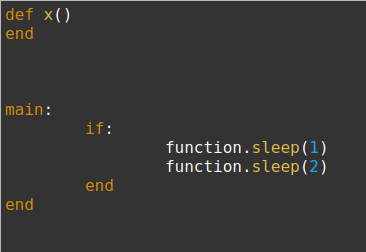
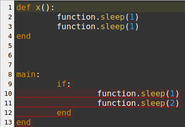
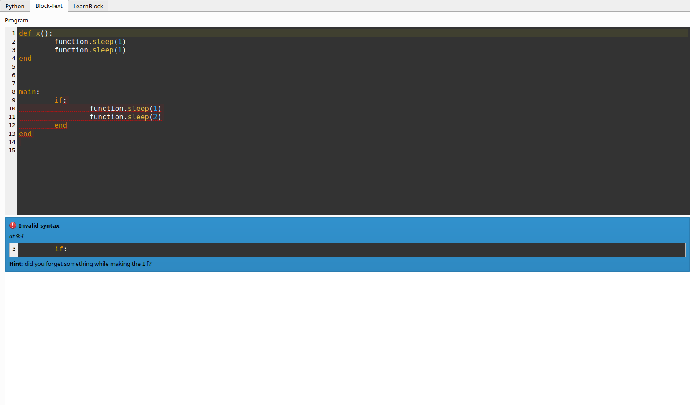
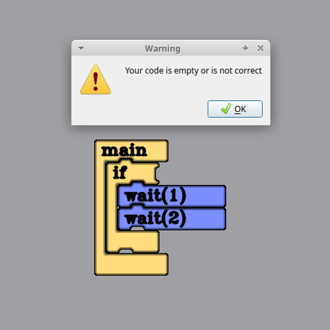
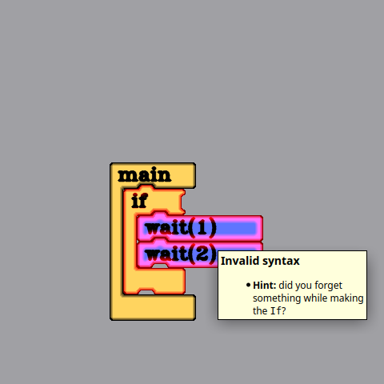

# Project finished!

I'm writing this just after submitting the last PR needed to fulfill my goals
for this Google Summer of Code. It's been an incredible journey, and I'm really
proud of the results! The UI feels way better now, and the features implemented look way more important now that they are done than back when they were just
thoughts. Let's review them!

## Code editing area overhaul

### Before

### After

### Changes

A custom widget has been made, which is used whenever a piece of code has to
be shown or edited. It features line numbering (with customizable offset) and
highlighting.

## Block-Text notification area

### Before

### After

### Changes

Block-Text representation has been greatly improved, as it's the model for the
other representations and the target of the main Notification class.

- The coding area has been splitted horizontally to include a notification
  area.
- Messages thoughout the compilation stages subclass a common Notification
  class which takes care of its widget representation, while giving children
  some flexibility to alter it's behavior.

  * It has a concise title and an icon to quickly identify the issue
  * It also has information about the affected area, showing both exact
    position and a snippet from the original code which contains the error
  * It also provides some hints to help the user improve/fix their code, so
    they learn not only how but also why!

- Notifications are marked in the source code, and a double-click on a
  notification will take you to its location in the source code.

## Visual Block notification marking

### Before

### After

### Changes

Notifications are signaled as a red glow in the affected blocks. Hovering the
mouse over any of such blocks will show a short description of the error,
and some hints to aid the user (just like in the Block-Text area).

## Final thoughts

The changes made really improve the user experience, and the environment feels
more professional and welcoming. Now that the infrastructure is in place, I
expect it to be extended further with more errors and hints easily, so more
care is put into the user when LearnBlock grows. However the most important
change is the parser rewrite. It's funny: few people will notice it being
different than before, yet the changes made (modular architecture, the class
hierarchy of nodes rather than a flat list of tokens and so on) made these
changes possible, alongside any other coming in the future!
