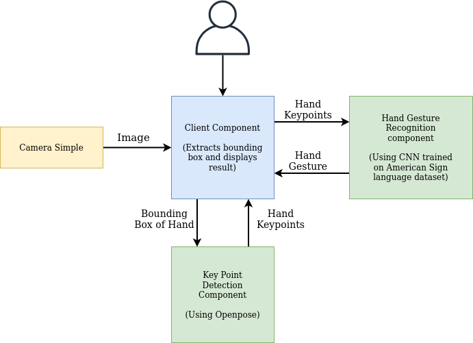

# Component Structure for Hand Gesture Recognition

June 22, 2020

In this article I will discuss about the different components I will be developing to implement **Hand Gesture Recognition** feature in robocomp-robolab and their interactions. I will also talk about advantages of using this structure.

Moreover, I will also elaborate the interface definitions (`.idsl` and `.cdsl` files) and usage of each component.

## Component Structure

The complete project is divided into three component *viz. Client Component, Keypoint Detection Component and Hand Gesture recognition Component*. These three components will interact with each other and *CameraSimple Component* to fulfill the project requirements.

### Client Component

This component acts as the black box or host component for the project. User or any other component can interact with this component to obtain features like hand's bounding box coordinates, keypoints coordinates or recognized hand gesture. This component takes image as input from *CameraSimple Component*. It finds the bounding box coordinates of hand in image itself and sends request to *Keypoint Detection Component and Hand Gesture recognition Component* for obtaining other hand features.

Component Interface Definitions:

**HandGestureClient.idsl**

```
module RoboCompHandGestureClient
{
    sequence<byte> ImgType;
    struct TImage
    {
        int width;
        int height;
        int depth;
        ImgType image;
    };
    sequence<float> HandBBox;
    sequence<float> KeyPoint;
    sequence<KeyPoint> KeypointType;

    struct HandType
    {
        HandBBox boundingbox;
        KeypointType keypoint;
        string gesture;
    };
    interface HandGestureClient
    {
        idempotent void getHandGesture(TImage handImg, out HandType hand);
    };
};
```

So here we can observe that it implements `getHandGesture` method which takes an image as input and output struct `HandType` containing Hand bounding box, keypoints and gesture.

**HandGestureClient.cdsl**

```
import "CameraSimple.idsl";
import "HandGestureClient.idsl";
import "HandGesture.idsl";
import "HandKeypoint.idsl";

Component HandGestureClient
{
    Communications
    {
        requires CameraSimple, HandGesture, HandKeypoint;
		implements HandGestureClient;
    };
    language Python;
};
```

As explained earlier, Client component interact with *CameraSimple, HandGesture and HandKeypoint Components* to achieve it's goals.

### Keypoint Detection Component

As name suggests, this component finds the coordinates of **hand keypoints** from image of **hand**. It recieves hand image from the client component, find coordinates and returns a float sequence of size 21 representing 21 key points of hand back to Client component. These 21 keypoints consist of four keypoints for each finger and one for the wrist.

Component Interface Definitions:

**HandKeypoint.idsl**

```
module RoboCompHandKeypoint
{
    sequence<byte> ImgType;

    struct TImage
    {
        int width;
        int height;
        int depth;
        ImgType image;
    };

    sequence<float> KeyPoint;
    sequence<KeyPoint> KeypointType;

    interface HandKeypoint
    {
        idempotent void getKeypoints(TImage handImg, out KeypointType keypoints);
    };
};
```
`getKeypoints` method can be used to obtain keypoints from the image of hand.


**HandKeypoint.cdsl**

```
import "HandKeypoint.idsl";

Component HandKeypoint
{
    Communications
    {
        implements HandKeypoint;
    };
    language Python;
};
```

This component is standalone and does not require any other component.

### Hand Gesture Recognition Component

*Client Component* will collect hand keypoints from *HandKeypoint Component* and will pass it to this component. This Component will use these keypoints to recognize the hand gesture (American Sign Language Alphabets) and will return the same to Client.


**HandGesture.idsl**

```
module RoboCompHandGesture
{
    sequence<float> KeyPoint;
    sequence<KeyPoint> KeypointType;

    interface HandGesture
    {
        idempotent void getHandGesture(KeypointType keypoints, out string gesture);  
    };
};
```

`getHandGesture` method can be used to obtain hand gesture from keypoints.

**HandGesture.cdsl**

```
import "HandGesture.idsl";

Component HandGesture
{
    Communications
    {
        implements HandGesture;
    };
    language Python;
};
```
Like HandKeypoint Component, this component is also standalone and does not require any other component.


### Schematic Representation

Below schematic representation provides an overview of components and their interaction:



## Advantages of this structure

The component structure is kept as modular as possible. Few advantages of structuring the project in an above-mentioned way are:

- Each component can be independently used for other use cases
- Allow for convenient future upgrades of components
- Enhances readability of codebase enabling easy future contributions by other members of the community

***

**Kanav Gupta**
