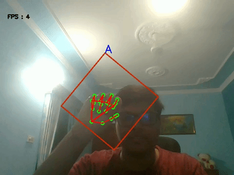

# Hand Gesture Recognition

August 24, 2020

In this article, I will elaborate on the method used by me to recognize hand gesture and it's accuracy. For achieving this, I created the `Hand Gesture Recognition component`. This component achieves the final and the most important objective of my Google Summer of Code project. I have already talked about the dataset creation, different methods in the components and purpose of each in my [last blog](https://robocomp.github.io/web/gsoc/2020/posts/kanav/DatasetCreation).

Since this is my last blog, I will also mention future work that can be done to improve the component.

## Method Used

I used Support Vector Machine (SVM) to recognize gestures in this component which is a supervised learning technique. I used one vs one technique of the SVM, in which, for every pair of classes a classifier is trained that maximize the distance of data points from the hyperplane separating them. All these hyperplanes are then used to predict the class for the new data.

I decided to use SVMs because of following reasons:

- Training and testing SVM is faster, so we can train for custom classes on every run.
- SVM is effective in high dimensional spaces. Hand Keypoints on which we are training are 42 dimensional.
- SVM is memory efficient, so fewer resources are required.
- Unlike in neural networks, SVM is not solved for local optima.
- Risk of overfitting is very less in SVMs

I also considered other techniques like CNN (High training time so can't train for custom classes every time), KNN (Can be trained and tested in real-time, but accuracy was low compared to SVM).

## Future Work

In this project, I have created a basic structure and properly functioning components for gesture recognition in real-time. But some improvements can be made, which are mentioned below:

- Accuracy of gesture recognition can be improved by using a larger dataset of keypoints
-  In this project scope of gestures was limited to ASL alphabets, in the future, we can improve this component to work for a wider range of gestures like ASL words. Also, since ASL alphabets are single-handed, we can work on two-handed sign languages like British Sign language.

## Project Demo

I have made a video demo explaining the steps to run the component.

Youtube Link: [https://youtu.be/1JFvr_lMYTo](https://youtu.be/1JFvr_lMYTo)

For experiencing this yourself, visit [handGestureClient Component](https://github.com/robocomp/robocomp-robolab/tree/master/components/detection/test/handGestureClient) and follow the the given instructions.

## Thanking Note

The whole journey of Google Summer of Code has been really exciting. It was a brilliant learning experience as I was working on the problem of this kind for the first time. There were some challenges I faced and it was fun solving them.

I would like to thank **Aditya Aggarwal**, **Francisco Andrés**, **Esteban Martinena Guerrero**, and **Pilar Bachiller** for helping me overcome challenges and giving constructive suggestions throughout the project.

***
**Kanav Gupta**