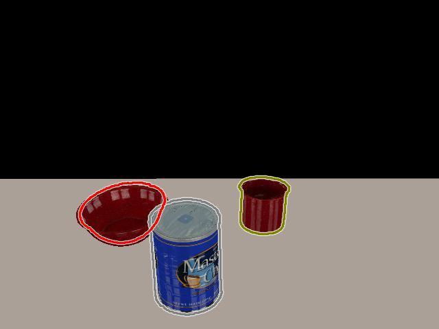
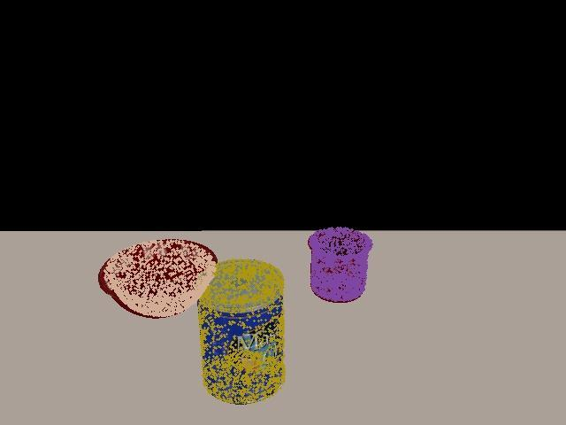

# Final Pose Estimation Settings

_DATE : July 15, 2020_

In this post, I share the final settings of pose estimation DNN and component. Also, I discuss recent updates and final training results.

## Pose Estimation Progress

-   After training `Segmentation-driven 6D Object Pose Estimation` network on the final setting (focal loss + textured objects), I tested the network performance on both RGB data from YCB-Videos dataset and CoppeliaSim simulator. The trained network performs well in both cases, however the poses can be inaccurate in specific cases with high occlusion. This is, mainly, due to the fact that small errors in the extraction of 2D keypoints can greatly affect the 3D poses.

-   Consequently, I had to search for a way to refine the bad poses. The search process was very long, as I explored both classical and DNN-based methods. However, here is a brief overview of my search directions and their results :
    -   First, I searched for classical methods for pose estimation and refinement. The majority of these methods uses visual features, extracted using classical methods like SIFT and ORB, in order to solve 2D-3D correspondace problem, which is exactly the methodology of `Segmentation-driven 6D Object Pose Estimation` network. However, these methods don't work well with complex objects, so I didn't go for them.
    -   Second, I continued searching for DNN-based methods. I focused my search on RGBD-based methods, as depth information can greatly improve the DNN performance. I tried `DenseFusion` pretrained network and the results were very good. Consequently, I tried to search for improvements over `DenseFusion`, which led me to `PVN3D`, which was published in _CVPR 2020_.

-   I studied `PVN3D` network, understood the open-source code and wrote an inference script myself. After trying the pretrained network on YCB-Videos and simulator data, I found out that the results are actually very good and stable. However, this came with one issue, which is inference time. `Segmentation-driven 6D Object Pose Estimation` can run at 20 FPS, meanwhile `PVN3D` runs at 3~4 FPS.

-   Finally, my decision was to use `Segmentation-driven 6D Object Pose Estimation` network to get poses from RGB images (for fast inference) and use `PVN3D` to correct bad poses from RGBD images (in the approach stage). Also, I decided to create a seperate component for each of them. This way, they can be used independently and adapt to any new situation.  

## Final Pose Estimation Structure

There are two separate pose estimation components, each uses the same component to publish the poses into the shared graph, which is `objectPoseEstimationPub` component. Also, each of them has a separate interface method to get poses, directly, by calling it. The two components are :

-   `objectPoseEstimationRGB` component : responsible for object pose estimation using RGB image only and uses `Segmentation-driven 6D Object Pose Estimation` network.

-   `objectPoseEstimationRGBD` component : responsible for object pose estimation using RGBD image and uses `PVN3D` network.

## Pose Estimation Results

Figure(1): Sample of output poses of Segmentation-driven 6D Object Pose Estimation network in the simulator.

 

Figure(2): Sample of output poses of PVN3D network in the simulator.

 

## Other Updates

Apart from my work on pose estimation, I was working on grasping using Gen3 arm, as well. I defined the new arm in PyRep API and passed the unit tests. Then, I tried to work on grasping using PyRep IK (Inverse Kinematics) solver, but it didn't work. This is, mainly, because PyRep IK solver is very sensitive to physical noise and requires excessive tuning of the target pose. Thus, we decided to utilize the work done with the original remote Python API and integrate it to PyRep.

## Important Dates

- __July 13, 2020 :__

Finish `Segmentation-driven 6D Object Pose Estimation` network training and finalize `objectPoseEstimationRGB` component.

Commit : https://github.com/robocomp/grasping/commit/322ea4304bf07bd4efe378b89805ddc454a25d40

- __July 15, 2020 :__

Complete `PVN3D` network testing and inference scripts.

Commit : https://github.com/robocomp/grasping/commit/fd49394bc41abaeb5970b67e593170a53557204e

## Upcoming Work

-   Complete `objectPoseEstimationRGBD` component using `PVN3D` network.

-   Adapt the original work with Gen3 arm to PyRep API.

-   Complete `viriatoGraspingPyrep` component for grasping test.

-   Integrate pose estimation components into the new software architecture using `objectPoseEstimationPub` component.

__Mohamed Shawky__