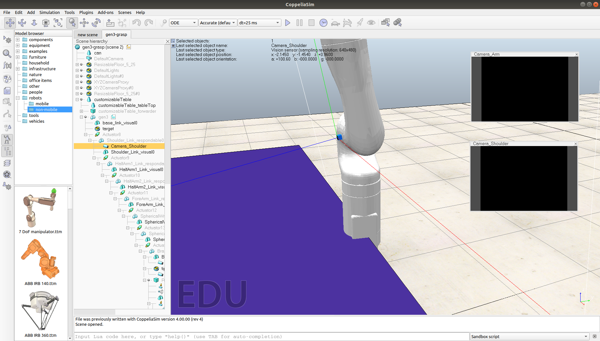

# Pipeline Integration and First Grasping Demo
 
_DATE : July 24, 2020_

In this post, I discuss the whole working pipeline after integration and show the first demo of Gen3 arm grasping using DNN-estimated poses.

## Pose Estimation Components

Let's start with discussing the final work done with the pose estimation components :

-   The previous post showed that we divide DNN pose estimation into two separate components, `objectPoseEstimationRGB` and `objectPoseEstimationRGBD`. `objectPoseEstimationRGB` component performs pose estimation using `Segmentation-driven 6D Object Pose Estimation` network from RGB images only. While, `objectPoseEstimationRGBD` component performs pose estimation using `PVN3D` network from RGBD images for extra information. We discussed that this separation allows us to use each component separately, or even ensemble their outputs for more precision. Also, the previous post showed that `objectPoseEstimationRGB` component was complete.

-   Now, `objectPoseEstimationRGBD` component is, also, complete using `PVN3D` network. There is an open-source implementation for the network, already. So, I spent time studying it and trying to refactor some code. Then, I wrote some inference scripts to help connecting with RoboComp component, easily. Also, some pre-processing and visualization code had to be written. After so, `objectPoseEstimationRGBD` component was integrated and tested.

-   The two pose estimation components were, then, tested thoroughly. I used `viriatoGraspingPyrep` component to test the connection with components and added pose visualization utilities to verify the validity of the estimated poses.

-   The tests focused on both accuracy and execution time. `objectPoseEstimationRGB` component can run with up to 20 FPS (average 0.05 seconds per frame), however the network can, sometimes, mispredict the object translation along the camera z-axis, as the depth information isn't provided. On the other hand, `objectPoseEstimationRGBD` component runs with 3~4 FPS (average 0.25 seconds per frame), but it's more robust, due to depth information.

-   Finally, the tests showed that the two components can estimate poses of YCB-Videos dataset objects with high accuracy and that they can be used to perform a successful grasp on those objects.

## Arm Modifications

To perform the grasping tests, I used the new Gen3 arm. However, I had to add some modifications over the arm to ease the pose estimation and path planning stages :

-   The vision sensor was fixed at the gripper, which didn't provide a good view of the objects in front of the arm. So, I added a new vision sensor in the arm's shoulder, that can provide a better view of the objects.

Figure(1): The added shoulder camera to Gen3 arm.

 

-   I used previously-developed Lua scripts to develop a grasping pipeline with PyRep API. I will discuss the path planning challenges in the next section, however it was one of the modifications, I did to the arm, that I used similar Lua scripts to perform path planning and grasping. These Lua scripts are embedded in Gen3 arm as threaded child scripts.

-   Viriato Gen3 arm model can be found [here](https://drive.google.com/file/d/1z7TZP6zbNzlrMwSWsogVPlnGv_FaBwRb/view?usp=sharing).

## Path Planning Challenges

-   Path planning was one of the most challenging parts of the whole grasping pipeline. It took me some time to be able to sucessfully perform path planning with Gen3 arm based on the DNN-estimated poses for a successful object grasp, as we needed a fast and accurate way to perform such task.

-   First, I considered PyRep API to perform path planning. I defined our new arm in the API and passed the unit tests. However, PyRep API Ik (Inverse Kinamatics) solver was very sensitive to physical noise. Consequently, I couldn't use it directly for path planning, but we still need it, because of the fast Python connection with V-REP simulator.

-   Thus, I had to take a more involved path to solve this issue. After discussing the problem with Professor Pablo Bustos, he suggested that I use a previously-developed Lua script that works with the traditional V-REP python API and adapt it to PyRep API. We couldn't use the old scripts straight away though, as the remote API was very slow.

-   So, I started studying the previous work with grasping and was able to refactor the Lua scripts to adapt to our work. I embedded these Lua scripts in Gen3 arm as threaded child scripts. Furthermore, I was able to call these procedures through PyRep API. Thanks to V-REP robust IK solver, path planning was more accurate and less sensitive to noise.

-   This way, we can combine the speed of PyRep API and the robustness of V-REP IK solver into one fast and accurate path planner and thus the path planning problem was solved.

## Whole Pipeline Integration

So far, I have completed the pose estimation DNN implementation and training, created two pose estimation component and tested them. Moreover, I have created the path planning and grasping pipeline. So, now it's time to integrate the whole pipeline and test it. I developed a separate component named `viriatoGraspingPyrep`, which includes the work done with path planning and grasping. Also, it connects to the pose estimation component to estimate poses from RGB(D) images captured by the arm's shoulder camera. The system integration goes as follows :

-   `viriatoGraspingPyrep` component uses PyRep API to start the simulation and define required models and shapes. Also, it connects to `objectPoseEstimationRGB` and `objectPoseEstimationRGBD` components.

-   Once everything is initialized and connection is established, `viriatoGraspingPyrep` component reads RGBD image from Gen3 arm's shoulder vision sensor. Then, it passes the data to the pose estimation components and save their results in an internal storage.

-   Then, `viriatoGraspingPyrep` component uses the estimated poses to create some dummies for the arm to approach the target object, then calls a remote Lua procedure to define these dummies in the Lua script.

-   Finally, the Lua procedures are called to perform path planning based on the created dummies to approach and grasp the target objects.

This way, the arm can detect and grasp any of YCB-Videos dataset objects within its camera sight.

## First Demo Showcase

After finishing the integration, I had to test the whole pipeline in an initial setting. The test setting is simply a can, for which the arm has to move based on the DNN-estimated pose. So, here are the results of the first demo :

Figure(2): Video of grasping first demo.

 

Figure(3): Visualization of the DNN-estimated pose in first demo.

 

You can try the demo by running [viriatoGraspingPyrep](https://github.com/robocomp/grasping/tree/master/components/viriatoGraspingPyrep) component, along with [objectPoseEstimationRGB](https://github.com/robocomp/grasping/tree/master/components/objectPoseEstimationRGB) and [objectPoseEstimationRGBD](https://github.com/robocomp/grasping/tree/master/components/objectPoseEstimationRGBD) components.

## Important Dates

-   __July 18, 2020 :__

Finish and test `objectPoseEstimationRGB` and `objectPoseEstimationRGBD` components.

Commit : https://github.com/robocomp/grasping/commit/0ef5e8230f32cf761d8b068750441fd2efffe8ac

-   __July 24, 2020 :__

Finish the work with path planning and the whole pipeline integration.

Commit : https://github.com/robocomp/grasping/commit/6833e2b7cdef9e54e6ea08c8d890f585e601e8b2

## Upcoming Work

-   Fix some issues with pose estimation regarding depth factor and camera-to-world projection.

-   Integrate the whole pipeline into the new software architecture using `objectPoseEstimationPub` component.

__Mohamed Shawky__
