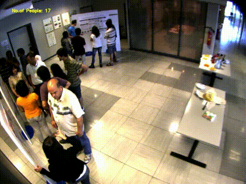
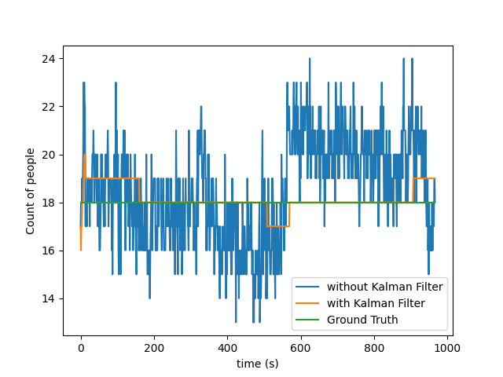
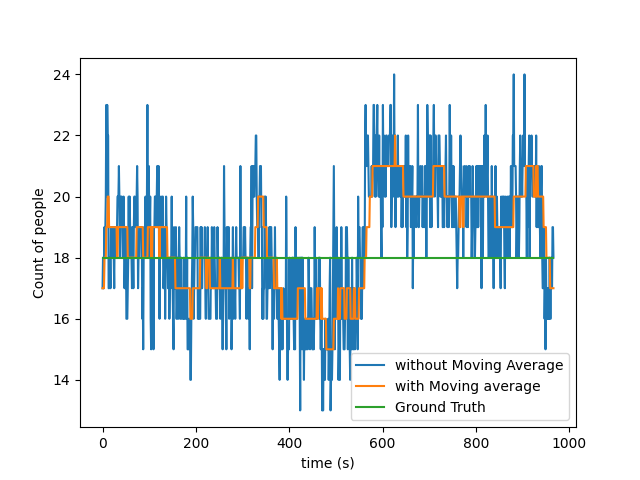

## A Summary of my Contributions up until the First Evaluations  

Once the results were announced, I immediately started my work by fixing minor issues in the [human-detection repository](https://github.com/robocomp/human-detection), particularly in the [PeopleCounter](https://github.com/robocomp/human-detection/tree/master/components/peopleCounter) module. I made relevant pull requests for the same, some of which are under review. These included issues like porting to from Python2 to Python3, fixing code according to the latest version of the pip packages, etc. Please read my [blog](https://niveditarufus.github.io/) for further details.  

The project phase started with me doing a literature survey and implementation of few people counting approaches depending on the placement of cameras:
**1. Tracking people entering and exiting the building:**  
This is possible when we have cameras at the entrances to the building.  
**2. Keeping a running count of people in each room of the building:**  
This is possible when the cameras are placed facing the inside of the room, And the number of people inside the building is given by the sum of the count in all rooms of the building.  

### Implementation of the first approach:
This implementation using the MobileNet SSD model was done to track and count people entering and exiting the building with cameras placed at the entrances. You can find the code [here](https://github.com/niveditarufus/People_counter).  
  

### Implementation of the second approach:
For this approach, I had a choice between: 
1. [Deep-SORT](https://arxiv.org/pdf/1703.07402.pdf)  
2. [CSRNet](https://arxiv.org/pdf/1802.10062.pdf)  
3. [SS-DCNet](https://arxiv.org/pdf/2001.01886.pdf)  

CSRNet and SS-DCNet are suited to cases when we have footage that is from within the room by keeping a running count of the number of people in the room frame-by-frame. Both these networks work well for densely crowded places. On analysis, the SS-DCNet algorithm seems to work better based on factors like MAE, etc. I had implemented a People Counter based on the SS-DCNet algorithm [here](https://github.com/niveditarufus/PeopleCounter-SSDCNet).  
  
I had also encountered some problems with the accuracy of the count values given by the SS-DCNet based counter which sometimes gave unrealistic jumps in a continuous video feed, I had resorted to two major methods which proved to improve the performance of the count values return with the SS-DCNet model namely,  

1. 1D Kalman Filter based approach  
  

2. A moving average based approach
  

I have modified the code so that the user can specify the filtering method wants according to the setting in which want it to work. This just a brief summary of my work during the first phase. More details can be found [here](https://niveditarufus.github.io/).  
In the next phase, I will be working with getting the people-count from multiple views.