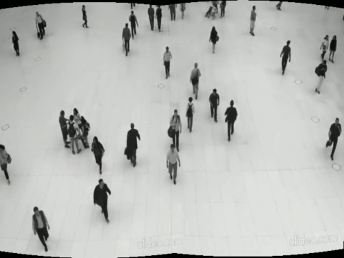
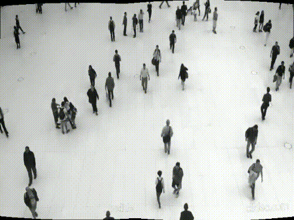
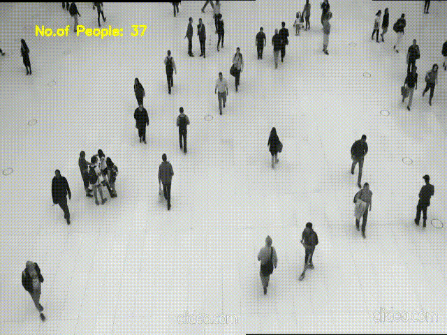
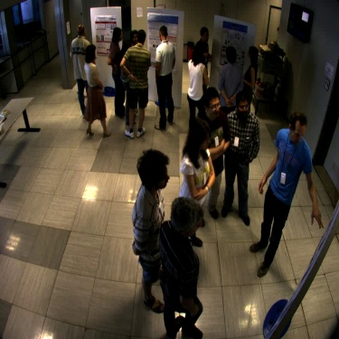
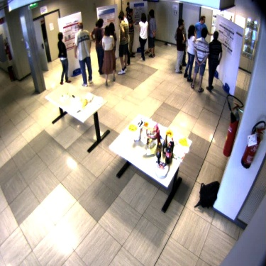
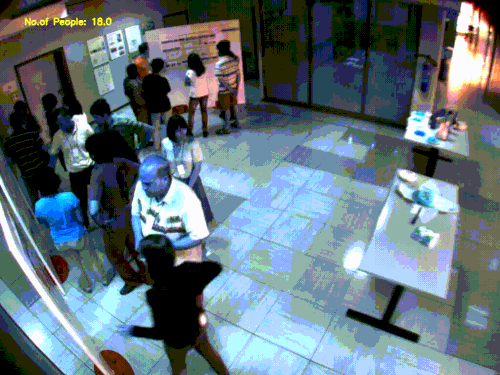

## A Summary of my Contributions in the Second phase of GSoC 2020  

28 July 2020

My first phase of the GSoC Journey ended with an implementation of the people Counter from a single view which involved a lot of literature survey and some unprecedented problems which required some brainstorming solutions. This made my work for the second phase much less hectic and simpler as I had to find the best way to integrate the information given by each image from multiple cameras. I have proposed and implemented two approaches for different types of views as I had promised in my proposal.  
The first one being, the addition of a preprocessing step of image stitching according to this [publication](http://matthewalunbrown.com/papers/ijcv2007.pdf) for partially overlapping views. This step involves the stitching of the images together to form a single image which is then passed into the counting module. This results in a performance overhead that can be compensated by adjusting the `skip_frames` parameter.  
An example of this preprocessing step is shown below  

  
The image obtained by stitching is shown below:  
  
Unlike many image stitching algorithms that are sensitive to the order of input images, this method is not only insensitive to the order of the input images but also orientation and illumination changes. I also verified this by introducing some random illumination changes(dark, bright, hazy) [here](https://github.com/niveditarufus/ImageStitching).  
An example is hown below:  
  

The value og the count given from the stiched video is shown below: 
  

The next approach I had implemented was for multiple views from different perspectives where stitching cannot happen. I implemented the [Boyer-Moore Majority Vote algorithm](https://www.cs.utexas.edu/~moore/best-ideas/mjrty/) to return the count value from multiple views as shown below:  

  

  
This algorithm is implemented on the count values returned by the SS-DCNet Counter for each of the different perspective views to return the count value that forms the majority. If there is no clear majority, the element with the maximum count is returned and if all the elements are unique, the average of all count values is returned. For more details refer to my [blog](https://niveditarufus.github.io/).  
The example of the count value return through the given four perspective views is shown below:  
  

For the third phase, I will be working on integrating all my contributions until now as a working module into the RoboComp architecture.  
