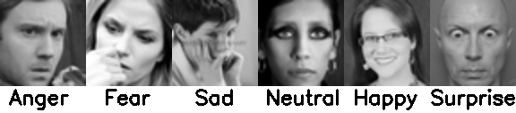
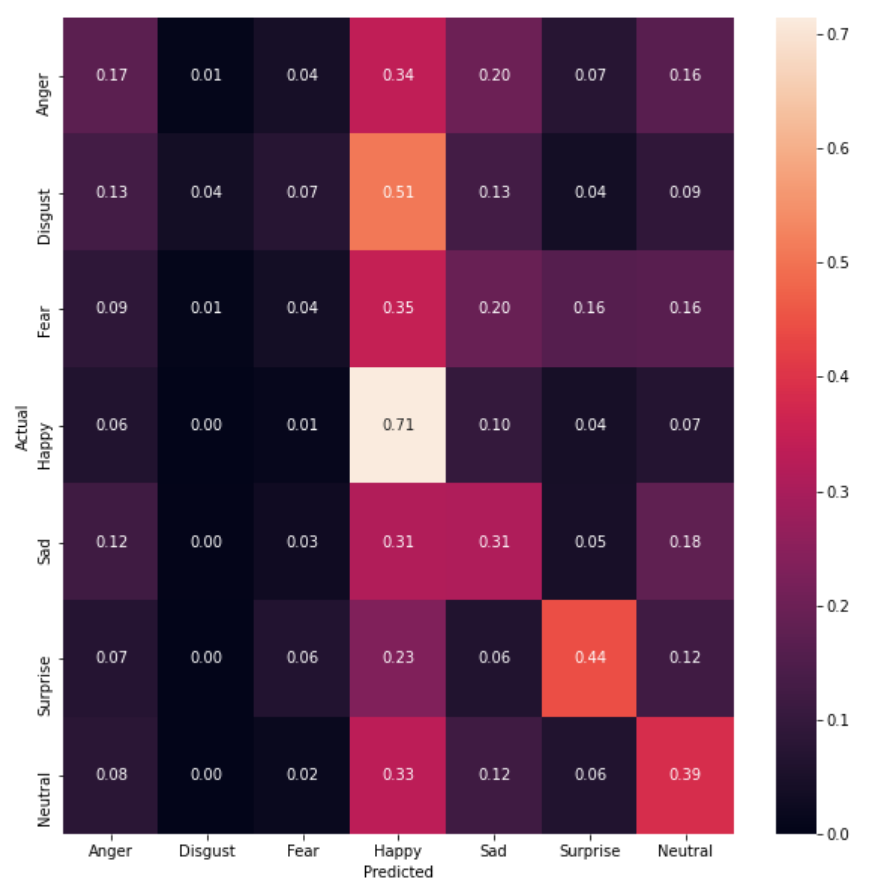
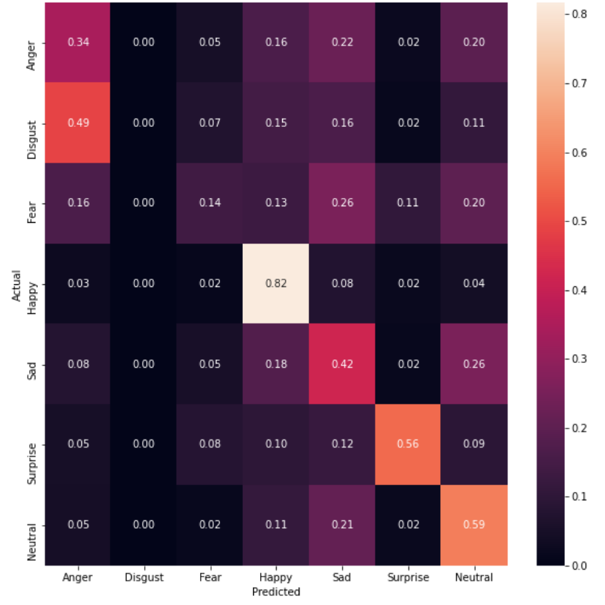

# Hand Crafted Features for Emotion Recognition
 
June 23, 2020
 
In this post I will share the first milestone to investigate the efficacy of classical ML models for the task of Emotion Recognition. For this, we considered the hand crafted features: Local Binary Patterns (LBP) and Histogram of Oriented Gradients (HOG) using facial landmarks. We used the FER 2013 dataset for the benchmarking. 

Some statistics of the FER 2013 dataset are:

Number of training samples: 28709

Number of validation samples: 3589

Number of testing samples: 3589

Number of emotions: 7

 
## Local Binary Pattern Features

In this approach a facial image is divided into local patches and then local binary pattern features are used to represent that local appearance. These features have proven to be a powerful descriptor in expression recongition and face verification. These concatenated features give a global descriptor of a face and represents region and pixel level features. Further in order to reduce the size of feature vectors we perform LDA to remove redundant features. The accuracy of these features on the various ML models for the test set of FER 2013 dataset is given in the below table:

| Classifier       | Accuracy |  Weighted F1 Score |
|------------------|----------|--------------------|
| Decision Tree    | 0.31     | 0.31               |
| Random Forest    | 0.38     | 0.33               |
| Linear SVM       | 0.38     | 0.34               |
| SVM (RBF Kernel) | 0.31     | 0.26               |

## Dense SIFT + CNN

The SIFT algorithm is used to identify the keypoints in an image. For each key point, a key point descriptor is obtained, which is a histogram of local gradients around the key point. We use Dense SIFT in which SIFT descriptors are computed over dense grids in the image and not just at the key points. We use a CNN classifier on top of these features to recognize 5 basic emotions Happy, Neutral, Sad, Anger, Suprise. This model is the currently integrated in the emotion recognition component in Robocomp. This model performed slightly better than the previous models with an accuracy of 43% and a weighted F1 score of 0.42 on the FER dataset.

## Face Landmarks + HOG using SVM classifier

In this approach we use the Facial Landmarks using the Dlib library with the Histogram of Gradient Orientations. These concatenated features are then passed to a multi-class SVM classifier with RBF kernel. We report an accuracy of 51% with a weighted F1 score of 0.48 on the test set.

This is the best performance we achieved using the handcrafted features. However we can see that these models do not perform very well on classes Disgust and Fear which are very complex. So in order to tackle this we plan to train deep learning models on larger datasets and benchmark the transfer learning on the FER 2013 dataset.

**Palash Agarwal**