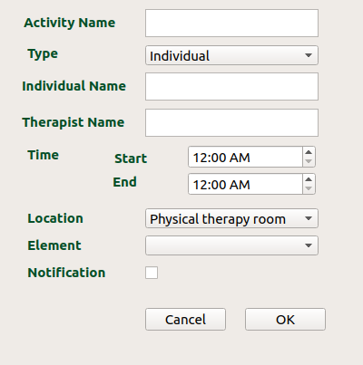

# Graphical User Interface Developed for Viriato

## First GUI mockup


The Grahical User Interface is divided into subsection
* Activity Calender
* Robot Navigation & control
* Human Observer agent
* Human-Robot interaction
***
### Activity Calender
**Motive:**
The Purpose to include this part in the GUI is to view and set event for the Robot. Using this we can instruct robot to perform specific task at specific time and location.

**Requirement** : This element require internet access, so make sure you have internet connectivity otherwise an error message will appear on terminal

```
No internet connection detected
Restart the application to to enable Activity Calendar
```
It also require, the client_secret.json file which contains the api Key.

**How This Element Works:**
To create a new activity select the date in the left side, and click on the new Activity button. This will popup a new dialog box



Enter the details and click OK

``Note: The time specified here is in UTC``

You can now view this event in the scrollBar.\
To view all the event for particular day you can click on the View agenda. A Dialog box will popup which contain a table of all the event and their information.


The event can also be added using Google Calendar using Browser

[Links of the video Tutorial](https://youtu.be/XqS8dCrGka0)
***

### Robot Navigation & control
If u have started RCIS which contains omniRobot. We can use the buttons on the left side to move the robot. We can also use the GoTo section to position the robot at a particular coordinates and heading. \
There are two more buttons to view Laser & Camera (if robot has one).


If you switch on the Keyboard control, you can use keyboard keys to navigate the robot.\
w -> forward \
s -> backward \
a -> left \
d -> right \
f -> CClockwise \
g -> clockwise \
backspace -> stop


[Links of the video Tutorial](https://youtu.be/XqS8dCrGka0)
***

### Human Observer agent
* This part of the GUI will help to add a person as well as modify the attributes of the persons like
Name, Age, UserType etc.
* we can also change the pose of the person by changing the x & z position

* After clicking **New Human** button a new person can be added in the DSR as well as in RCIS (inner Model)
  * the id of the new person will appear in the id field, Also this drop-down will contain all the ids of the person that are present in the DSR.

* information of a particular person can be edited by
  * selecting the id of the person using the id drop-down
  * change the value corresponding to the attribute field in the right
  * we can also add the photo corresponding to the person
  `NOTE: only the image path is stored not the photo.`
  * after setting all the values click on **Set Human** button, this will update the values in the DSR.


### Human-Robot interaction

The first part will contain a face emotion
  * the emotion can be selected using the drop-down backward
  * these emotion will later show on the display that is attached to the robot.

The second part will contain a Text to Speech & Automatic Speech Recognition.
  * In the first text box user can enter a message manually
  * After which when the **Speak** button is pressed the audio of the same message is spoken.
  * In the second text box, first user has to click on the **Listen** button to activate the ASR.
  * After which user can speek, and this will then converted into text and will display in the text box in the right
  of the button.

We can also modify the links between object as well as between human & object.
  * select the id of the two entities between which you want to add link.
  * also select the linkType, we can also specify about some linktype by selecting the type from the drop-down list below the button.
  * the text box in the bottom will show all the links that are there in the DSR.


* * *
Rahul Katiyar
