# Connecting google calendar with humanObserverAgent_GUI component


---
- we cannot share API keys of a google account with all the public users. Also, the new google account must be separated from a personal one so that the privacy of the user should be preserved.

- Google Calendar API use Oauth2.0 for interfacing with the client, which opens up a consent screen when the client makes a request for authorization token, which is not suitable for our case.

- To achieve this, a google dummy account is needed.
- This can be achieved using a service account on Google, which is entirely isolated.

```
+--------+                               +---------------+
|        |--(A)- Authorization Request ->|   Resource    |
|        |                               |     Owner     |
|        |<-(B)-- Authorization Grant ---|               |
|        |                               +---------------+
|        |
|        |                               +---------------+
|        |--(C)-- Authorization Grant -->| Authorization |
| Client |                               |     Server    |
|        |<-(D)----- Access Token -------|               |
|        |                               +---------------+
|        |
|        |                               +---------------+
|        |--(E)----- Access Token ------>|    Resource   |
|        |                               |     Server    |
|        |<-(F)--- Protected Resource ---|               |
+--------+                               +---------------+
```
OAuth protocol flow

## Flow
- A service account's credentials, which you obtain from the Google API Console, include a generated email address that is unique, a client ID, and at least one public/private key pair.
- You use the client ID and one private key to create a signed JWT and construct an access-token request in the appropriate format. Your application then sends the token request to the Google OAuth 2.0 Authorization Server, which returns an access token.
- The application uses the token to access a Google API. When the token expires, the application repeats the process.
Your server application uses a JWT to request a token from the Google Authorization Server, then uses the token to call a Google API endpoint. No end-user is involved.


---

## Getting started with Google Calendar API With Service Account

---

*A service account is a particular type of Google account intended to represent a non-human user that needs to authenticate and be authorized to access data in Google APIs.*

---


## Steps to download client_secret file
 - client_secret file contains the API key which is used by the python script to communicate with the google calendar.

1. Go to the following link: [https://console.developers.google.com/](https://console.developers.google.com/)

  You are now at the dashboard.
  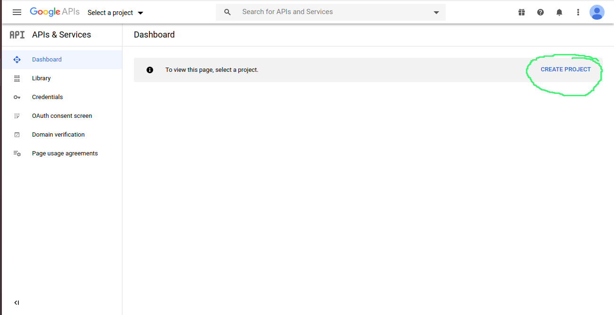

2. Create a new project and name it "*RobocompActivityAPI*."
  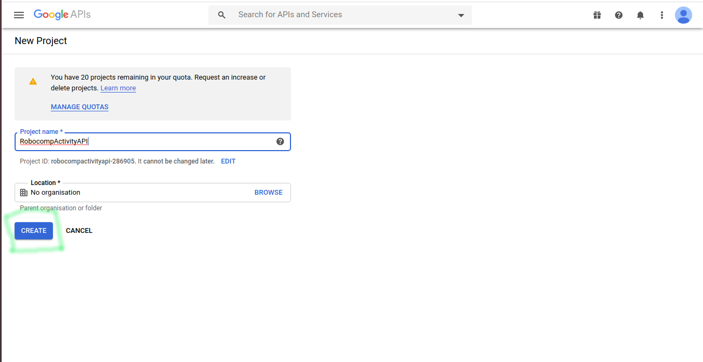

3. After creating a new project, click on the Enable API & Services.

  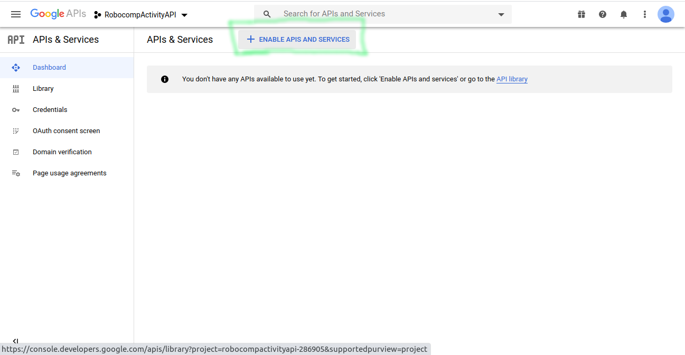

  Now find the Google calendar API and click it\
  Enable it or if already enabled then click on manage.
  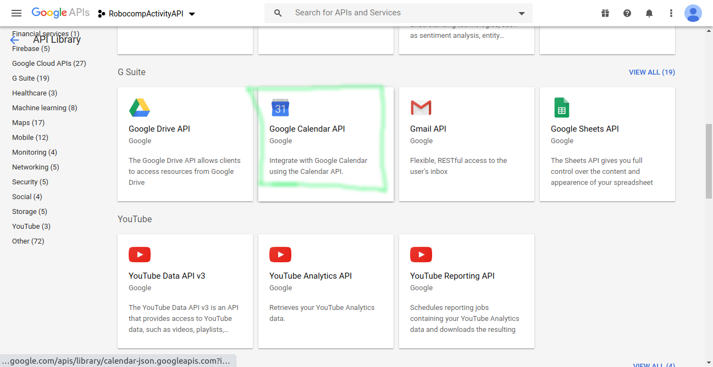

  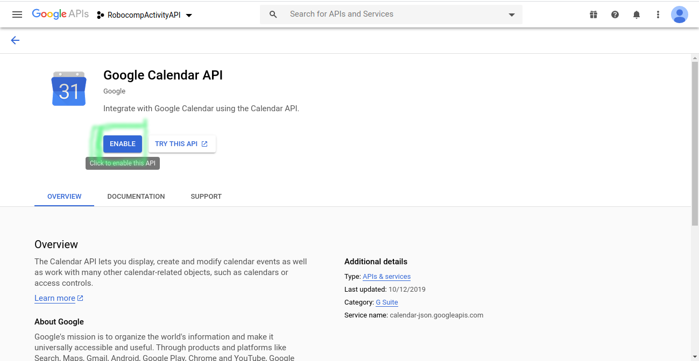


4. Click on credential on the left side under a service account.
  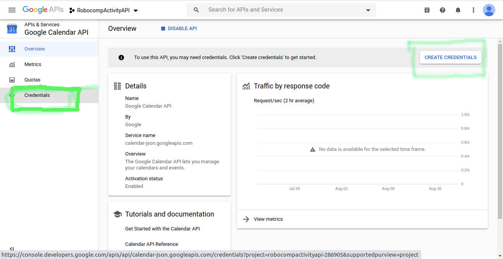

5. Click on manage service accounts.
  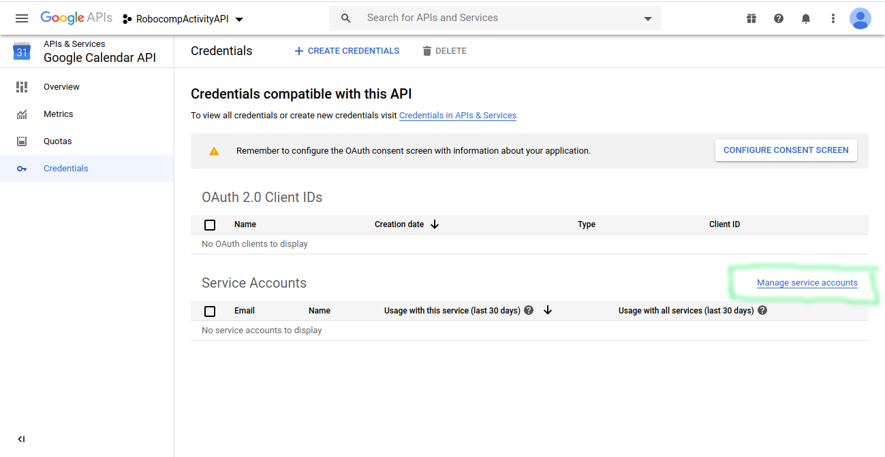

6. Then click on Create service account on the top

    Create a service account name "RobocompAPI"\
    Leave all the optional.
    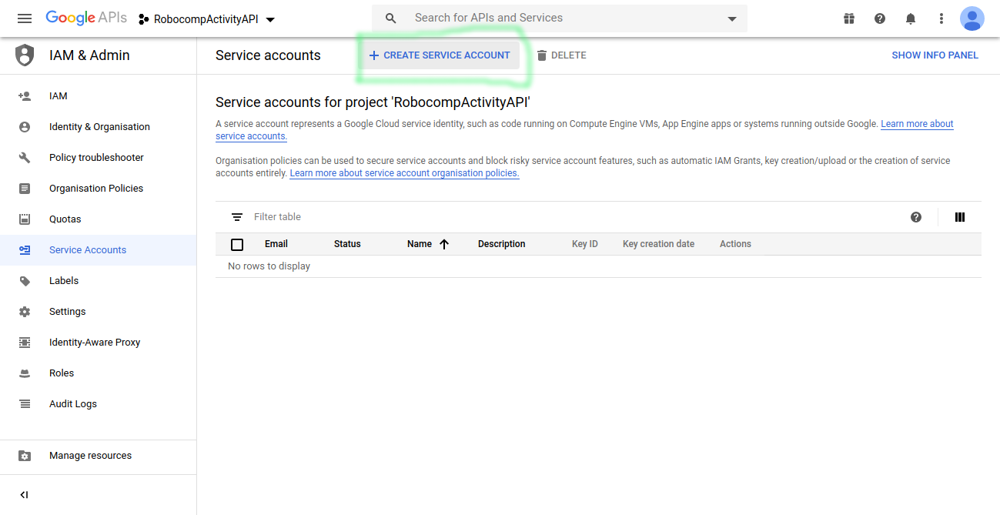

    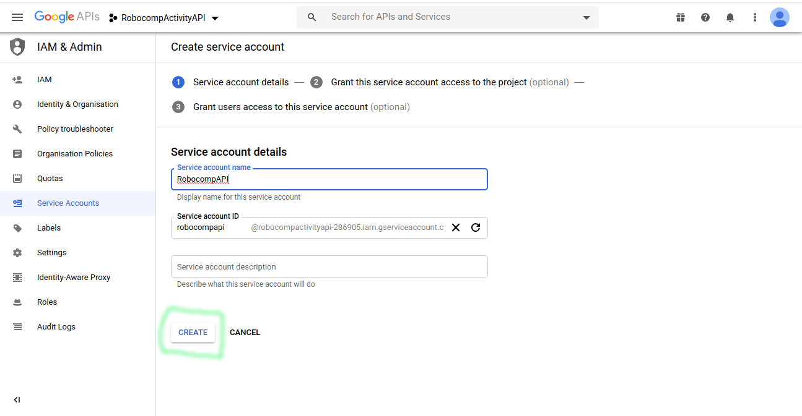

7. Click on the three dots under the action column and
create new key

  Select key type as JSON and download
  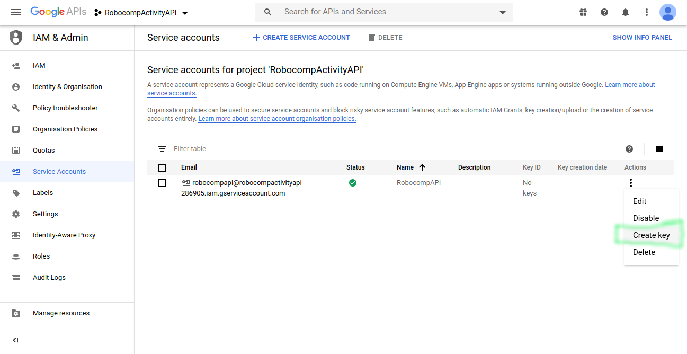

> rename the file as client_secret.json

  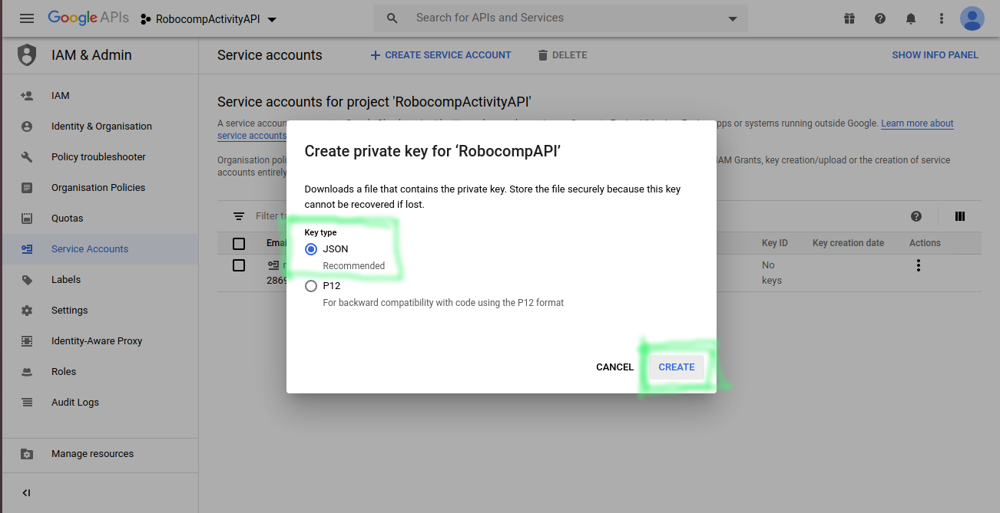

8. Copy the service account email, which, in my case, it is "*robocompapi@robocompactivityapi.iam.gserviceaccount.com*."


> place the downloaded client_secret.json file in  \<humanObserverAgent_GUI path>


9. Open the google_calender.py inside the src folder and rename line no 14

```
self.service_account_name = 'testacc@robocompgui-1591069682447.iam.gserviceaccount.com'
```

Change the service_account_name with your service account name\
In my case, it is "*robocompapi@robocompactivityapi.iam.gserviceaccount.com*."


10. You can now use the gui, and the changes are now linked with this service account.


>> To view the calendar we must add the calendar and give access to the user to view and modify events.
the trickest part is to figure out how to provide access from the service account as the service account
is a dummy account and nowhere can be seen.\
>> So the only solution I came up with is to give access to the user programmatically using ** _(acl.insert)_** of the google calendar API.


11. So to view as well as to create or edit the events on google calendar browser, we need
to give access to this account's calendar to any other google account.

**we can achieve this using the API itself,**

12. Follow these steps to give access.
  * open terminal
  * Go to the <humanObserverAgent_GUI path>
  * open python3 shell
  * run the following
  ```bash
  kati@kari-PC:~/robocomp/components/robocomp-viriato/components/humanObserverAgent_GUI$ python3
  Python 3.6.9 (default, Jul 17 2020, 12:50:27)
  [GCC 8.4.0] on linux
  Type "help", "copyright", "credits" or "license" for more information.
  >>> from src.google_calender import CalenderApi
  >>> Mycalender = CalenderApi()
  >>> Mycalender.giveAccess("rahulkatiyar19955@gmail.com")
  'user:rahulkatiyar19955@gmail.com'
  >>> exit()
  ```

13. go to calendar.google.com

14. add subscribe to a calendar and paste the service account email id as URL

15. A new calendar is now added to your calendar list


**now you can create/modify/delete events directly from the browser**

---
[Rahul Katiyar](http://rahulkatiyar19955.github.io/)
