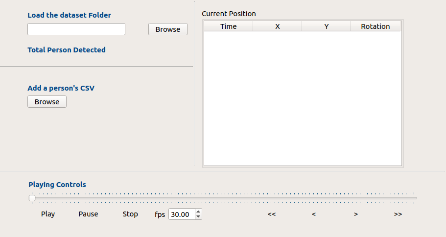

# Human Scene Simulation

---
This component is created to simulate an environment, where several people interact with each other based on the dataset.

> The component can be found at the robocomp-viriato directory with the name "*HumanSceneSim*."

Video Demo can be found at [https://youtu.be/dUrtZGbO7Oc](https://youtu.be/dUrtZGbO7Oc)

---

## Dataset Used
Here We are using the [SALSA Dataset](http://tev.fbk.eu/salsa)

- The purpose of this component is to create a specific agent with a new graphical interface that allows, frame by frame, to update the position of a person, or a group of people, in the environment - and, therefore, in the DSR.

- This dataset contains a frame by frame position change of the persons.

## About the Dataset

- The first column of all modalities is the timestamp in SECONDS from the first visual images

- The Position/pose related to persons are stores in the geometryGT

- These are the columns\
Timestamp[s]  , Ground_Position_X[m] ,  Ground_Position_Y[m] , Useless_Field ,  Body_Pose[rad] ,  Relative_Head2Body_Pose[rad] , Validity[bool]

- Each CSV file in the geometryGT folder corresponds to a person with the ID as the name of the CSV file.

- there are two different scenes:
  - [PosterSession](https://drive.google.com/open?id=0Bzf1l8WmTwu0QlpnX0Q5TDdsM0E)
  - [CocktailParty](https://drive.google.com/open?id=0Bzf1l8WmTwu0QmJjM1NJNC04Z2M)

## How we have proceeded

- The first step is to get to know about the dataset, what each column signifies and how to use these value to recreate the environment, also filter out unnecessary columns.

- Data Extraction from the CSV file is done using `extractCSV` function, which uses File stream to fetch the data from the CSV.

- These data are then stored in a `PersonCsvData` Class.

- This class stores only a single frame of the person's pose data.

- A vector of PersonCsvData `vector<PersonCsvData> personCsv` is used to store all the pose frame of a particular person.

- These Person specific pose data is now mapped with the ID of the Person, and stored as `map<int, vector<PersonCsvData>> PersonAvailable`

## UI Perspective

- Two Separate options are given to the user; the first one is to include a folder and the second one to include only a person's CSV file.

- A playing control is also added to give functionality to the user to view the environment at that particular timestamp.

- Another functionality is given to play frame by frame at a specific interval as set by the user in `fps` drop down box.

- Arrows are also provided to move to the next or previous frame.

- QTableView is also implemented to view the exact data in realtime as the user move to a new frame.

## AGM Integration

- This component needs to be linked with the AGM so that all the changes will also be reflected in the AGM.

- For this `agmexecutive_proxy` is used and for every new frame a link update is performed using `AGMMisc::publishEdgeUpdate` method.

- The function `includeInAGM` is used to include a person in the AGM.

## RCIS Integration

- To make the person move in the RCIS, we need to make changes in the inner model.

- This is achieved using the `innermodelmanager_proxy`, and we have used a common mesh for all persons that are added.

- The function `includeInRCIS` is used to include a person in the inner model.

- The function `movePersons` is responsible for all the person movement both in inner model as well as in AGM.

---
[Rahul Katiyar](http://rahulkatiyar19955.github.io/)
