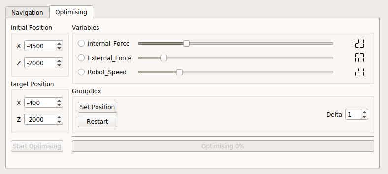
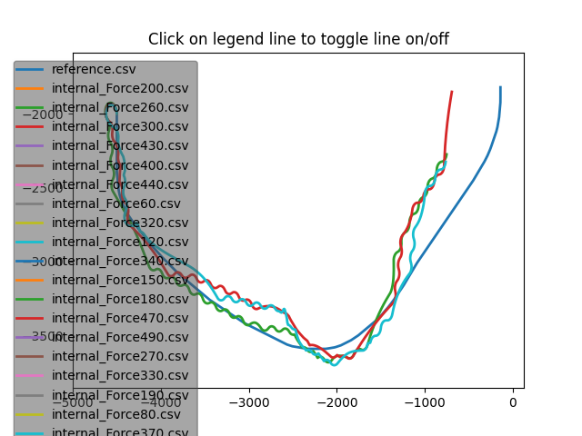

# Automated tool to perform optimisation

---
This component is built on top of socialNavigationAgent.
## Primary Objective
- The objective is to improve the navigation algorithm by tunning the variables realted to navigation.

---

## How we have proceeded

In the starting we write-down all the requirements:
- Finding free target points.
- Send the robot to these points.
- Monitor the route with a timeout in case it stops.
- Save data for further analysis.

And all these functionalities should work automatically with minimum human intervention.

- The free target points can be found out by checking all the grid points other than the objects.
- Setting the target with the point and calculating the path to the target point.
- continuously monitor with a periodic timer the state of the robot.

### For monitoring
A timeout is created whose timeout period can be set by the user. At the same time we check for the robot position, if the robot comes on or near to the target point, we know that the robot achieves the target, and then we start again from the origin with the new target point.

### For Saving data
For making a modular approach, a different component is proposed, which is completely separated from all others and will work independently.

- The component's name is `datacapture.`

- This component will be run independently and will communicate with the `innermodelmanager_proxy` to fetch the robot pose periodically.

- All these data are stored as a class object.
- The class `NavData` is used to store the processed data related to the robot.
- The class `NavStoreFile` handles all the functionalities, including getting the minimum obstacle distance by using laser data, calculating the distance travelled till now, saving the processed information in binary files.

### For analysing the captured data
For making the process simple, a `navDataReader` component is made which take the binary file as input that is generated from the above component.
- After reading data from the binary files, further analysis is to be carried including calculating different metrics.

---
After working with all these components, we decided to merge these components into one, so that we can efficiently automate these things.

- We combine datacapture component in the socialNavigationAgent
- This way we can automate the procedure and use the different optimiser.

### Optimizer Used

- We have decided to use gradient descent.

- Gradient descent is a first-order iterative optimisation algorithm for finding a local minimum of a differentiable function. To find a local minimum of a function using gradient descent, we take steps proportional to the negative of the gradient of the function at the current point.

### how to use the components

1. Select the initial position of the robot.
2. Select the final position. This is treated as the target position. after this press `Set Position` button to position the robot at the initial position.
3. Select the variable that you need to optimise and change the value of that variable from where you wish to continue.
4. Set the value of the other variables.
5. Choose the delta value, which is the default increment value between successive iteration.
6. Start the process by clicking on the optimising button.
7. A progress bar will start. This tells you about the percentage of the process is over.

> After the process is completed, we can measure and compare this value with reference data.

For this, we have created two python script
- metricCalc.py
- graphPlotter.py

**Graph Plotter**

- The user can click on the legend and can disable or enable the line plot, to compare two or more Pose data.

**Metric Calculator**
- This script will calculate different metrics like path smoothness, path length ..
- It will then calculate the error between the calculated metric and the reference data, then sort the data set in increasing order of errors.

---
Video Demo can be found here .. [https://youtu.be/xr-TUMnq8gI](https://youtu.be/xr-TUMnq8gI)

---
[Rahul Katiyar](http://rahulkatiyar19955.github.io/)
