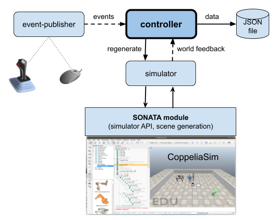
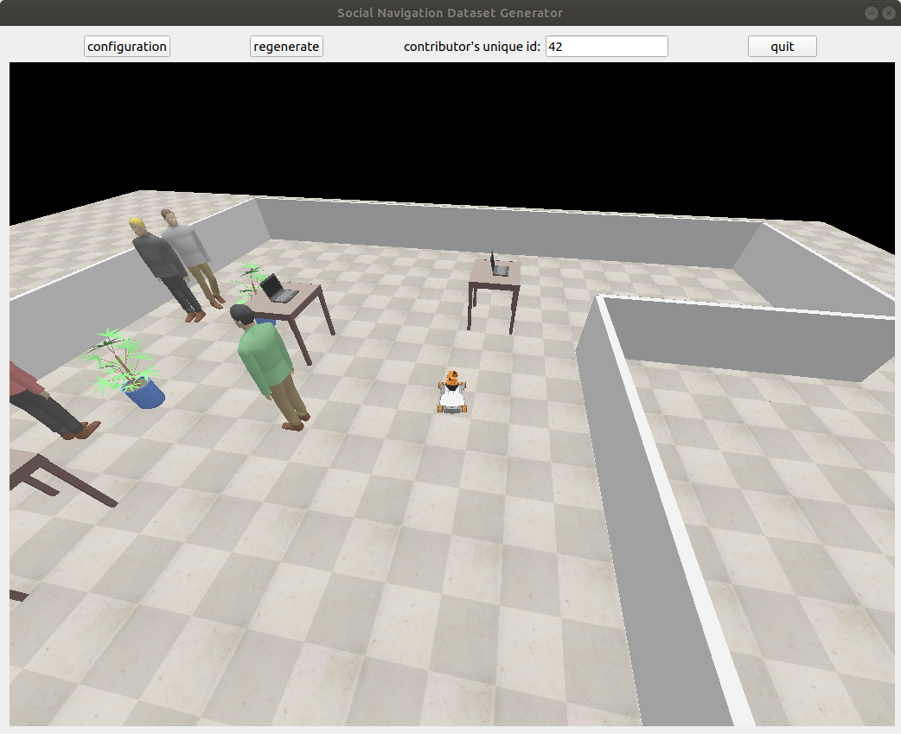

# A Toolkit to Generate Social Navigation Datasets

## Update about the work:
After solving the issues with graph generation, we moved to build a tool with an UI for collecting a dataset for the social navigation of the robot. The data collected from this tool consists of the positions, velocity, orientation of the different objects in a scenario with respect to the navigating robot, the data collected from the tool is stored as a JSON file. The tool consists of three main components, and a python module, the structure of the tool can be seen in the figure below. The three components are:
* Controller
* Simulator
* Joystick (event publisher)

## Working of the tool:
The Controller component takes in the data from the user input (Joystick) and the simulator. The tool uses subscribe/publish to communicate between different components. When the controller receives input from the joystick, it tells the simulator what to do. Some function of the controller are to move the robot, restarting the scenario, controlling the number of objects in a scene, e.t.c.

The simulator instantiates the CoppeliaSim simulation, and handle robot's movement and regenerate scene on command from controller. It also publishes information to controller like co-ordinates of the different objects, relationships, interactions, velocities, orientation.

The Joystick component takes in command from the user to make the robot move and publish it to the controller.

The image below shows the GUI of the tool.

* * *

*Rishabh*

