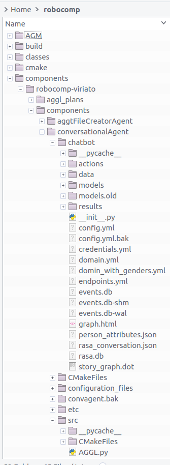
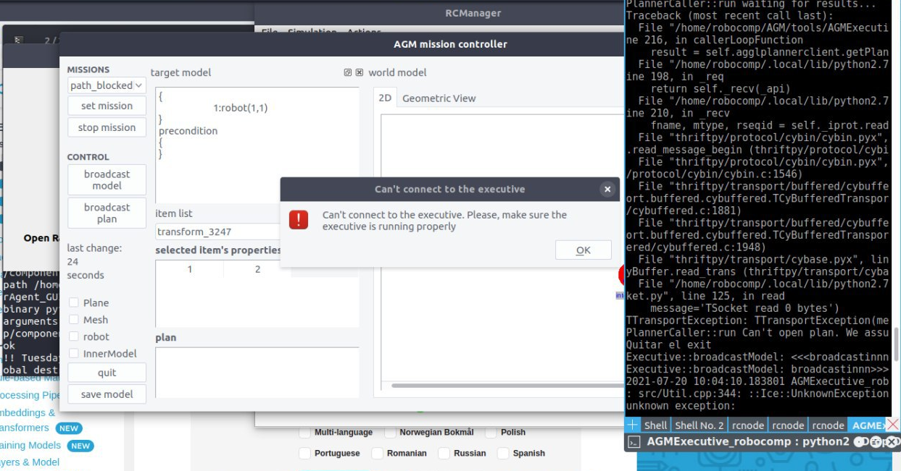
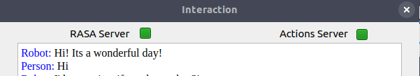
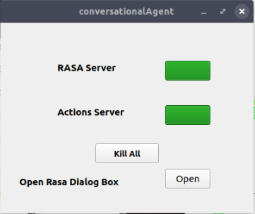
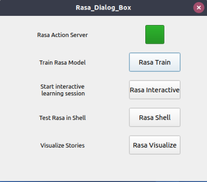
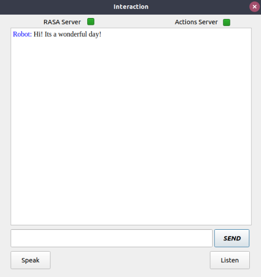

## Installing Robocomp

I had to repeat this process a few times as I could not build it exactly right in my initial attempts. 

I tried building the main branch, development branch and the stable branch. Anticipating several configuration and installation problems, I started off my installations on a Virtual Machine (Single core, 3 GB Ram, Lubuntu 18.04 LTS).

#### Picking the right branch

The *stable* branch has not had any commits merged for over two years, and it did not build correctly on ubuntu 18.04. The *development* branch was having PRs merged nearly everyday, so it seemed a little too volatile to touch. The very first time I built the *main* branch, it did not build correctly. I had to change some paths in the `cmake.txt` file, and symlink some directories to the right places where the installer was expecting them. Some dependencies mentioned in the readme were also outdated and those packages either didn’t exist in current repositories, or were replaced with newer packages.

#### AGM

After building Robocomp, I was told I need AGM running correctly to run the conversational agent. Installing the prerequisite packages and then running the dependencies installation worked well, and AGM was installed correctly with no problems. 

#### Components

I finally cloned the robocomp-viriato repo, to build the conversational agent. This was the hardest part, even with all suggested dependencies installed, and paths configured, I couldn’t get it running. I would have everything that was required, but for some reason some file would always not be in its location. My fix to every such problem was a symlink :man_shrugging: . I ended up with over 50 symlinks.

After a few more attempts at cleaning up, starting with a clean system from scratch, and reinstalling robocomp-viriato, I could launch the deployment file.

#### Test drive

Next I had to launch the components:

- ISExecutive

- Mission

- RCIS

- Human Observer Agent

- Conversational Agent

  

#### Bottlenecks

Launching mission and setting the plan would always take very long and crash everything. I realised that my 3 GB single-core VM was extremely underpowered for these tasks. Running the first few components would push RAM usage to 100% in no time. I had grossly underestimated the system requirements.

#### Into the future

One of the most important reasons why I chose to install on a VM is the ability to easily start fresh, which could also have been done in a virtual environment, but since none of the tutorials suggest using a virtual environment, I never leaned toward that option.

It was time to start all over again. This time I dual-booted Ubuntu Budgie 20.04 LTS. Now the components have 8 GB RAM and 2 cores to run themselves. Some steps into Robocomp’s installation I realised some of the versions of dependencies I needed did not exist in Ubuntu’s 20.04 LTS repositories, but did exist in 18.04 repos. That is how I finally ended up with an installation of Ubuntu Budgie 18.04 LTS. 

#### Final switch

From my installation experience, I learned it would make things a lot smoother if I set my username to *robocomp*. And it did! The installation was completely smooth until I had to reinstall AGM. 

By the time I was doing this, AGM was already being ported to python3, probably as a part of another GSoC'21 project. And it was halfway there. Trying several fixes and installing the dependencies mentioned in errors did not work. So I decided to use the last stable version. I finally picked the correct point in the repositories commit history, cloned that repo and installed AGM correctly.

After installing robocomp-viriato, mission would still continue to crash. 

After consulting with my mentors, and some debugging, we realised that the wrong plan was being set. So I got an updated plan from my mentors, **but that didn’t work either.**

#### A little bit of cheating

What finally worked was what I should have done a long time ago. I requested from my mentor’s entire robocomp folder, with AGM and robocomp-viriato. This worked instantly. I could launch all components with no problems. 

*Spoiler: But this wasn’t the end of my config problems.*

## Understanding the plan and rasa server

#### Starting a conversation

The conversational agent, once up and running, is activated when the robot comes across an intent to start a conversation. So for the robot to start a conversation, we:

- Create a human
- Set mission
- Add a path-block event

This path block event is acknowledged by the conversational agent. A chat window appears, with a greeting from the robot.

The current conversational agent keeps listening for this intent, and once the chat needs to begin it sends a POST request to the RASA server. RASA server works on a request/response design. Client sends a message and the server responds. It is easy to find an immediate application for RASA in customer support chat bots.

#### Specificworker.py

The entire control of the current conversational agent is done by the file at:

`$ROBOCOMP/components/robocomp-viriato/components/conversationalAgent/src/specificworker.py`.

Some important UI components this project focuses its new GUI on:

- The component that shows status of, and turns RASA server and RASA actions server on and off. It runs a shell script to do perform these actions.

- RASA dialog box lets you run a few more rasa shell actions. These simply open a new *gnome-terminal* and run a script.

  Also note: These fail if there is no gnome-terminal installed.

- Finally, the chat window. It auto - appears when a block is detected, and starts a conversation. If you click on close window, sometime in the next 15 seconds, it will re-appear (that is the delay set in an infinite check loop). 

So once I create my GUI, next task would be to start replacing these components, and sending appropriate data to the new conversational agent.
