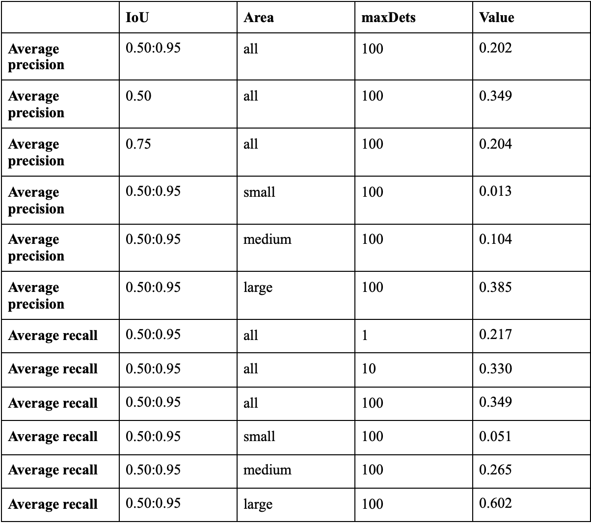
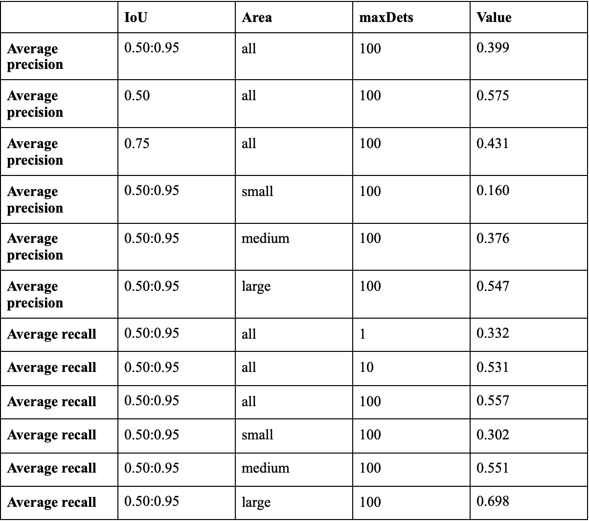
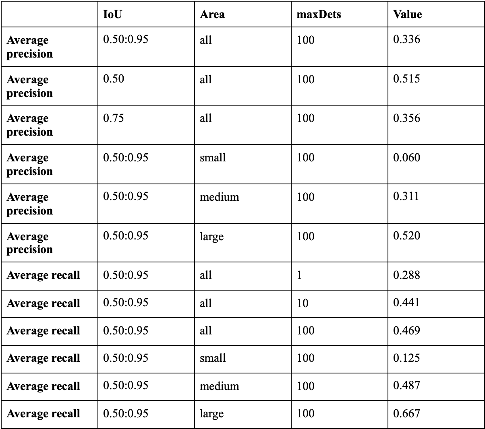

# Evaluation of the models

_25 June, 2021_

## Introduction

We have five different models to evaluate:

- **Faster R-CNN ResNet 50 V1 640x640**
- **SSD MobileNet v2 320x320**
- **CenterNet HourGlass104 Keypoints v2 512x512**
- **CenterNet MobileNetV2 FPN 512x512**
- **EfficientDet D0 512x512**

All these models have been got from [TensorFlow 2 Detection Model Zoo](https://github.com/tensorflow/models/blob/master/research/object_detection/g3doc/tf2_detection_zoo.md) and have been trained in the [COCO 2017 dataset](https://cocodataset.org/#home).

## Metrics

The metrics are going to be the typical used in the COCO dataset, apart from them we have added the average prediction time and the necessary memory as they have an important role in low computational environments. The average prediction time information have been got from the repository of the models as is standardized and the necessary memory has been measured according the weight of the compressed file that have all necessary to use the model. Respect to the metrics of the COCO dataset have been obtained doing the evaluation in the validation dataset of COCO 2017.

## Development

Firstly, we need to transform the dataset to a compatible format (tfrecord), we can get the data in this format using this [script](https://github.com/tensorflow/models/blob/f98f000a6e76f7889953097769745ff28289d0d0/research/object_detection/dataset_tools/create_coco_tf_record.py) from the [Tensorflow Object Detection API](https://github.com/tensorflow/models/tree/f98f000a6e76f7889953097769745ff28289d0d0/research/object_detection).

After that, the process is pretty straightforward so we need only to execute the following command in the directory research in the repository of the models with each model:

    python object_detection/model_main_tf2.py 
    --pipeline_config_path=PIPELINE_CONFIG_PATH 
    --model_dir=MODEL_DIR
    --checkpoint_dir=CHECKPOINT_DIR 
    --alsologtostderr
  
  Only is necessary to configure the pipeline config with the path of the label map and the data converted to tfrecord. Also, all the files for the command are provided by the compressed file downloaded from the repository.

# Evaluation data

### Faster R-CNN ResNet 50 V1 640x640

- Average prediction time: 53 ms
- Memory: 235.5 MB

### SSD MobileNet v2 320x320

- Average prediction time: 19 ms
- Memory: 58.3 MB

### CenterNet HourGlass104 Keypoints v2 512x512

- Average prediction time: 76 ms
- Memory: 1.62 GB

### CenterNet MobileNetV2 FPN 512x512

- Average prediction time: 6 ms
- Memory: 60.2 MB

### EfficientDet D0 512x512

- Average prediction time: 39 ms
- Memory: 66.9 MB

# Problems

The initials models to evaluate were Tiny-YOLO, SSD and R-CNN, but there were some problems. The idea was to search for repositories with these models in a compatible format with Keras or Tensorflow, but some of them were 3-4 years old so appeared some problems relate to installing the exact version of Keras, Tensorflow, Numpy, etc. As a consequence of this, only have been evaluated a version of R-CNN call Mask R-CNN. Luckily, one of my tutor suggested me to use the tensorflow object detection zoo and after some minor problems with getting the data in tfformat, I was capable of evaluate the models and as this was really quickly we decided to evaluate more models to compensate that we cannot evaluate the Tiny-YOLO model.

# Conclusion

The goal of this was to determinate the best model for the component and after we can say that the principal options for the component are **EfficientDet D0 512x512** and **SSD MobileNet v2 320x320** because are the only that can be converted to TFLite format. The EfficientDet have better results in average precision and average recall meanwhile SSD MobileNet is quickier than the EfficientDet(19 ms vs 36 ms). So we will need to evaluate the perfomance of this two models in the componenet in TFLite format to decide which of them is better. 

__Alejandro Fernández Camello__
