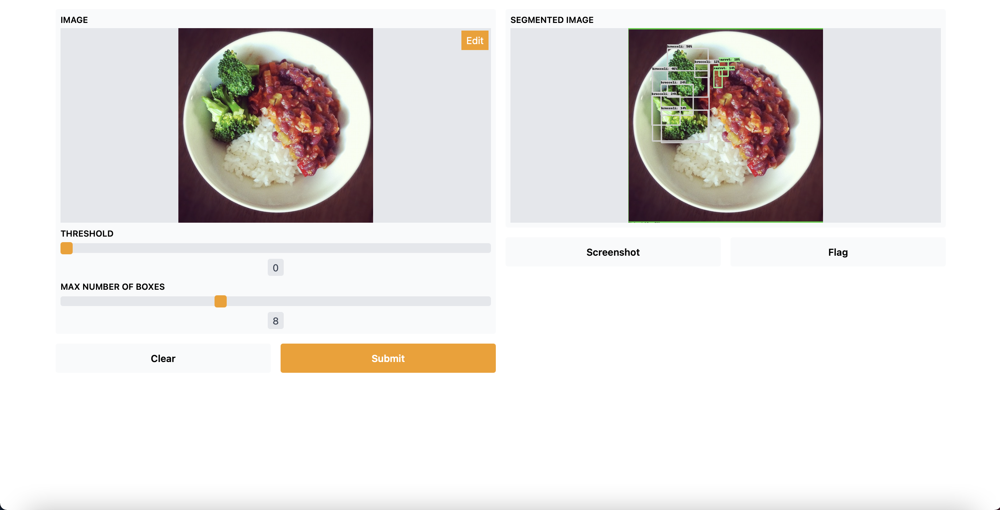

# Creating the component and improve the test of the model

_26 July, 2021_

## Introduction

The goal of the previous week was to create the component, that has been done easily using the [RoboComp](https://github.com/robocomp/robocomp) command robocompdsl and having a good reference in emotionrecognition2 component previously create made things easier.

## Creating the component

Firstly, I need to locate the interface that I have previously created in my robocomp installation in the directory interfaces/IDSLs, also I have done some changes in the interfaces to modify and get the threshold (if the confidence of the prediction is lower than the threshold it will not be included in the predictions) and change the string class in SPrediction to label as class is a keyword in Python. So the final code of the interface will be like this:

    module DetectionComponent
    {
        struct SPrediction
        {
            int x;
            int y;
            int w;
            int h;
            string label;
        };

        sequence<SPrediction> Predictions;

        sequence<byte> ImgType;

        struct TImage
        {
            int width;
            int height;
            int depth;
            ImgType image;
        };

        interface DetectionComponent
        {
            Predictions processImage(TImage frame);
            void setThreshold(float threshold);
            float getThreshold();
         };
    };
    
After that, I need to execute the following command with the cdsl file in the directory of the component to generate almost all the code that I will need:

    robocompdsl DetectionComponent.cdsl .

With the code generated I only need to write the methods of the interface in the specificworker.py generated by robocompdsl, also I will need to read the model in the constructor of SpecificWorker as is not a good idea to open it each time an image is processed.

### Constructor:

    def __init__(self, proxy_map, startup_check=False):
        super(SpecificWorker, self).__init__(proxy_map)
        self.Period = 2000

        # Set a default threshold
        self.threshold = 0.3

        # Read the model
        self.interpreter: tf.lite.Interpreter = tf.lite.Interpreter("../models/model_efficientdet.tflite")
        self.interpreter.allocate_tensors()

        # Get the input and output tensors
        self.input_details: list = self.interpreter.get_input_details()
        self.output_details: list = self.interpreter.get_output_details()

        if startup_check:
            self.startup_check()
        else:
            pass

### Interface methods:

    # =============== Methods for Component Implements ==================
    # ===================================================================

    #
    # IMPLEMENTATION of getThreshold method from DetectionComponent interface
    #
    def DetectionComponent_getThreshold(self):
        return self.threshold

    #
    # IMPLEMENTATION of processImage method from DetectionComponent interface
    #
    def DetectionComponent_processImage(self, frame):
        predictions = list()
        try:
            # Convert the bytes of the image to a tensor with shape (width,height,3) RGB
            arr = np.fromstring(frame.image, np.uint8)
            frame = np.reshape(arr, (frame.width, frame.height, frame.depth))
            frame = cv2.cvtColor(frame, cv2.COLOR_BGR2RGB)

            # Preprocess the image
            frame = cv2.resize(frame, dsize=(448, 448))
            frame = np.expand_dims(frame, axis=0)

            # Execute the interpreter
            self.interpreter.set_tensor(self.input_details[0]['index'], frame)
            self.interpreter.invoke()

            # Get the outputs of the model
            boxes: np.array = self.interpreter.get_tensor(self.output_details[0]['index'])
            classes: np.array = self.interpreter.get_tensor(self.output_details[1]['index'])
            scores: np.array = self.interpreter.get_tensor(self.output_details[2]['index'])
            num_predictions: int = int(self.interpreter.get_tensor(self.output_details[3]['index'])[0])

            # Prepare the data according to the interface
            for i in range(num_predictions):
                if scores[i] > self.threshold:
                    prediction = SPrediction()
                    prediction.x = int(boxes[i][0] * frame.height)
                    prediction.y = int(boxes[i][1] * frame.width)
                    prediction.w = int((boxes[i][2]-boxes[i][0]) * frame.height)
                    prediction.h = int((boxes[i][3]-boxes[i][1]) * frame.width)
                    prediction.label = LABELS[int(classes[i])]
                    predictions.append(prediction)

        except Ice.Exception as e:
            traceback.print_exc()
            print(e)
        finally:
            return predictions

    #
    # IMPLEMENTATION of setThreshold method from DetectionComponent interface
    #
    def DetectionComponent_setThreshold(self, threshold):
        self.threshold = threshold

    # ===================================================================
    # ===================================================================
 
After these, the next steps will be testing the component in the RCIS simulator and if is possible in real robots.

## Improving the testing of the model

I thought that the interface to test images with the models was not very good so I decided to do a better one using the library [Gradio](https://github.com/gradio-app/gradio) that is only used for this test so it will not be registered in the requirements.txt of LearnBlock. The visualization_utils are provided by the [Tensorflow models](https://github.com/tensorflow/models) where I have taken only the code that I need for the project.

        import numpy as np
        import tensorflow as tf
        from cv2 import resize
        from utils import visualization_utils
        import gradio as gr

        MODEL_FILE = "../models/model_efficientdet.tflite"

        LABELS = ['person',
                  'bicycle',
                  'car',
                  'motorcycle',
                  'airplane',
                  'bus',
                  'train',
                  'truck',
                  'boat',
                  'traffic light',
                  'fire hydrant',
                  'street sign',
                  'stop sign',
                  'parking meter',
                  'bench',
                  'bird',
                  'cat',
                  'dog',
                  'horse',
                  'sheep',
                  'cow',
                  'elephant',
                  'bear',
                  'zebra',
                  'giraffe',
                  'hat',
                  'backpack',
                  'umbrella',
                  'shoe',
                  'eye glasses',
                  'handbag',
                  'tie',
                  'suitcase',
                  'frisbee',
                  'skis',
                  'snowboard',
                  'sports ball',
                  'kite',
                  'baseball bat',
                  'baseball glove',
                  'skateboard',
                  'surfboard',
                  'tennis racket',
                  'bottle',
                  'plate',
                  'wine glass',
                  'cup',
                  'fork',
                  'knife',
                  'spoon',
                  'bowl',
                  'banana',
                  'apple',
                  'sandwich',
                  'orange',
                  'broccoli',
                  'carrot',
                  'hot dog',
                  'pizza',
                  'donut',
                  'cake',
                  'chair',
                  'couch',
                  'potted plant',
                  'bed',
                  'mirror',
                  'dining table',
                  'window',
                  'desk',
                  'toilet',
                  'door',
                  'tv',
                  'laptop',
                  'mouse',
                  'remote',
                  'keyboard',
                  'cell phone',
                  'microwave',
                  'oven',
                  'toaster',
                  'sink',
                  'refrigerator',
                  'blender',
                  'book',
                  'clock',
                  'vase',
                  'scissors',
                  'teddy bear',
                  'hair drier',
                  'toothbrush',
                  'hair brush']

        category_index = {i: {"id": i, "name": LABELS[i]} for i in range(len(LABELS))}

        # Read the model
        interpreter: tf.lite.Interpreter = tf.lite.Interpreter(MODEL_FILE)
        interpreter.allocate_tensors()

        # Getting the input and output tensors
        input_details: list = interpreter.get_input_details()
        output_details: list = interpreter.get_output_details()

        def process_image(image: np.array, threshold: float, max_boxes: float):
            original_image: np.array = np.copy(image)
            image = resize(image, dsize=(448, 448))
            image = np.expand_dims(image, axis=0)

            interpreter.set_tensor(input_details[0]['index'], image)
            interpreter.invoke()

            boxes: np.array = interpreter.get_tensor(output_details[0]['index'])
            classes: np.array = interpreter.get_tensor(output_details[1]['index'])
            scores: np.array = interpreter.get_tensor(output_details[2]['index'])

            image = visualization_utils.visualize_boxes_and_labels_on_image_array(
                original_image,
                boxes[0],
                classes[0].astype(np.uint32),
                scores[0],
                category_index,
                use_normalized_coordinates=True,
                min_score_thresh=threshold,
                max_boxes_to_draw=int(max_boxes) + 1
            )

            return image

        if __name__ == "__main__":
            input_image = gr.inputs.Image(shape=None, source="upload", label="Image")
            input_threshold = gr.inputs.Slider(minimum=0, maximum=1, default=0.3, label="Threshold")
            input_max_boxes = gr.inputs.Slider(minimum=1, maximum=20, default=10, step=1, label="Max number of boxes")
            output = gr.outputs.Image(type="numpy", labeled_segments=False, label="Segmented image")
            interface = gr.Interface(fn=process_image, inputs=[input_image, input_threshold, input_max_boxes], outputs=output)
            interface.launch(inbrowser=True)
 
After executing the code, it will launch the browser with a windows where you can upload images, also you will have two slider where you can select the threshold (between 0 and 1) and the max number of boxes (1 to 20). It will look like this:

### Conclusion

RoboComp allow us to simplify a lot the integration of new components in LearnBlock, so the only needed to finish the project will be testing the component, make the necessary improvements according with this and some documentation.

__Alejandro Fernández Camello__

